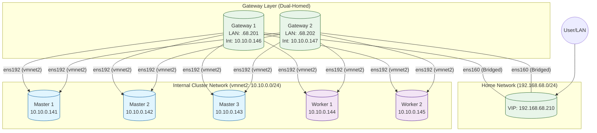

# Kubernetes Cluster on VMware Fusion

This repository contains scripts and Terraform configurations for deploying a high-availability Kubernetes cluster on VMware Fusion using Apple Silicon Macs.

## Architecture: Dual-Homed DMZ

The cluster uses a secure "Dual-Homed" network design with dedicated internal networking via vmnet2.

*   **Gateways**: Sit on the "Edge". They have one interface on your Home LAN (`192.168.68.x`) and one on the Internal Cluster Network (`10.10.0.x` via vmnet2).
*   **Cluster Nodes**: Reside entirely on the Internal Network (`10.10.0.x`), isolated from the LAN.
*   **Access**: User traffic hits the **VIP (192.168.68.210)** on the LAN, and is proxied by Nginx to the internal nodes.



## Network Configuration

### VMware Fusion Networks

| Network | Subnet | Type | Purpose |
|---------|--------|------|---------|
| Bridged | 192.168.68.0/24 | Physical LAN | Gateway external interface, VIP |
| **vmnet2** | **10.10.0.0/24** | **NAT + Host-only** | **Internal cluster communication** |

### IP Address Allocation (Updated 2025-11-25)

| Host | LAN IP | Internal IP | Role | Snapshot |
|------|--------|-------------|------|----------|
| VIP | 192.168.68.210 | - | External access point | - |
| gateway1 | 192.168.68.201 | 10.10.0.146 | Load balancer (MASTER) | `patched-20251125` |
| gateway2 | 192.168.68.202 | 10.10.0.147 | Load balancer (BACKUP) | `patched-20251125` |
| k8s-master1 | - | 10.10.0.141 | Control plane | `patched-20251125` |
| k8s-master2 | - | 10.10.0.142 | Control plane | `patched-20251125` |
| k8s-master3 | - | 10.10.0.143 | Control plane | `patched-20251125` |
| k8s-worker1 | - | 10.10.0.144 | Workloads | `patched-20251125` |
| k8s-worker2 | - | 10.10.0.145 | Workloads | `patched-20251125` |
| apt-cache-server | - | 10.10.0.148 | APT cache (port 3142) | - |

## API Endpoints

| Service | Endpoint | Access From | Description |
|---------|----------|-------------|-------------|
| **Cluster VIP** | `192.168.68.210` | **LAN** | Entry point for all services |
| **K8s API** | `https://192.168.68.210:6443` | **LAN** | Kubernetes Control Plane |
| **HTTPS Ingress** | `https://192.168.68.210:443` | **LAN** | App Traffic (Passthrough) |
| **HTTP Ingress** | `http://192.168.68.210:80` | **LAN** | App Traffic (Forwarded) |

## Deployment Process

### Prerequisites
*   VMware Fusion Pro 13+
*   vmnet2 configured in VMware Fusion (10.10.0.0/24 with NAT)
*   A LAN network subnet `192.168.68.0/24` (or modify Terraform vars)
*   Free IP `192.168.68.210` for the VIP

### Quick Start
```bash
# 1. Deploy everything (Destructive!)
./k8s-manager.sh -o 1 -y
```

### Migration from vmnet8 to vmnet2
If you have existing VMs on vmnet8, migrate them:
```bash
# Interactive migration
./migrate-to-vmnet2.sh

# Or non-interactive
./migrate-to-vmnet2.sh --migrate-all
```

## Accessing the Cluster

From your laptop (on the same LAN):
```bash
# Configure kubectl to talk to the VIP
kubectl config set-cluster my-cluster --server=https://192.168.68.210:6443 --insecure-skip-tls-verify

# Or copy kubeconfig from a master node
scp ubuntu@10.10.0.131:~/.kube/config ~/.kube/config
```

## Documentation

| Document | Description |
|----------|-------------|
| [Infrastructure](docs/infrastructure.md) | Network architecture, VMware config |
| [Networking](docs/networking.md) | Traffic flow, CNI, port mappings |
| [VM Management](docs/vm_management.md) | Provisioning, cloud-init, snapshots |
| [K8s Deployment](docs/k8s_deployment.md) | Cluster bootstrap, join process |
| [Snapshot Management](docs/snapshot_management.md) | Backup and restore |

## Key Scripts

| Script | Purpose |
|--------|---------|
| `k8s-manager.sh` | Main management script (create, delete, snapshot VMs) |
| `migrate-to-vmnet2.sh` | Migrate VMs from vmnet8 to vmnet2 |
| `terraform-setup.sh` | Initialize Terraform configuration |

## Software Stack

| Component | Version |
|-----------|---------|
| Ubuntu | 24.04 LTS |
| Kubernetes | v1.29.0 |
| Cilium CNI | v1.16.x |
| Nginx | Latest |
| Keepalived | Latest |

## Troubleshooting

### Check VM Network Configuration
```bash
# Verify VMX settings
grep -E "ethernet|vnet" ~/VMs/k8s_cluster/k8s-master1.vmwarevm/k8s-master1.vmx

# Check VM IP addresses
./k8s-manager.sh -o 3
```

### Verify Internal Connectivity
```bash
# SSH to a gateway and ping internal nodes
ssh ubuntu@192.168.68.201
ping 10.10.0.141  # Master 1
```

### Check vmnet2 Status
```bash
# On Mac host
cat "/Library/Preferences/VMware Fusion/networking" | grep VNET_2
```

## Qdrant Knowledge Base Integration

This project includes a Qdrant vector database for semantic search of K8s documentation, enabling intelligent knowledge retrieval via Claude Code MCP integration.

### Architecture

```
Qdrant Vector DB (Docker)
├── Container: qdrant-k8s (ports 6335:6333, 6336:6334)
├── Storage: ./qdrant_storage (persistent)
├── Collection: k8s-docs (auto-created by MCP)
└── MCP Integration: mcp-server-qdrant (FastEmbed)
```

### Quick Start

```bash
# 1. Start Qdrant container
docker-compose -f docker-compose-qdrant.yml up -d

# 2. Verify container running
docker ps | grep qdrant-k8s

# 3. Test API access
curl http://localhost:6335/collections
```

### MCP Server Configuration

The MCP server is configured in `~/.claude.json` for the k8s project:

```json
{
  "mcpServers": {
    "qdrant-k8s": {
      "type": "stdio",
      "command": "uvx",
      "args": ["mcp-server-qdrant"],
      "env": {
        "QDRANT_URL": "http://localhost:6335",
        "COLLECTION_NAME": "k8s-docs",
        "QDRANT_API_KEY": "your-api-key-here",
        "EMBEDDING_MODEL": "sentence-transformers/all-MiniLM-L6-v2"
      }
    }
  }
}
```

### MCP Tools Available

| Tool | Purpose |
|------|---------|
| `qdrant-store` | Store content with semantic embeddings |
| `qdrant-find` | Search knowledge base via natural language |

### Important: Collection Creation

**DO NOT manually create Qdrant collections!**

The mcp-server-qdrant uses FastEmbed which requires **named vectors** (e.g., `fast-all-minilm-l6-v2`). If you manually create collections, they will have unnamed vectors and cause errors.

**Correct approach**: Let the MCP server auto-create collections on first `qdrant-store` operation.

### Troubleshooting Qdrant

#### Error: "Not existing vector name error: fast-all-minilm-l6-v2"

**Cause**: Collection was manually created with unnamed vectors.

**Solution**:
```bash
# Delete the incorrectly created collection
curl -X DELETE http://localhost:6335/collections/k8s-docs \
  -H "api-key: your-api-key"

# The MCP server will auto-recreate with correct schema on next store operation
```

**Correct collection schema** (auto-created by MCP):
```json
{
  "vectors": {
    "fast-all-minilm-l6-v2": {
      "size": 384,
      "distance": "Cosine"
    }
  }
}
```

**Incorrect schema** (manually created):
```json
{
  "vectors": {
    "size": 384,
    "distance": "Cosine"
  }
}
```

#### Check Collection Status
```bash
# List all collections
curl http://localhost:6335/collections

# Get collection details
curl http://localhost:6335/collections/k8s-docs
```

#### Container Issues
```bash
# Check container logs
docker logs qdrant-k8s

# Restart container
docker-compose -f docker-compose-qdrant.yml restart

# Full reset (removes all data!)
docker-compose -f docker-compose-qdrant.yml down -v
docker-compose -f docker-compose-qdrant.yml up -d
```

### CKA Learning Content

The knowledge base contains CKA exam preparation material:

| Topic | Weight | Content |
|-------|--------|---------|
| Troubleshooting | 30% | Pod debugging, node issues, networking |
| Cluster Architecture | 25% | Control plane, kubeadm, etcd, RBAC |
| Services & Networking | 20% | Services, DNS, NetworkPolicy, Gateway API |
| Workloads & Scheduling | 15% | Pods, Deployments, scheduling |
| Storage | 10% | PV, PVC, StorageClasses |

**Query examples**:
- "How do I troubleshoot a pod stuck in Pending?"
- "Explain etcd backup and restore"
- "What are Kubernetes NetworkPolicies?"
