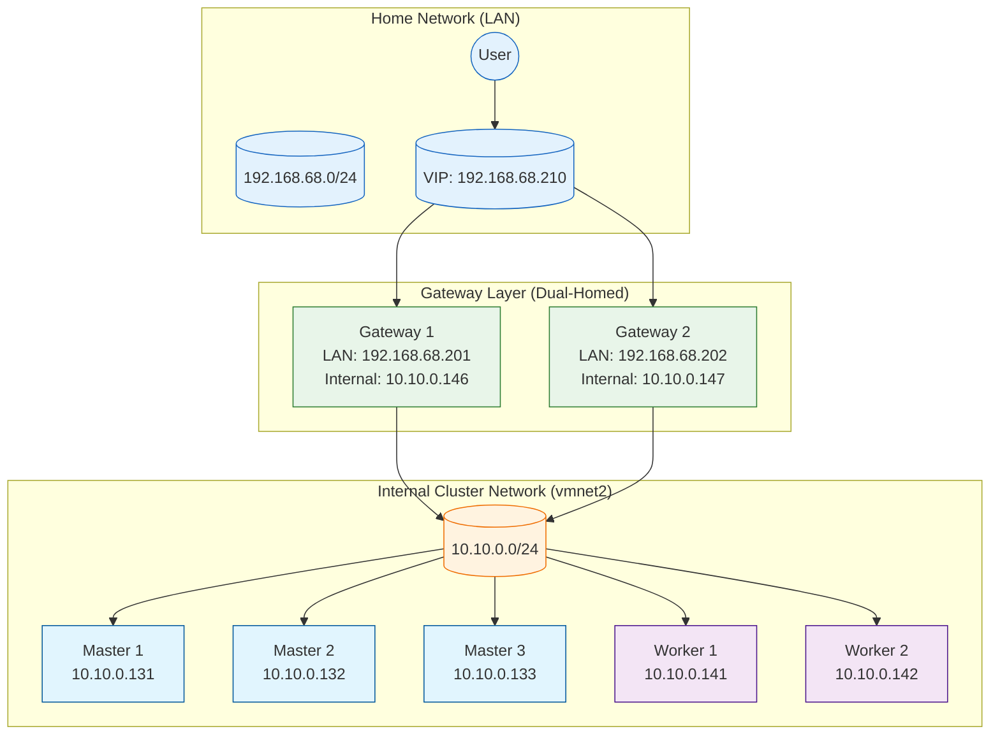

# Infrastructure Documentation

## Network Architecture: Dual-Homed DMZ

This project implements a "Dual-Homed" network architecture to secure the Kubernetes cluster while maintaining easy access from the local network.



### 1. The Gateway Layer (The "Edge")

| Property | Value |
|----------|-------|
| **Nodes** | `gateway1`, `gateway2` |
| **Role** | Load Balancing, SSL Passthrough, High Availability |
| **Software** | Nginx (L4/L7 proxy), Keepalived (VRRP) |

**Network Configuration: Dual Interfaces**

| Interface | Type | Network | Purpose |
|-----------|------|---------|---------|
| `ens160` | Bridged | 192.168.68.0/24 (LAN) | Hosts the VIP, external access |
| `ens192` | vmnet2 | 10.10.0.0/24 (Internal) | Talks to Masters/Workers |

### 2. The Cluster Layer (The "Core")

| Property | Value |
|----------|-------|
| **Nodes** | `k8s-master1-3`, `k8s-worker1-2` |
| **Role** | Running Kubernetes workloads |
| **Network** | vmnet2 (10.10.0.0/24) only |

**Network Configuration: Single Interface**

| Interface | Type | Network | Purpose |
|-----------|------|---------|---------|
| `ens160` | vmnet2 | 10.10.0.0/24 (Internal) | All cluster traffic |

**Security Isolation:**
- Nodes **cannot** be reached directly from the LAN
- Admin access via Gateways (for API) or Host Machine
- Internet access through vmnet2 NAT gateway (10.10.0.2)

### 3. High Availability (Keepalived)

| Property | Value |
|----------|-------|
| **VRRP Interface** | `ens160` (Bridged Interface) |
| **VIP** | `192.168.68.210` |
| **Failover** | If Gateway 1 fails, Gateway 2 claims the VIP |

### 4. Load Balancing (Nginx)

Nginx listens on all interfaces (0.0.0.0) and serves traffic via the VIP.

**Upstream Configuration:**

| Traffic Type | LAN Endpoint | Backend (vmnet2) |
|--------------|--------------|------------------|
| K8s API | 192.168.68.210:6443 | 10.10.0.131-133:6443 |
| HTTPS Ingress | 192.168.68.210:443 | 10.10.0.141-142:30443 |
| HTTP Ingress | 192.168.68.210:80 | 10.10.0.141-142:30080 |

## VMware Fusion Network Configuration

### Virtual Networks

| vmnet | Subnet | Type | NAT | Purpose |
|-------|--------|------|-----|---------|
| vmnet1 | 172.16.12.0/24 | Host-only | No | Unused |
| **vmnet2** | **10.10.0.0/24** | **Host-only + NAT** | **Yes** | **K8s Internal Cluster** |
| vmnet3 | 172.16.130.0/24 | Host-only + NAT | Yes | Available |
| vmnet8 | 192.168.130.0/24 | NAT (default) | Yes | Default NAT (not used) |
| Bridged | 192.168.68.0/24 | Physical LAN | N/A | Gateway LAN interface |

### vmnet2 Details

```
Subnet: 10.10.0.0/24
Netmask: 255.255.255.0
Host IP: 10.10.0.1 (Mac)
NAT Gateway: 10.10.0.2
DHCP Range: 10.10.0.128 - 10.10.0.254
```

### VM Network Adapter Configuration

**Gateway VMs (.vmx):**
```
ethernet0.connectionType = "bridged"      # LAN
ethernet1.connectionType = "custom"       # Internal
ethernet1.vnet = "vmnet2"
```

**K8s VMs (.vmx):**
```
ethernet0.connectionType = "custom"       # Internal only
ethernet0.vnet = "vmnet2"
```

## Software Stack

| Component | Version | Purpose |
|-----------|---------|---------|
| **OS** | Ubuntu 24.04 LTS | Base operating system |
| **LB** | Nginx | L4/L7 load balancing (Stream + HTTP) |
| **HA** | Keepalived | Virtual IP failover |
| **K8s** | v1.29.0 | Container orchestration |
| **CNI** | Cilium v1.16.x | Networking and security |
| **Gateway API** | v1.1.0 | Ingress management |

## IP Address Allocation

### LAN Network (192.168.68.0/24)

| IP | Host | Purpose |
|----|------|---------|
| 192.168.68.201 | gateway1 | Gateway 1 LAN interface |
| 192.168.68.202 | gateway2 | Gateway 2 LAN interface |
| **192.168.68.210** | **VIP** | **Virtual IP (Keepalived)** |

### Internal Network (10.10.0.0/24 - vmnet2)

| IP | Host | Purpose |
|----|------|---------|
| 10.10.0.1 | Mac Host | VMware host interface |
| 10.10.0.2 | NAT Gateway | Internet access for VMs |
| 10.10.0.146 | gateway1 | Gateway 1 internal interface |
| 10.10.0.147 | gateway2 | Gateway 2 internal interface |
| **10.10.0.100** | **Internal VIP** | **K8s API internal endpoint** |
| 10.10.0.131 | k8s-master1 | Control plane node 1 |
| 10.10.0.132 | k8s-master2 | Control plane node 2 |
| 10.10.0.133 | k8s-master3 | Control plane node 3 |
| 10.10.0.141 | k8s-worker1 | Worker node 1 |
| 10.10.0.142 | k8s-worker2 | Worker node 2 |

## Traffic Flow

```
User Request → 192.168.68.210 (VIP)
                    ↓
              Gateway (Nginx)
                    ↓
           10.10.0.x (Internal)
                    ↓
            K8s Node (Cilium)
                    ↓
                  Pod
```

## Migration Notes

**Migrated from vmnet8 to vmnet2 (2025-11-25)**

To migrate existing VMs, use the migration script:
```bash
./migrate-to-vmnet2.sh --migrate-all
```

This script:
1. Stops all VMs
2. Backs up VMX files
3. Updates network configuration to vmnet2
4. Updates vm-ips.env with new IP addresses
