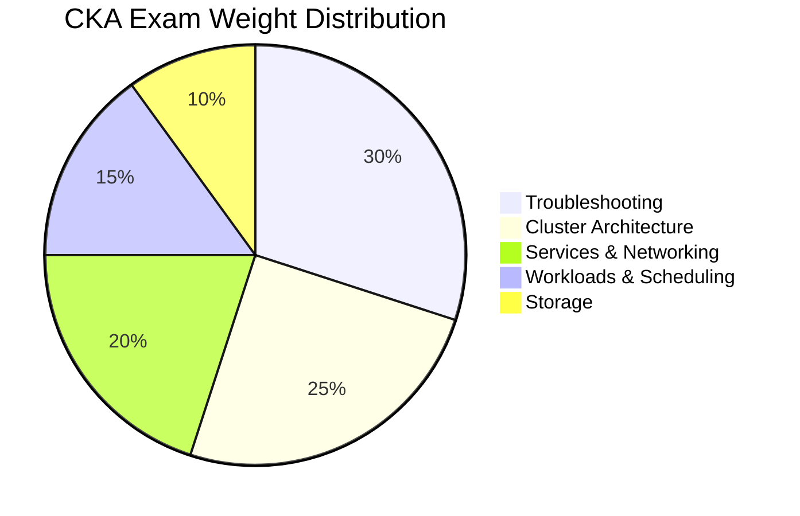
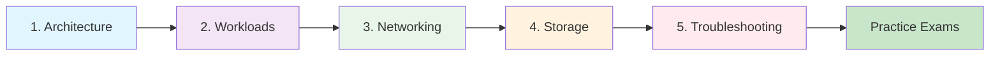

# CKA Exam Learning Guide

**Target**: Certified Kubernetes Administrator (CKA)
**Kubernetes Version**: v1.32+
**Last Updated**: 2025-11-27

## Exam Overview



| Domain | Weight | Time (2h) | Doc |
|--------|--------|-----------|-----|
| [Troubleshooting](05-troubleshooting.md) | 30% | 36 min | Debugging pods, nodes, networking, control plane |
| [Cluster Architecture](01-cluster-architecture.md) | 25% | 30 min | Control plane, kubeadm, etcd, RBAC, HA |
| [Services & Networking](03-services-networking.md) | 20% | 24 min | Services, DNS, NetworkPolicy, **Gateway API** |
| [Workloads & Scheduling](02-workloads-scheduling.md) | 15% | 18 min | Pods, Deployments, Scheduling, ConfigMaps |
| [Storage](04-storage.md) | 10% | 12 min | PV, PVC, StorageClasses |

### Bonus: Additional CKA Resources
| Document | Description |
|----------|-------------|
| [Installation Deep Dive](06-installation-deep-dive.md) | Complete 8-phase installation guide with CKA failure scenarios |
| [CKA 2025 New Topics](07-cka-2025-new-topics.md) | **NEW** Helm, Kustomize, HPA/VPA, CRDs, CNI/CSI/CRI, etcdutl |
| [Resource Management](08-resource-management.md) | **NEW** Namespaces, ResourceQuotas, LimitRanges, PDBs, Probes |
| [Practice Exam Questions](09-practice-exam-questions.md) | **NEW** 71 hands-on scenarios organized by domain |

## Study Path



**Recommended Order**:
1. **Architecture** - Understand the building blocks first
2. **Workloads** - How applications run on K8s
3. **Networking** - How apps communicate
4. **Storage** - How apps persist data
5. **Troubleshooting** - Diagnose when things break (LARGEST section!)

## Quick Links by Topic

### Control Plane
- [API Server, etcd, Scheduler](01-cluster-architecture.md#control-plane-components)
- [kubeadm init/join](01-cluster-architecture.md#kubeadm-operations)
- [etcd backup/restore](01-cluster-architecture.md#etcd-backup-and-restore)

### Workloads
- [Pod lifecycle](02-workloads-scheduling.md#pod-fundamentals)
- [Deployments vs StatefulSets](02-workloads-scheduling.md#workload-controllers)
- [Scheduling (affinity, taints)](02-workloads-scheduling.md#scheduling)

### Resource Management
- [Namespaces](08-resource-management.md#1-namespace-fundamentals)
- [ResourceQuotas](08-resource-management.md#2-resourcequota)
- [LimitRanges](08-resource-management.md#3-limitrange)
- [PodDisruptionBudgets](08-resource-management.md#4-poddisruptionbudget-pdb)
- [Container Probes](08-resource-management.md#5-container-probes-health-checks)

### Networking
- [Service types](03-services-networking.md#service-types)
- [Network Policies](03-services-networking.md#network-policies)
- [Gateway API (NEW!)](03-services-networking.md#gateway-api-2025-standard)

### Storage
- [PV/PVC lifecycle](04-storage.md#persistent-volumes-pv)
- [StorageClasses](04-storage.md#storageclasses)

### Troubleshooting
- [Pod issues](05-troubleshooting.md#pod-troubleshooting)
- [Node issues](05-troubleshooting.md#node-troubleshooting)
- [Network debugging](05-troubleshooting.md#network-troubleshooting)

### Installation Deep Dive (CKA Scenarios)
- [8-Phase Installation](06-installation-deep-dive.md#installation-phases-overview)
- [kubeadm init/join flags](06-installation-deep-dive.md#phase-5-cluster-bootstrap-kubeadm-init)
- [CKA Failure Scenarios](06-installation-deep-dive.md#cka-exam-failure-scenarios)
- [Certificate Management](06-installation-deep-dive.md#certificates-generated)

## Important 2025 Updates

### Gateway API Replaces Ingress
- **Ingress NGINX retiring**: November 2025
- **Gateway API** is the new standard
- See [Services & Networking](03-services-networking.md#gateway-api-2025-standard)

### Exam Environment
- **K8s Version**: 1.32+
- **Container Runtime**: containerd (dockershim removed)
- **Time**: 2 hours
- **Passing Score**: 74% (increased Feb 2025)
- **Format**: Performance-based (hands-on tasks)

## Your Cluster Context

This documentation is tailored for your specific cluster:

| Component | Configuration |
|-----------|---------------|
| **Masters** | 3 (HA with stacked etcd) |
| **Workers** | 2 |
| **CNI** | Cilium v1.18+ |
| **Ingress** | Gateway API (Cilium) |
| **Network** | vmnet2 (10.10.0.0/24) |
| **VIP** | 192.168.68.210 |

## Essential kubectl Commands

```bash
# Context switching (exam will have multiple clusters)
kubectl config get-contexts
kubectl config use-context <context-name>

# Quick resource generation
kubectl run nginx --image=nginx --dry-run=client -o yaml > pod.yaml
kubectl create deployment nginx --image=nginx --dry-run=client -o yaml > deploy.yaml
kubectl expose pod nginx --port=80 --dry-run=client -o yaml > svc.yaml

# Debugging
kubectl describe pod <pod>
kubectl logs <pod> [-c container] [--previous]
kubectl exec -it <pod> -- /bin/sh
kubectl debug node/<node> -it --image=busybox

# Fast editing
kubectl edit <resource> <name>
kubectl patch <resource> <name> -p '{"spec":...}'
```

## Exam Tips

1. **Use `kubectl explain`** - Built-in docs: `kubectl explain pod.spec.containers`
2. **Use `-o yaml --dry-run=client`** - Generate YAML templates quickly
3. **Bookmark kubernetes.io** - Only allowed reference during exam
4. **Practice with killer.sh** - Included with exam registration
5. **Time management** - Skip stuck questions, return later
