# Cluster Architecture, Installation & Configuration (CKA 25%)

**Exam Weight**: 25% of CKA exam score
**Kubernetes Version**: v1.32+ (exam aligns within 4-8 weeks of release)
**Pass Score**: 74% | **Duration**: 2 hours | **Clusters**: 6 different contexts

---

## Overview

The control plane manages cluster state while worker nodes run containerized applications. All control plane components typically run as static Pods in `/etc/kubernetes/manifests`.

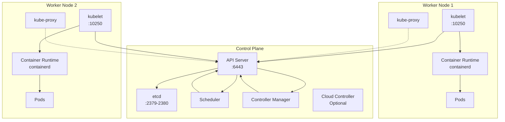

---

## Control Plane Components

### API Server (kube-apiserver)

**Purpose**: Frontend to the Kubernetes control plane, all operations go through the API server.

**Key Responsibilities**:
- Validates and processes REST requests
- Authentication and authorization (RBAC)
- Admission control
- Updates etcd with cluster state

**Critical Details**:
- Listens on port **6443** (HTTPS)
- Static Pod manifest: `/etc/kubernetes/manifests/kube-apiserver.yaml`
- Logs: `journalctl -u kubelet` or `kubectl logs -n kube-system kube-apiserver-<node>`

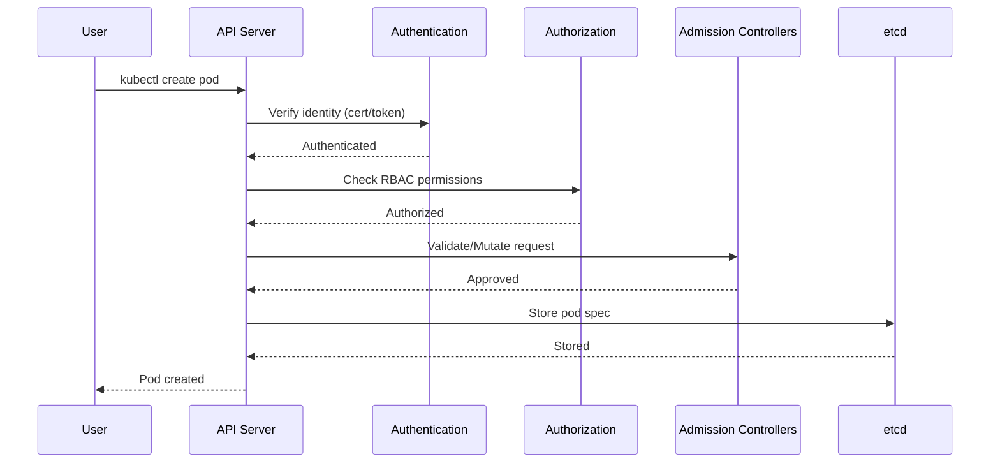

**Troubleshooting**:
```bash
# If API server is down, kubectl won't work - check directly on node
ssh master-node
sudo crictl ps -a | grep kube-apiserver
sudo cat /var/log/pods/kube-system_kube-apiserver-*/kube-apiserver/*.log
```

---

### etcd

**Purpose**: Distributed key-value store holding all cluster state and configuration.

**Key Responsibilities**:
- Stores cluster state (pods, services, secrets, configmaps)
- Provides watch API for state changes
- Leader election for HA

**Critical Details**:
- Client port: **2379**, Peer port: **2380**
- Data directory: `/var/lib/etcd` (default)
- Manifest: `/etc/kubernetes/manifests/etcd.yaml`
- **CRITICAL**: Only component that persists cluster state

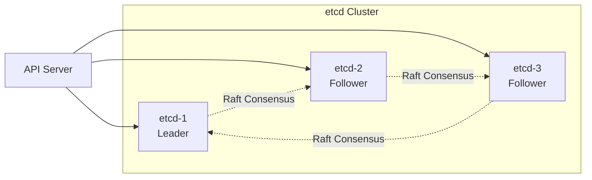

**Certificate Locations** (needed for backup/restore):
```bash
# Get from etcd pod manifest
kubectl describe pod etcd-<node> -n kube-system

# Typical locations
--cacert=/etc/kubernetes/pki/etcd/ca.crt
--cert=/etc/kubernetes/pki/etcd/server.crt
--key=/etc/kubernetes/pki/etcd/server.key
```

---

### Scheduler (kube-scheduler)

**Purpose**: Assigns Pods to Nodes based on resource requirements and constraints.

**Scheduling Process**:
1. **Filtering**: Eliminates nodes that don't meet requirements
2. **Scoring**: Ranks remaining nodes
3. **Binding**: Assigns Pod to highest-scoring node

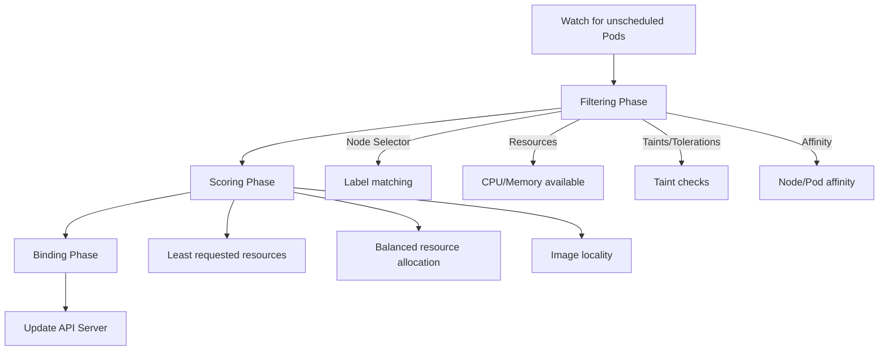

**Key Concepts**:
- **Node Selector**: Simple label-based scheduling
- **Node Affinity**: Advanced label-based rules (required/preferred)
- **Taints & Tolerations**: Prevent Pods from scheduling on nodes
- **Pod Affinity/Anti-Affinity**: Schedule based on other Pods

---

### Controller Manager (kube-controller-manager)

**Purpose**: Runs controllers that regulate cluster state (reconciliation loops).

**Core Controllers**:
- **Node Controller**: Monitors node health
- **Replication Controller**: Maintains correct number of Pods
- **Endpoints Controller**: Populates Endpoints objects
- **Service Account & Token Controllers**: Creates default accounts and API tokens

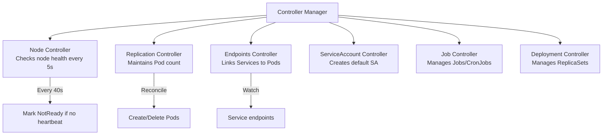

**Reconciliation Loop**:
```
Current State → Desired State → Reconcile → Repeat
```

---

## Worker Node Components

### kubelet

**Purpose**: Agent running on each node that ensures containers are running in Pods.

**Key Responsibilities**:
- Registers node with API server
- Watches for Pod assignments via API server
- Manages Pod lifecycle (create, start, stop, delete)
- Reports node and Pod status
- Executes liveness/readiness probes
- Mounts volumes

**Critical Details**:
- **NOT** a static Pod - runs as systemd service
- Port: **10250** (API endpoint)
- Config: `/var/lib/kubelet/config.yaml`
- Manifest directory: `/etc/kubernetes/manifests` (static Pods)

```bash
# Check kubelet status
systemctl status kubelet

# View logs
journalctl -u kubelet -f

# Restart after config changes
systemctl daemon-reload
systemctl restart kubelet
```

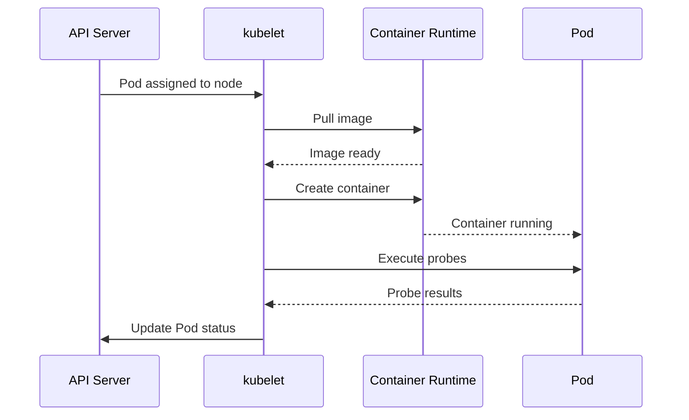

---

### kube-proxy

**Purpose**: Network proxy that maintains network rules for Service connectivity.

**Modes**:
- **iptables** (default): Uses iptables rules for load balancing
- **ipvs**: More efficient for large clusters
- **userspace**: Legacy mode (deprecated)

**Responsibilities**:
- Implements Service virtual IPs
- Load balances traffic to Pod endpoints
- Watches API server for Service/Endpoints changes

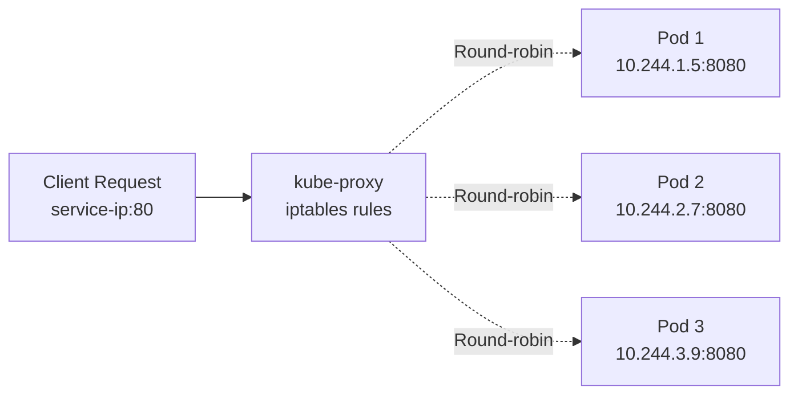

**Debug**:
```bash
# Check kube-proxy logs
kubectl logs -n kube-system kube-proxy-<pod-name>

# View iptables rules (if using iptables mode)
sudo iptables-save | grep <service-name>
```

---

### Container Runtime

**Purpose**: Software responsible for running containers (CRI-compliant).

**Supported Runtimes**:
- **containerd** (most common, CKA exam default)
- **CRI-O**
- **Docker Engine** (via cri-dockerd shim, dockershim removed in v1.24)

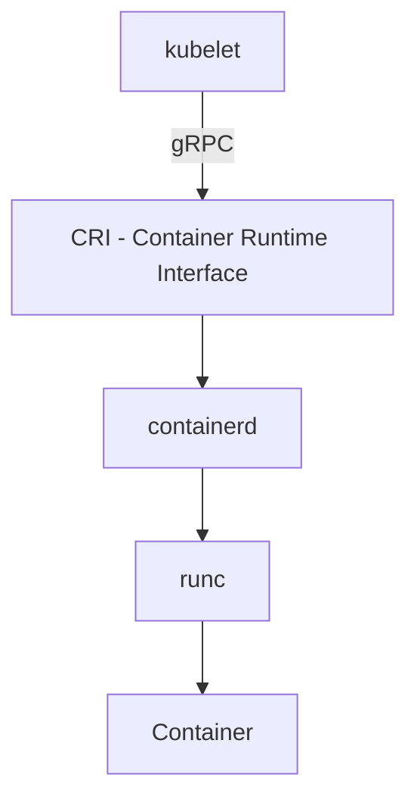

**crictl Commands** (CKA exam tool):
```bash
# List running containers
crictl ps

# List all containers (including stopped)
crictl ps -a

# Inspect container
crictl inspect <container-id>

# View container logs
crictl logs <container-id>

# List images
crictl images

# Execute command in container
crictl exec -it <container-id> /bin/sh
```

---

## kubeadm Cluster Operations

### Cluster Initialization

**Prerequisites** (per node):
- 2 vCPU minimum (control plane), 1 vCPU (worker)
- 2GB RAM minimum
- Swap disabled
- Unique hostname, MAC, product_uuid
- Required ports open (6443, 2379-2380, 10250-10252)
- Container runtime installed (containerd)

```bash
# Initialize control plane (standard)
sudo kubeadm init \
  --pod-network-cidr=10.244.0.0/16 \
  --apiserver-advertise-address=<control-plane-ip> \
  --control-plane-endpoint=<control-plane-endpoint>

# Initialize HA cluster with certificate upload (for multi-master)
# IMPORTANT: --upload-certs allows other masters to join without manual cert copy
sudo kubeadm init \
  --control-plane-endpoint "10.10.0.141:6443" \
  --upload-certs \
  --pod-network-cidr=10.244.0.0/16 \
  --service-cidr=10.96.0.0/12

# If using Cilium with kube-proxy replacement, skip kube-proxy:
sudo kubeadm init \
  --control-plane-endpoint "10.10.0.141:6443" \
  --upload-certs \
  --pod-network-cidr=10.244.0.0/16 \
  --service-cidr=10.96.0.0/12 \
  --skip-phases=addon/kube-proxy  # Critical for Cilium kube-proxy replacement!

# Setup kubeconfig
mkdir -p $HOME/.kube
sudo cp -i /etc/kubernetes/admin.conf $HOME/.kube/config
sudo chown $(id -u):$(id -g) $HOME/.kube/config

# Install CNI (example: Calico)
kubectl apply -f https://docs.projectcalico.org/manifests/calico.yaml

# Generate worker join command
kubeadm token create --print-join-command
```

**Control Plane Join (HA - Additional Masters)**:
```bash
# kubeadm init output provides this command with certificate-key
# Certificate-key is only valid for 2 hours after init!
sudo kubeadm join 10.10.0.141:6443 \
  --token <token> \
  --discovery-token-ca-cert-hash sha256:<hash> \
  --control-plane \
  --certificate-key <certificate-key>

# NOTE: Expected transient errors during join (these are NORMAL):
# - "node X not found" - before node registration completes
# - "etcd cluster is not healthy" - during etcd learner promotion
# - "can only promote a learner member which is in sync" - etcd sync in progress
# These resolve automatically within 30-60 seconds
```

**Worker Node Join**:
```bash
# On worker node (use command from kubeadm init output)
sudo kubeadm join <control-plane-ip>:6443 \
  --token <token> \
  --discovery-token-ca-cert-hash sha256:<hash>
```

**CNI Installation - Cilium with kube-proxy Replacement**:
```bash
# IMPORTANT: Install Gateway API CRDs BEFORE Cilium if using Gateway API
kubectl apply -f https://github.com/kubernetes-sigs/gateway-api/releases/download/v1.2.0/standard-install.yaml

# Add Cilium Helm repo
helm repo add cilium https://helm.cilium.io/
helm repo update

# Install Cilium 1.18+ with kube-proxy replacement
# Prerequisites: kubeadm init was run with --skip-phases=addon/kube-proxy
helm install cilium cilium/cilium --version 1.18.4 \
  --namespace kube-system \
  --set kubeProxyReplacement=true \           # Replaces kube-proxy entirely
  --set k8sServiceHost=10.10.0.141 \          # API server IP
  --set k8sServicePort=6443 \
  --set gatewayAPI.enabled=true \             # Enable Gateway API support
  --set l2announcements.enabled=true \        # For LoadBalancer on bare-metal
  --set hubble.relay.enabled=true \           # Observability
  --set hubble.ui.enabled=true \
  --set ipam.mode=kubernetes                  # Use Kubernetes IPAM
```

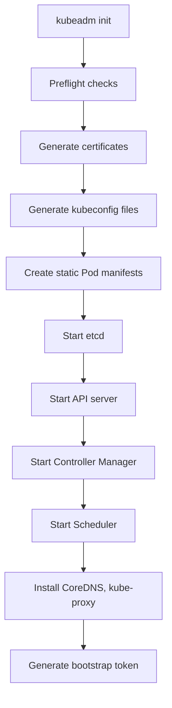

---

### Cluster Upgrade

**Version Skew Policy**:
- Kubelet version must match or be one minor version behind kubeadm
- **Cannot skip minor versions** (e.g., 1.29 → 1.30 → 1.31, not 1.29 → 1.31)

**Upgrade Workflow**:
1. Upgrade primary control plane node
2. Upgrade additional control plane nodes (if HA)
3. Upgrade worker nodes (one at a time or in batches)

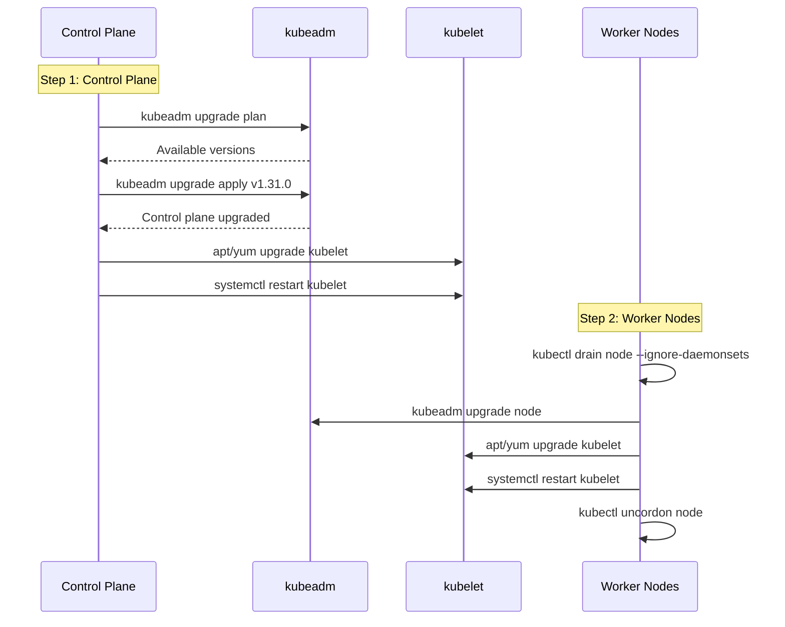

**Control Plane Upgrade** (Ubuntu/Debian):
```bash
# Step 1: Check available versions (on control plane)
sudo kubeadm upgrade plan

# Step 2: Update kubeadm
sudo apt-mark unhold kubeadm
sudo apt-get update && sudo apt-get install -y kubeadm=1.31.0-00
sudo apt-mark hold kubeadm

# Step 3: Verify version
kubeadm version

# Step 4: Upgrade control plane
sudo kubeadm upgrade apply v1.31.0

# Step 5: Drain control plane node
kubectl drain <control-plane-node> --ignore-daemonsets

# Step 6: Upgrade kubelet and kubectl
sudo apt-mark unhold kubelet kubectl
sudo apt-get update && sudo apt-get install -y kubelet=1.31.0-00 kubectl=1.31.0-00
sudo apt-mark hold kubelet kubectl

# Step 7: Restart kubelet
sudo systemctl daemon-reload
sudo systemctl restart kubelet

# Step 8: Uncordon node
kubectl uncordon <control-plane-node>

# Verify
kubectl get nodes
```

**Worker Node Upgrade**:
```bash
# On control plane: drain worker node
kubectl drain <worker-node> --ignore-daemonsets --delete-emptydir-data

# On worker node: upgrade kubeadm
sudo apt-mark unhold kubeadm
sudo apt-get update && sudo apt-get install -y kubeadm=1.31.0-00
sudo apt-mark hold kubeadm

# Upgrade node config
sudo kubeadm upgrade node

# Upgrade kubelet and kubectl
sudo apt-mark unhold kubelet kubectl
sudo apt-get update && sudo apt-get install -y kubelet=1.31.0-00 kubectl=1.31.0-00
sudo apt-mark hold kubelet kubectl

# Restart kubelet
sudo systemctl daemon-reload
sudo systemctl restart kubelet

# On control plane: uncordon node
kubectl uncordon <worker-node>
```

**Post-Upgrade Verification**:
```bash
# Verify kubelet status
systemctl status kubelet
journalctl -xeu kubelet

# Check cluster component versions
kubectl get nodes -o wide
kubectl version --short

# Verify all pods running
kubectl get pods -A
```

---

## etcd Backup and Restore

**CRITICAL CKA SKILL**: etcd is the single source of truth for cluster state.

### Backup

**Step 1: Identify etcd deployment type**
```bash
# Internal etcd (running as Pod)
kubectl get pods -n kube-system | grep etcd

# External etcd (systemd service)
systemctl status etcd
```

**Step 2: Get certificate paths**
```bash
# Method 1: Describe etcd Pod
kubectl describe pod etcd-<node-name> -n kube-system | grep -E 'cert|key|ca'

# Method 2: Check static Pod manifest
sudo cat /etc/kubernetes/manifests/etcd.yaml | grep -E 'cert|key|ca'

# Typical paths:
# --cacert=/etc/kubernetes/pki/etcd/ca.crt
# --cert=/etc/kubernetes/pki/etcd/server.crt
# --key=/etc/kubernetes/pki/etcd/server.key
```

**Step 3: Create backup**
```bash
# Export ETCDCTL_API version
export ETCDCTL_API=3

# Backup command
ETCDCTL_API=3 etcdctl snapshot save /opt/etcd-backup.db \
  --endpoints=https://127.0.0.1:2379 \
  --cacert=/etc/kubernetes/pki/etcd/ca.crt \
  --cert=/etc/kubernetes/pki/etcd/server.crt \
  --key=/etc/kubernetes/pki/etcd/server.key

# Verify backup
ETCDCTL_API=3 etcdctl snapshot status /opt/etcd-backup.db --write-out=table
```

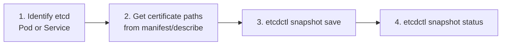

---

### Restore

**CRITICAL**: Restore creates a NEW data directory. You must update etcd configuration to use it.

**Step 1: Stop control plane components**
```bash
# Move static Pod manifests (they'll auto-restart when moved back)
sudo mv /etc/kubernetes/manifests/kube-apiserver.yaml /tmp/
sudo mv /etc/kubernetes/manifests/kube-controller-manager.yaml /tmp/
sudo mv /etc/kubernetes/manifests/kube-scheduler.yaml /tmp/
sudo mv /etc/kubernetes/manifests/etcd.yaml /tmp/

# Verify all stopped
crictl ps
```

**Step 2: Restore to new directory**
```bash
# Simple restore (recommended for CKA)
ETCDCTL_API=3 etcdctl snapshot restore /opt/etcd-backup.db \
  --data-dir=/var/lib/etcd-from-backup

# Full restore with cluster options
ETCDCTL_API=3 etcdctl snapshot restore /opt/etcd-backup.db \
  --endpoints=https://127.0.0.1:2379 \
  --cacert=/etc/kubernetes/pki/etcd/ca.crt \
  --cert=/etc/kubernetes/pki/etcd/server.crt \
  --key=/etc/kubernetes/pki/etcd/server.key \
  --data-dir=/var/lib/etcd-from-backup \
  --initial-cluster=master=https://127.0.0.1:2380 \
  --initial-cluster-token=etcd-cluster-1 \
  --initial-advertise-peer-urls=https://127.0.0.1:2380
```

**Step 3: Update etcd manifest**
```bash
# Edit etcd manifest
sudo vi /tmp/etcd.yaml

# Change volumes.hostPath.path from:
volumes:
- hostPath:
    path: /var/lib/etcd
    type: DirectoryOrCreate
  name: etcd-data

# To new restore directory:
volumes:
- hostPath:
    path: /var/lib/etcd-from-backup
    type: DirectoryOrCreate
  name: etcd-data
```

**Step 4: Restart control plane**
```bash
# Move manifests back (kubelet will restart them)
sudo mv /tmp/etcd.yaml /etc/kubernetes/manifests/
sudo mv /tmp/kube-apiserver.yaml /etc/kubernetes/manifests/
sudo mv /tmp/kube-controller-manager.yaml /etc/kubernetes/manifests/
sudo mv /tmp/kube-controller-manager.yaml /etc/kubernetes/manifests/

# Wait for containers to start (1-2 minutes)
watch crictl ps
```

**Step 5: Verify cluster**
```bash
# Check cluster status
kubectl get nodes
kubectl get pods -A
kubectl cluster-info
```

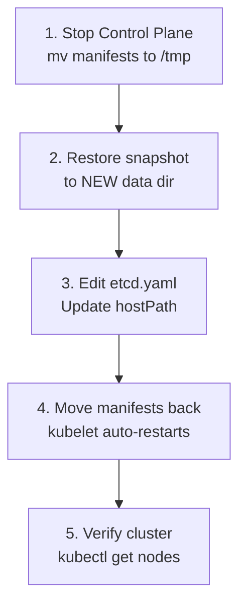

**Common Errors**:
```bash
# Error: data-dir not empty
# Solution: Remove old data directory
sudo rm -rf /var/lib/etcd
# Then restore again

# Error: permission denied
# Solution: Fix ownership
sudo chown -R etcd:etcd /var/lib/etcd-from-backup
```

**External etcd Restore** (if etcd runs as systemd service):
```bash
# After restore, restart etcd service
sudo systemctl daemon-reload
sudo systemctl restart etcd
systemctl status etcd

# Verify cluster health
ETCDCTL_API=3 etcdctl member list \
  --endpoints=https://127.0.0.1:2379 \
  --cacert=/etc/kubernetes/pki/etcd/ca.crt \
  --cert=/etc/kubernetes/pki/etcd/server.crt \
  --key=/etc/kubernetes/pki/etcd/server.key
```

---

## High Availability (HA) Architecture

### Stacked etcd Topology

**Design**: etcd runs on same nodes as control plane components (most common).

**Pros**:
- Simpler setup (fewer nodes)
- Easier management
- Lower resource requirements

**Cons**:
- Coupled failure domain (if control plane fails, etcd fails)
- Less resilient

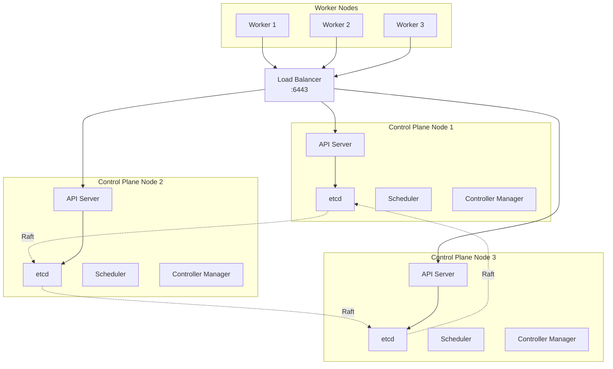

**Setup**:
```bash
# Initialize first control plane node
sudo kubeadm init --control-plane-endpoint "LOAD_BALANCER_DNS:6443" \
  --upload-certs \
  --pod-network-cidr=10.244.0.0/16

# Join additional control plane nodes
sudo kubeadm join LOAD_BALANCER_DNS:6443 \
  --token <token> \
  --discovery-token-ca-cert-hash sha256:<hash> \
  --control-plane \
  --certificate-key <cert-key>
```

---

### External etcd Topology

**Design**: etcd cluster runs on separate dedicated nodes.

**Pros**:
- Decoupled failure domain
- More resilient (etcd survives control plane failures)
- Better for large-scale production

**Cons**:
- More complex setup
- More nodes required
- Higher resource cost

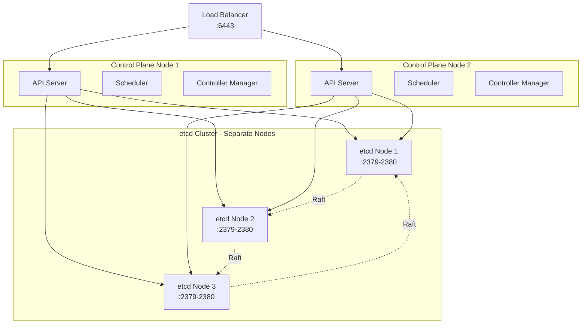

**Minimum Nodes**:
- **Stacked**: 3 control plane nodes (etcd + control plane)
- **External**: 3 etcd nodes + 2 control plane nodes = 5 total

**etcd Quorum**:
- 3 nodes: Can tolerate 1 failure (quorum = 2)
- 5 nodes: Can tolerate 2 failures (quorum = 3)
- Formula: Quorum = (N/2) + 1

---

## RBAC Fundamentals

**RBAC**: Role-Based Access Control - controls who can do what in the cluster.

### Core Concepts

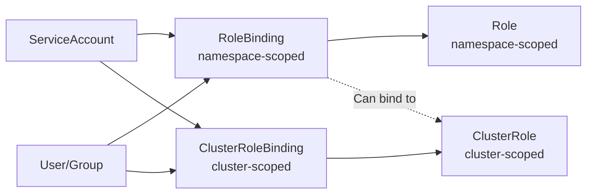

### Role vs ClusterRole

| Role | ClusterRole |
|------|-------------|
| Namespace-scoped | Cluster-scoped |
| Access to resources in ONE namespace | Access to resources in ALL namespaces |
| Example: pods, deployments, services | Example: nodes, PVs, namespaces |

**Role Example**:
```yaml
apiVersion: rbac.authorization.k8s.io/v1
kind: Role
metadata:
  namespace: production
  name: pod-reader
rules:
- apiGroups: [""]
  resources: ["pods"]
  verbs: ["get", "list", "watch"]
```

**ClusterRole Example**:
```yaml
apiVersion: rbac.authorization.k8s.io/v1
kind: ClusterRole
metadata:
  name: node-reader
rules:
- apiGroups: [""]
  resources: ["nodes"]
  verbs: ["get", "list", "watch"]
```

---

### RoleBinding vs ClusterRoleBinding

**RoleBinding**: Grants permissions defined in a Role to users/ServiceAccounts **within a specific namespace**.

```yaml
apiVersion: rbac.authorization.k8s.io/v1
kind: RoleBinding
metadata:
  name: read-pods
  namespace: production
subjects:
- kind: User
  name: jane
  apiGroup: rbac.authorization.k8s.io
roleRef:
  kind: Role
  name: pod-reader
  apiGroup: rbac.authorization.k8s.io
```

**ClusterRoleBinding**: Grants permissions defined in a ClusterRole **cluster-wide** (all namespaces).

```yaml
apiVersion: rbac.authorization.k8s.io/v1
kind: ClusterRoleBinding
metadata:
  name: read-nodes-global
subjects:
- kind: User
  name: jane
  apiGroup: rbac.authorization.k8s.io
roleRef:
  kind: ClusterRole
  name: node-reader
  apiGroup: rbac.authorization.k8s.io
```

**Important**: You can bind a ClusterRole to a RoleBinding (limits ClusterRole to a namespace):
```yaml
apiVersion: rbac.authorization.k8s.io/v1
kind: RoleBinding
metadata:
  name: read-pods-dev
  namespace: development
subjects:
- kind: User
  name: bob
roleRef:
  kind: ClusterRole  # ClusterRole bound at namespace level
  name: pod-reader
```

---

### Common Verbs

| Verb | Description |
|------|-------------|
| **get** | Read a specific resource |
| **list** | Read all resources of a type |
| **watch** | Watch for changes to resources |
| **create** | Create new resources |
| **update** | Update existing resources (full object) |
| **patch** | Partially update resources |
| **delete** | Delete resources |
| **deletecollection** | Delete multiple resources |

**Wildcard**: `verbs: ["*"]` grants all verbs

---

### ServiceAccounts

**Purpose**: Identity for Pods to authenticate with API server.

```bash
# Create ServiceAccount
kubectl create serviceaccount my-app -n production

# Create Role
kubectl create role pod-reader \
  --verb=get,list,watch \
  --resource=pods \
  -n production

# Bind Role to ServiceAccount
kubectl create rolebinding read-pods \
  --role=pod-reader \
  --serviceaccount=production:my-app \
  -n production

# Use in Pod
apiVersion: v1
kind: Pod
metadata:
  name: my-app
  namespace: production
spec:
  serviceAccountName: my-app
  containers:
  - name: app
    image: nginx
```

**Check Permissions**:
```bash
# Check if user can perform action
kubectl auth can-i create deployments --namespace=production

# Check as another user
kubectl auth can-i list pods --namespace=production --as=jane

# Check for ServiceAccount
kubectl auth can-i get pods --namespace=production \
  --as=system:serviceaccount:production:my-app
```

---

## Quick Reference - CKA Exam Commands

### Cluster Info
```bash
# Cluster information
kubectl cluster-info
kubectl cluster-info dump

# Node information
kubectl get nodes -o wide
kubectl describe node <node-name>

# Component status (deprecated but may appear)
kubectl get componentstatuses
```

### Control Plane Troubleshooting
```bash
# Check static Pods
kubectl get pods -n kube-system

# Describe control plane components
kubectl describe pod kube-apiserver-<node> -n kube-system
kubectl describe pod etcd-<node> -n kube-system

# Check manifests
ls -l /etc/kubernetes/manifests/
cat /etc/kubernetes/manifests/kube-apiserver.yaml

# kubelet logs (if API server is down)
journalctl -u kubelet -f
systemctl status kubelet
```

### etcd Operations
```bash
# Export API version
export ETCDCTL_API=3

# Backup
ETCDCTL_API=3 etcdctl snapshot save /tmp/etcd-backup.db \
  --endpoints=https://127.0.0.1:2379 \
  --cacert=/etc/kubernetes/pki/etcd/ca.crt \
  --cert=/etc/kubernetes/pki/etcd/server.crt \
  --key=/etc/kubernetes/pki/etcd/server.key

# Restore
ETCDCTL_API=3 etcdctl snapshot restore /tmp/etcd-backup.db \
  --data-dir=/var/lib/etcd-from-backup

# Verify
ETCDCTL_API=3 etcdctl snapshot status /tmp/etcd-backup.db --write-out=table
```

### Upgrade Operations
```bash
# Check upgrade plan
kubeadm upgrade plan

# Upgrade control plane
kubeadm upgrade apply v1.31.0

# Upgrade node configuration
kubeadm upgrade node

# Drain node
kubectl drain <node> --ignore-daemonsets --delete-emptydir-data

# Uncordon node
kubectl uncordon <node>
```

### Container Runtime (crictl)
```bash
# List containers
crictl ps
crictl ps -a

# Container logs
crictl logs <container-id>

# Execute in container
crictl exec -it <container-id> /bin/sh

# List images
crictl images

# Pull image
crictl pull nginx:latest
```

### RBAC
```bash
# Create ServiceAccount
kubectl create serviceaccount <name> -n <namespace>

# Create Role
kubectl create role <role-name> \
  --verb=get,list,watch \
  --resource=pods \
  -n <namespace>

# Create RoleBinding
kubectl create rolebinding <binding-name> \
  --role=<role-name> \
  --serviceaccount=<namespace>:<sa-name> \
  -n <namespace>

# Create ClusterRole
kubectl create clusterrole <role-name> \
  --verb=get,list \
  --resource=nodes

# Create ClusterRoleBinding
kubectl create clusterrolebinding <binding-name> \
  --clusterrole=<role-name> \
  --user=<user-name>

# Check permissions
kubectl auth can-i <verb> <resource> --namespace=<namespace>
kubectl auth can-i list pods --as=<user>
```

---

## Exam Tips

1. **Practice etcd backup/restore** - Most critical skill, appears frequently
2. **Know certificate paths** - `/etc/kubernetes/pki/etcd/`
3. **Static Pods location** - `/etc/kubernetes/manifests/`
4. **kubelet is NOT a Pod** - It's a systemd service
5. **Use crictl, not docker** - containerd is the runtime
6. **Drain before upgrade** - `kubectl drain --ignore-daemonsets`
7. **Check API server first** - If kubectl doesn't work, API server is down
8. **RBAC verb order** - get, list, watch, create, update, patch, delete
9. **ServiceAccount format** - `system:serviceaccount:<namespace>:<name>`
10. **Verify everything** - `kubectl get nodes`, `kubectl get pods -A`

---

## Sources

- [Linux Foundation CKA Certification](https://training.linuxfoundation.org/certification/certified-kubernetes-administrator-cka/)
- [CKA Study Guide 2025](https://passitexams.com/study-guide/cka/)
- [Kubernetes Upgrading kubeadm clusters](https://kubernetes.io/docs/tasks/administer-cluster/kubeadm/kubeadm-upgrade/)
- [DevOpsCube: Upgrade Kubernetes Cluster Using Kubeadm](https://devopscube.com/upgrade-kubernetes-cluster-kubeadm/)
- [DevOpsCube: etcd Backup and Restore Tutorial](https://devopscube.com/backup-etcd-restore-kubernetes/)
- [CKA Exam Task: Backup and Restore etcd](https://go-cloud-native.com/kubernetes/cka-exam-task-backup-and-restore-etcd)
- [GitHub: CKA Guide 2025](https://github.com/Cloud-Native-Islamabad/Certified-Kubernetes-Administrator-CKA-Guide-2025)
