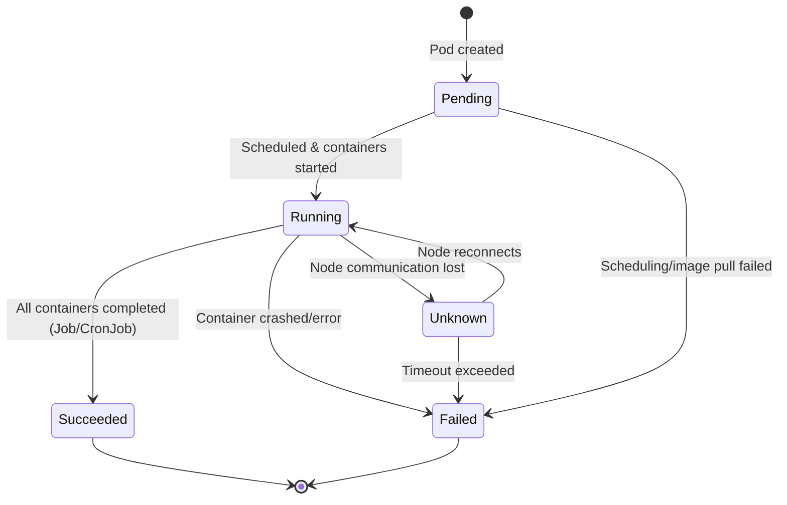
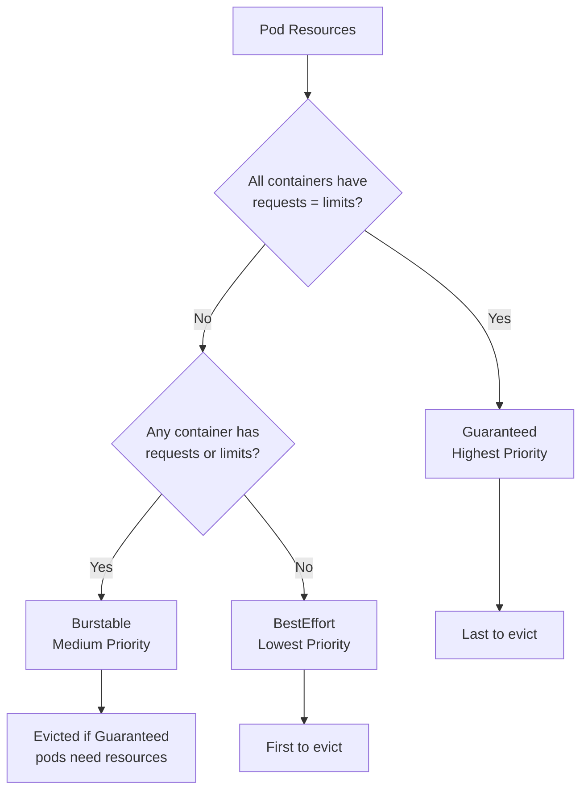
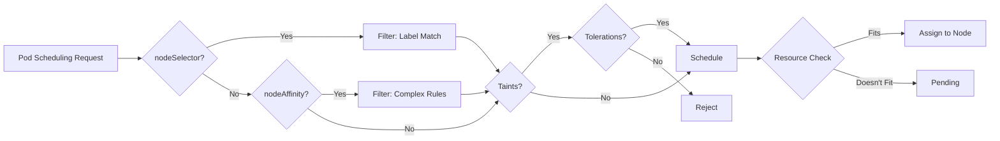

# Workloads & Scheduling (CKA 15%)

**CKA Exam Weight**: 15% | **Kubernetes Version**: v1.34+

## Overview

This domain tests your ability to deploy, configure, and manage workloads using Kubernetes primitives. Key objectives include:

- Deploying applications using various workload controllers
- Performing rolling updates and rollbacks
- Configuring applications with ConfigMaps and Secrets
- Managing resource allocation and pod scheduling
- Understanding pod lifecycle and self-healing mechanisms
- Implementing autoscaling and pod admission controls

---

## Pod Fundamentals

### Pod Lifecycle Phases



**Phase Definitions**:

| Phase | Meaning | Common Causes |
|-------|---------|---------------|
| **Pending** | Pod accepted but not running | Waiting for scheduler, image pull, insufficient resources |
| **Running** | Pod bound to node, ≥1 container running | Normal operational state |
| **Succeeded** | All containers terminated successfully | Batch jobs completed |
| **Failed** | ≥1 container terminated with error | Container crash, non-zero exit code |
| **Unknown** | Node communication lost | Network partition, kubelet down |

**Pod Conditions** (check with `kubectl describe pod`):
- `PodScheduled`: Pod assigned to a node
- `Initialized`: All init containers completed
- `ContainersReady`: All containers ready
- `Ready`: Pod ready to serve requests
- `PodReadyToStartContainers`: Pod sandbox created (v1.27+)

### Multi-Container Patterns

```yaml
# Sidecar pattern: Helper container alongside main app
apiVersion: v1
kind: Pod
metadata:
  name: web-app
spec:
  containers:
  - name: nginx
    image: nginx:1.25
    volumeMounts:
    - name: shared-logs
      mountPath: /var/log/nginx
  - name: log-shipper  # Sidecar
    image: fluent/fluent-bit:2.2
    volumeMounts:
    - name: shared-logs
      mountPath: /logs
  volumes:
  - name: shared-logs
    emptyDir: {}
```

```yaml
# Init container pattern: Run before main containers
apiVersion: v1
kind: Pod
metadata:
  name: db-app
spec:
  initContainers:
  - name: wait-for-db
    image: busybox:1.36
    command: ['sh', '-c', 'until nslookup db-service; do sleep 2; done']
  containers:
  - name: app
    image: myapp:v1
```

**Container Lifecycle Hooks**:

```yaml
apiVersion: v1
kind: Pod
metadata:
  name: lifecycle-demo
spec:
  containers:
  - name: app
    image: nginx:1.25
    lifecycle:
      postStart:  # Executed immediately after container creation
        exec:
          command: ["/bin/sh", "-c", "echo 'Container started' > /tmp/started"]
      preStop:  # Called before container termination (default 30s grace period)
        exec:
          command: ["/bin/sh", "-c", "nginx -s quit; while killall -0 nginx; do sleep 1; done"]
```

---

## Workload Controllers

### Controller Comparison Matrix

| Controller | Use Case | Pod Identity | Persistent Storage | Update Strategy |
|------------|----------|--------------|-------------------|-----------------|
| **Deployment** | Stateless apps | No (interchangeable) | No (ephemeral) | Rolling/Recreate |
| **StatefulSet** | Stateful apps (databases) | Yes (stable hostname) | Yes (PVC templates) | RollingUpdate/OnDelete |
| **DaemonSet** | Node-level services | No | Optional | RollingUpdate/OnDelete |
| **Job** | Batch processing | No | No | N/A (run-to-completion) |
| **CronJob** | Scheduled tasks | No | No | N/A (time-based) |
| **ReplicaSet** | Pod replication (low-level) | No | No | N/A (managed by Deployment) |

### Deployment: Stateless Applications

```yaml
apiVersion: apps/v1
kind: Deployment
metadata:
  name: web-frontend
  labels:
    app: frontend
spec:
  replicas: 3
  strategy:
    type: RollingUpdate  # or Recreate
    rollingUpdate:
      maxSurge: 1         # Max pods above desired count
      maxUnavailable: 1   # Max pods unavailable during update
  selector:
    matchLabels:
      app: frontend
  template:
    metadata:
      labels:
        app: frontend
        version: v1
    spec:
      containers:
      - name: nginx
        image: nginx:1.25
        ports:
        - containerPort: 80
        resources:
          requests:
            cpu: 100m
            memory: 128Mi
          limits:
            cpu: 200m
            memory: 256Mi
```

**Rolling Update Operations**:

```bash
# Update deployment image
kubectl set image deployment/web-frontend nginx=nginx:1.26 --record

# Check rollout status
kubectl rollout status deployment/web-frontend

# View rollout history
kubectl rollout history deployment/web-frontend

# Rollback to previous version
kubectl rollout undo deployment/web-frontend

# Rollback to specific revision
kubectl rollout undo deployment/web-frontend --to-revision=2

# Pause rollout (e.g., for canary testing)
kubectl rollout pause deployment/web-frontend

# Resume rollout
kubectl rollout resume deployment/web-frontend
```

### StatefulSet: Stateful Applications

```yaml
apiVersion: apps/v1
kind: StatefulSet
metadata:
  name: postgres-cluster
spec:
  serviceName: postgres-svc  # Required: Headless service for stable network identity
  replicas: 3
  selector:
    matchLabels:
      app: postgres
  template:
    metadata:
      labels:
        app: postgres
    spec:
      containers:
      - name: postgres
        image: postgres:16
        ports:
        - containerPort: 5432
          name: postgres
        volumeMounts:
        - name: data
          mountPath: /var/lib/postgresql/data
  volumeClaimTemplates:  # Creates PVC per pod
  - metadata:
      name: data
    spec:
      accessModes: ["ReadWriteOnce"]
      resources:
        requests:
          storage: 10Gi
---
# Headless service (clusterIP: None) for stable DNS names
apiVersion: v1
kind: Service
metadata:
  name: postgres-svc
spec:
  clusterIP: None  # Headless
  selector:
    app: postgres
  ports:
  - port: 5432
    name: postgres
```

**StatefulSet Pod Naming**: `<statefulset-name>-<ordinal-index>`
- `postgres-cluster-0.postgres-svc.default.svc.cluster.local`
- `postgres-cluster-1.postgres-svc.default.svc.cluster.local`
- `postgres-cluster-2.postgres-svc.default.svc.cluster.local`

**StatefulSet Guarantees**:
- Ordered deployment: Pods created sequentially (0→1→2)
- Ordered termination: Pods deleted in reverse (2→1→0)
- Stable network identity: DNS name persists across rescheduling
- Stable storage: PVCs persist even if pod deleted (manual cleanup required)

### DaemonSet: Node-Level Services

```yaml
apiVersion: apps/v1
kind: DaemonSet
metadata:
  name: node-exporter
  namespace: monitoring
spec:
  selector:
    matchLabels:
      app: node-exporter
  template:
    metadata:
      labels:
        app: node-exporter
    spec:
      hostNetwork: true  # Use host's network namespace
      hostPID: true      # Access host processes
      containers:
      - name: node-exporter
        image: prom/node-exporter:v1.7.0
        args:
          - --path.procfs=/host/proc
          - --path.sysfs=/host/sys
        ports:
        - containerPort: 9100
          name: metrics
        volumeMounts:
        - name: proc
          mountPath: /host/proc
          readOnly: true
        - name: sys
          mountPath: /host/sys
          readOnly: true
      volumes:
      - name: proc
        hostPath:
          path: /proc
      - name: sys
        hostPath:
          path: /sys
```

**DaemonSet Use Cases**:
- Node monitoring agents (Prometheus node-exporter, Datadog agent)
- Log collectors (Fluentd, Filebeat)
- Storage daemons (Ceph, GlusterFS)
- Network plugins (CNI, kube-proxy alternatives)

### Job: Batch Processing

```yaml
apiVersion: batch/v1
kind: Job
metadata:
  name: data-import
spec:
  completions: 5        # Total successful completions needed
  parallelism: 2        # Max concurrent pods
  backoffLimit: 3       # Retries before marking failed
  activeDeadlineSeconds: 600  # Timeout (10 min)
  template:
    spec:
      restartPolicy: Never  # or OnFailure
      containers:
      - name: importer
        image: data-importer:v1
        command: ["python", "import.py"]
        args: ["--batch", "$(JOB_COMPLETION_INDEX)"]
      # Pods created: data-import-xxxxx-0, data-import-xxxxx-1, etc.
```

**Job Patterns**:

```yaml
# Work Queue Pattern: Each pod pulls items from queue
apiVersion: batch/v1
kind: Job
metadata:
  name: queue-worker
spec:
  parallelism: 10  # 10 concurrent workers
  completions: 50  # Process 50 items total
  template:
    spec:
      restartPolicy: OnFailure
      containers:
      - name: worker
        image: queue-processor:v1
        env:
        - name: QUEUE_URL
          value: "redis://queue-service:6379"
```

### CronJob: Scheduled Tasks

```yaml
apiVersion: batch/v1
kind: CronJob
metadata:
  name: backup-db
spec:
  schedule: "0 2 * * *"  # Every day at 2:00 AM (UTC)
  timeZone: "America/Los_Angeles"  # v1.27+
  concurrencyPolicy: Forbid  # Forbid|Allow|Replace
  successfulJobsHistoryLimit: 3
  failedJobsHistoryLimit: 1
  jobTemplate:
    spec:
      template:
        spec:
          restartPolicy: OnFailure
          containers:
          - name: backup
            image: pg-backup:v1
            command: ["/bin/sh"]
            args: ["-c", "pg_dump $DB_URL > /backups/$(date +%Y%m%d).sql"]
            volumeMounts:
            - name: backups
              mountPath: /backups
          volumes:
          - name: backups
            persistentVolumeClaim:
              claimName: backup-pvc
```

**Cron Schedule Format**: `minute hour day-of-month month day-of-week`
- `*/5 * * * *` - Every 5 minutes
- `0 */2 * * *` - Every 2 hours
- `0 9-17 * * 1-5` - Hourly, 9am-5pm, weekdays
- `0 0 1 * *` - Monthly on 1st at midnight

**Concurrency Policies**:
- `Allow`: Multiple jobs can run concurrently (default)
- `Forbid`: Skip new run if previous still running
- `Replace`: Cancel running job, start new one

---

## Configuration Management

### ConfigMaps

```yaml
# ConfigMap definition
apiVersion: v1
kind: ConfigMap
metadata:
  name: app-config
data:
  # Key-value pairs
  database.url: "postgres://db.example.com:5432"
  log.level: "INFO"
  # File-like keys
  nginx.conf: |
    server {
      listen 80;
      server_name example.com;
      location / {
        proxy_pass http://backend:8080;
      }
    }
```

**ConfigMap Usage Patterns**:

```yaml
apiVersion: v1
kind: Pod
metadata:
  name: app-pod
spec:
  containers:
  - name: app
    image: myapp:v1
    # Pattern 1: Environment variables from ConfigMap keys
    env:
    - name: DB_URL
      valueFrom:
        configMapKeyRef:
          name: app-config
          key: database.url
    # Pattern 2: All ConfigMap keys as env vars
    envFrom:
    - configMapRef:
        name: app-config
    # Pattern 3: Mount ConfigMap as volume (files)
    volumeMounts:
    - name: config-volume
      mountPath: /etc/nginx/nginx.conf
      subPath: nginx.conf  # Mount single file, not directory
  volumes:
  - name: config-volume
    configMap:
      name: app-config
```

**Create ConfigMaps from CLI**:

```bash
# From literal values
kubectl create configmap app-config \
  --from-literal=db.url=postgres://db:5432 \
  --from-literal=log.level=DEBUG

# From file
kubectl create configmap nginx-config --from-file=nginx.conf

# From directory (all files become keys)
kubectl create configmap configs --from-file=./config-dir/

# From env file (key=value format)
kubectl create configmap env-config --from-env-file=app.env
```

### Secrets

```yaml
# Secret definition (base64 encoded)
apiVersion: v1
kind: Secret
metadata:
  name: db-credentials
type: Opaque  # Generic secret type
data:
  username: cG9zdGdyZXM=  # "postgres" base64 encoded
  password: c3VwZXJzZWNyZXQxMjM=  # "supersecret123" base64
stringData:  # Alternative: plain text (auto-encoded)
  admin-password: "admin123"
---
# TLS secret type
apiVersion: v1
kind: Secret
metadata:
  name: tls-secret
type: kubernetes.io/tls
data:
  tls.crt: <base64-cert>
  tls.key: <base64-key>
```

**Secret Usage Patterns**:

```yaml
apiVersion: v1
kind: Pod
metadata:
  name: app-pod
spec:
  containers:
  - name: app
    image: myapp:v1
    # Pattern 1: Individual secret keys as env vars
    env:
    - name: DB_USER
      valueFrom:
        secretKeyRef:
          name: db-credentials
          key: username
    - name: DB_PASS
      valueFrom:
        secretKeyRef:
          name: db-credentials
          key: password
    # Pattern 2: All secret keys as env vars
    envFrom:
    - secretRef:
        name: db-credentials
    # Pattern 3: Mount secret as volume (files)
    volumeMounts:
    - name: secret-volume
      mountPath: /etc/secrets
      readOnly: true  # Best practice
  volumes:
  - name: secret-volume
    secret:
      secretName: db-credentials
      defaultMode: 0400  # Read-only for owner
```

**Create Secrets from CLI**:

```bash
# From literal values
kubectl create secret generic db-creds \
  --from-literal=username=postgres \
  --from-literal=password=secret123

# From files
kubectl create secret generic ssh-key \
  --from-file=id_rsa=~/.ssh/id_rsa

# TLS secret
kubectl create secret tls tls-cert \
  --cert=path/to/tls.crt \
  --key=path/to/tls.key

# Docker registry credentials
kubectl create secret docker-registry regcred \
  --docker-server=registry.example.com \
  --docker-username=user \
  --docker-password=pass \
  --docker-email=user@example.com
```

**Secret Types**:

| Type | Usage |
|------|-------|
| `Opaque` | Generic key-value data (default) |
| `kubernetes.io/tls` | TLS certificate and key |
| `kubernetes.io/dockerconfigjson` | Docker registry authentication |
| `kubernetes.io/basic-auth` | Basic authentication credentials |
| `kubernetes.io/ssh-auth` | SSH private key |
| `kubernetes.io/service-account-token` | Service account token (auto-created) |

---

## Resource Management

### Requests and Limits

```yaml
apiVersion: v1
kind: Pod
metadata:
  name: resource-demo
spec:
  containers:
  - name: app
    image: myapp:v1
    resources:
      requests:  # Minimum guaranteed resources
        cpu: 250m      # 0.25 CPU cores
        memory: 512Mi  # 512 MiB
        ephemeral-storage: 2Gi
      limits:    # Maximum allowed resources
        cpu: 500m      # 0.5 CPU cores
        memory: 1Gi    # 1 GiB
        ephemeral-storage: 4Gi
```

**Resource Units**:
- **CPU**: `1` = 1 CPU core | `100m` = 0.1 cores (100 millicores)
- **Memory**: `128Mi` (mebibytes) = 134217728 bytes | `1Gi` (gibibytes) = 1073741824 bytes
- **Storage**: `1Gi` = 1 gibibyte ephemeral storage (container writable layer + logs)

**QoS Classes** (auto-assigned based on requests/limits):



**QoS Eviction Order** (during node resource pressure):
1. **BestEffort**: Evicted first (no requests/limits defined)
2. **Burstable**: Evicted second (exceeding requests)
3. **Guaranteed**: Evicted last (only if exceeding limits)

**LimitRange** (namespace-level defaults):

```yaml
apiVersion: v1
kind: LimitRange
metadata:
  name: resource-limits
  namespace: production
spec:
  limits:
  - max:  # Maximum allowed per container
      cpu: "2"
      memory: 4Gi
    min:  # Minimum required per container
      cpu: 100m
      memory: 128Mi
    default:  # Default limits if not specified
      cpu: 500m
      memory: 1Gi
    defaultRequest:  # Default requests if not specified
      cpu: 250m
      memory: 512Mi
    type: Container
  - max:  # Maximum per Pod
      cpu: "4"
      memory: 8Gi
    type: Pod
```

**ResourceQuota** (namespace-level total limits):

```yaml
apiVersion: v1
kind: ResourceQuota
metadata:
  name: compute-quota
  namespace: production
spec:
  hard:
    requests.cpu: "10"      # Total CPU requests
    requests.memory: 20Gi   # Total memory requests
    limits.cpu: "20"        # Total CPU limits
    limits.memory: 40Gi     # Total memory limits
    pods: "50"              # Max pod count
    persistentvolumeclaims: "10"  # Max PVC count
    services.loadbalancers: "2"   # Max LoadBalancer services
```

---

## Pod Scheduling

### Node Selection Mechanisms



### nodeSelector (Simple Label Matching)

```yaml
apiVersion: v1
kind: Pod
metadata:
  name: gpu-pod
spec:
  nodeSelector:
    gpu: "true"  # Requires node labeled: gpu=true
    disktype: ssd
  containers:
  - name: app
    image: ml-training:v1
```

```bash
# Label nodes
kubectl label nodes node1 gpu=true
kubectl label nodes node2 disktype=ssd

# View node labels
kubectl get nodes --show-labels
```

### Node Affinity (Advanced Scheduling)

```yaml
apiVersion: v1
kind: Pod
metadata:
  name: affinity-demo
spec:
  affinity:
    nodeAffinity:
      # REQUIRED: Must match during scheduling
      requiredDuringSchedulingIgnoredDuringExecution:
        nodeSelectorTerms:
        - matchExpressions:
          - key: kubernetes.io/arch
            operator: In  # In, NotIn, Exists, DoesNotExist, Gt, Lt
            values:
            - amd64
            - arm64
      # PREFERRED: Soft constraint with weight
      preferredDuringSchedulingIgnoredDuringExecution:
      - weight: 80  # 1-100 (higher = more preferred)
        preference:
          matchExpressions:
          - key: disktype
            operator: In
            values:
            - ssd
      - weight: 20
        preference:
          matchExpressions:
          - key: region
            operator: In
            values:
            - us-west
  containers:
  - name: app
    image: myapp:v1
```

**Affinity Operators**:
- `In`: Label value in list
- `NotIn`: Label value not in list
- `Exists`: Label key exists (ignore values)
- `DoesNotExist`: Label key doesn't exist
- `Gt`: Label value greater than (numeric)
- `Lt`: Label value less than (numeric)

### Pod Affinity and Anti-Affinity

```yaml
apiVersion: apps/v1
kind: Deployment
metadata:
  name: web-frontend
spec:
  replicas: 3
  selector:
    matchLabels:
      app: web
  template:
    metadata:
      labels:
        app: web
    spec:
      affinity:
        # ANTI-AFFINITY: Spread pods across nodes/zones
        podAntiAffinity:
          requiredDuringSchedulingIgnoredDuringExecution:
          - labelSelector:
              matchExpressions:
              - key: app
                operator: In
                values:
                - web
            topologyKey: kubernetes.io/hostname  # Don't schedule on same node
        # AFFINITY: Co-locate with cache pods
        podAffinity:
          preferredDuringSchedulingIgnoredDuringExecution:
          - weight: 100
            podAffinityTerm:
              labelSelector:
                matchExpressions:
                - key: app
                  operator: In
                  values:
                  - redis
              topologyKey: kubernetes.io/zone  # Prefer same zone
      containers:
      - name: nginx
        image: nginx:1.25
```

**Common topologyKey Values**:
- `kubernetes.io/hostname`: Node-level (spread across nodes)
- `topology.kubernetes.io/zone`: Zone-level (spread across availability zones)
- `topology.kubernetes.io/region`: Region-level (spread across regions)

### Taints and Tolerations

```bash
# Add taint to node (prevents scheduling)
kubectl taint nodes node1 gpu=true:NoSchedule

# Taint effects:
# - NoSchedule: Don't schedule new pods
# - PreferNoSchedule: Soft version of NoSchedule
# - NoExecute: Evict existing pods + don't schedule new

# Remove taint
kubectl taint nodes node1 gpu=true:NoSchedule-

# View node taints
kubectl describe node node1 | grep Taints
```

```yaml
apiVersion: v1
kind: Pod
metadata:
  name: gpu-pod
spec:
  tolerations:
  - key: "gpu"
    operator: "Equal"  # Equal or Exists
    value: "true"
    effect: "NoSchedule"
  # Tolerate all taints with key "special"
  - key: "special"
    operator: "Exists"
  # Tolerate NoExecute and stay for 3600s after taint added
  - key: "maintenance"
    operator: "Exists"
    effect: "NoExecute"
    tolerationSeconds: 3600
  containers:
  - name: app
    image: ml-training:v1
```

**Built-in Taints**:
- `node.kubernetes.io/not-ready`: Node not ready (auto-added)
- `node.kubernetes.io/unreachable`: Node unreachable (auto-added)
- `node.kubernetes.io/disk-pressure`: Low disk space (auto-added)
- `node.kubernetes.io/memory-pressure`: Low memory (auto-added)
- `node.kubernetes.io/pid-pressure`: Too many processes (auto-added)
- `node.kubernetes.io/network-unavailable`: Network not configured (auto-added)

### Topology Spread Constraints (v1.19+)

```yaml
apiVersion: apps/v1
kind: Deployment
metadata:
  name: balanced-app
spec:
  replicas: 6
  selector:
    matchLabels:
      app: balanced
  template:
    metadata:
      labels:
        app: balanced
    spec:
      topologySpreadConstraints:
      - maxSkew: 1  # Max difference between zones
        topologyKey: topology.kubernetes.io/zone
        whenUnsatisfiable: DoNotSchedule  # or ScheduleAnyway
        labelSelector:
          matchLabels:
            app: balanced
      - maxSkew: 2
        topologyKey: kubernetes.io/hostname
        whenUnsatisfiable: ScheduleAnyway
        labelSelector:
          matchLabels:
            app: balanced
      containers:
      - name: app
        image: myapp:v1
```

**Example Distribution** (3 zones, 6 replicas, maxSkew=1):
- Zone A: 2 pods
- Zone B: 2 pods
- Zone C: 2 pods
(Perfectly balanced: difference ≤ 1)

---

## Static Pods

**Definition**: Pods managed directly by kubelet on a specific node (not via API server).

**Use Cases**:
- Control plane components (kube-apiserver, kube-controller-manager, kube-scheduler, etcd)
- Node-level system services

**Static Pod Manifests Location**:

```bash
# Default path (configured in kubelet)
/etc/kubernetes/manifests/

# Check kubelet config for custom path
cat /var/lib/kubelet/config.yaml | grep staticPodPath
```

**Create Static Pod**:

```yaml
# Create file: /etc/kubernetes/manifests/static-web.yaml
apiVersion: v1
kind: Pod
metadata:
  name: static-web
  labels:
    role: static-pod
spec:
  containers:
  - name: nginx
    image: nginx:1.25
    ports:
    - containerPort: 80
```

**Static Pod Behavior**:
- Kubelet watches manifest directory and auto-creates/updates/deletes pods
- Mirror pod created in API server (read-only, suffixed with node name)
- Example: `static-web-node1` appears in `kubectl get pods`
- Cannot be deleted via `kubectl delete` (delete manifest file instead)
- Always bound to specific node (no rescheduling)

```bash
# View static pods (look for node suffix)
kubectl get pods -n kube-system

# Example output:
# kube-apiserver-master1        1/1  Running  kube-apiserver
# etcd-master1                  1/1  Running  etcd

# Delete static pod (remove manifest)
sudo rm /etc/kubernetes/manifests/static-web.yaml
# Kubelet auto-deletes pod within ~20 seconds
```

---

## Quick Reference

### Essential kubectl Commands

```bash
# --- Deployments ---
kubectl create deployment web --image=nginx:1.25 --replicas=3
kubectl scale deployment web --replicas=5
kubectl set image deployment/web nginx=nginx:1.26 --record
kubectl rollout status deployment/web
kubectl rollout undo deployment/web
kubectl rollout history deployment/web

# --- Pods ---
kubectl run pod1 --image=nginx:1.25
kubectl run pod2 --image=busybox --restart=Never -- sleep 3600
kubectl get pods -o wide --show-labels
kubectl describe pod pod1
kubectl logs pod1 -f  # Follow logs
kubectl logs pod1 -c container-name  # Multi-container pod
kubectl exec -it pod1 -- /bin/bash
kubectl delete pod pod1 --grace-period=0 --force  # Force delete

# --- Jobs & CronJobs ---
kubectl create job test-job --image=busybox -- echo "Hello"
kubectl create cronjob backup --image=backup:v1 --schedule="0 2 * * *" -- /backup.sh
kubectl get jobs,cronjobs
kubectl logs job/test-job

# --- ConfigMaps & Secrets ---
kubectl create configmap app-config --from-literal=key=value
kubectl create secret generic db-creds --from-literal=password=secret123
kubectl get configmap app-config -o yaml
kubectl describe secret db-creds

# --- Resource Management ---
kubectl top nodes  # Node resource usage
kubectl top pods   # Pod resource usage
kubectl describe node node1 | grep -A 5 "Allocated resources"
kubectl get resourcequota -n production
kubectl get limitrange -n production

# --- Scheduling ---
kubectl label nodes node1 disktype=ssd
kubectl taint nodes node1 key=value:NoSchedule
kubectl describe node node1 | grep Taints
kubectl get pods -o wide  # Show which node pods are on
kubectl get events --sort-by=.metadata.creationTimestamp

# --- Debugging ---
kubectl get pods --field-selector=status.phase=Pending
kubectl describe pod failing-pod
kubectl logs pod-name --previous  # Logs from crashed container
kubectl get events --field-selector involvedObject.name=pod-name
```

### Common YAML Snippets

```yaml
# Multi-container pod with shared volume
apiVersion: v1
kind: Pod
metadata:
  name: multi-container
spec:
  containers:
  - name: app
    image: nginx:1.25
    volumeMounts:
    - name: shared
      mountPath: /app/data
  - name: sidecar
    image: busybox:1.36
    command: ['sh', '-c', 'tail -f /data/access.log']
    volumeMounts:
    - name: shared
      mountPath: /data
  volumes:
  - name: shared
    emptyDir: {}

# Deployment with resource limits + probes
apiVersion: apps/v1
kind: Deployment
metadata:
  name: production-app
spec:
  replicas: 3
  selector:
    matchLabels:
      app: prod
  template:
    metadata:
      labels:
        app: prod
    spec:
      containers:
      - name: app
        image: myapp:v1
        resources:
          requests:
            cpu: 250m
            memory: 512Mi
          limits:
            cpu: 500m
            memory: 1Gi
        livenessProbe:
          httpGet:
            path: /health
            port: 8080
          initialDelaySeconds: 30
          periodSeconds: 10
        readinessProbe:
          httpGet:
            path: /ready
            port: 8080
          initialDelaySeconds: 5
          periodSeconds: 5

# StatefulSet with persistent storage
apiVersion: apps/v1
kind: StatefulSet
metadata:
  name: database
spec:
  serviceName: db-service
  replicas: 3
  selector:
    matchLabels:
      app: db
  template:
    metadata:
      labels:
        app: db
    spec:
      containers:
      - name: postgres
        image: postgres:16
        volumeMounts:
        - name: data
          mountPath: /var/lib/postgresql/data
  volumeClaimTemplates:
  - metadata:
      name: data
    spec:
      accessModes: ["ReadWriteOnce"]
      resources:
        requests:
          storage: 10Gi

# DaemonSet with tolerations
apiVersion: apps/v1
kind: DaemonSet
metadata:
  name: log-collector
spec:
  selector:
    matchLabels:
      app: logs
  template:
    metadata:
      labels:
        app: logs
    spec:
      tolerations:
      - effect: NoSchedule
        operator: Exists  # Tolerate all taints
      containers:
      - name: fluentd
        image: fluent/fluentd:v1.16
        volumeMounts:
        - name: varlog
          mountPath: /var/log
      volumes:
      - name: varlog
        hostPath:
          path: /var/log

# Job with parallelism
apiVersion: batch/v1
kind: Job
metadata:
  name: parallel-job
spec:
  completions: 10
  parallelism: 3
  backoffLimit: 3
  template:
    spec:
      restartPolicy: OnFailure
      containers:
      - name: worker
        image: worker:v1
        command: ["process", "--task=$(JOB_COMPLETION_INDEX)"]
```

### Scheduling Decision Tree

```
Pod Creation
    ├─ NodeSelector labels match? ────── No ────> Pending
    │   └─ Yes
    ├─ Node affinity rules satisfied? ── No ────> Pending
    │   └─ Yes
    ├─ Node taints + pod tolerations? ── No ────> Pending
    │   └─ Yes
    ├─ Resource requests fit node? ───── No ────> Pending
    │   └─ Yes
    ├─ Pod affinity/anti-affinity OK? ── No ────> Pending
    │   └─ Yes
    └─ Schedule to best node (scoring phase)
```

### CKA Exam Tips

**Time Management**:
- Workloads & Scheduling: 15% of exam (~18 minutes of 120-minute exam)
- Practice YAML from memory (no copy-paste in exam environment)
- Use `kubectl explain` for field lookups: `kubectl explain deployment.spec.strategy`

**Common Tasks**:
1. Create Deployment, scale, perform rolling update, rollback
2. Configure pod with ConfigMap/Secret (env vars + volumes)
3. Set resource requests/limits, verify QoS class
4. Schedule pod on specific node using nodeSelector or affinity
5. Create DaemonSet with tolerations for tainted nodes
6. Configure StatefulSet with PVCs
7. Create Job/CronJob for batch processing

**Imperative Commands** (faster than YAML):

```bash
# Generate YAML without applying (modify and apply later)
kubectl create deployment web --image=nginx --replicas=3 --dry-run=client -o yaml > deploy.yaml

# Create and expose deployment
kubectl create deployment web --image=nginx --replicas=3
kubectl expose deployment web --port=80 --target-port=80

# Create pod with resource limits
kubectl run limited-pod --image=nginx \
  --requests='cpu=100m,memory=256Mi' \
  --limits='cpu=200m,memory=512Mi'

# Create secret from literal
kubectl create secret generic db-pass --from-literal=password=secret123

# Create configmap from file
kubectl create configmap app-config --from-file=config.properties
```

**Troubleshooting Checklist**:

| Symptom | Common Causes | Debug Commands |
|---------|---------------|----------------|
| Pod Pending | No nodes match, insufficient resources | `kubectl describe pod` → Events |
| Pod CrashLoopBackOff | App error, missing deps, config issue | `kubectl logs pod --previous` |
| Pod ImagePullBackOff | Invalid image name, auth issue | `kubectl describe pod` → Events |
| Deployment not updating | Typo in selector, image tag unchanged | `kubectl rollout status`, `describe` |
| StatefulSet stuck scaling | PVC not bound, volume provisioning failed | `kubectl get pvc`, `describe statefulset` |
| Job not completing | Container exiting with error | `kubectl logs job/name`, check backoffLimit |

---

## Sources

- [Kubernetes Pod Lifecycle Official Docs](https://kubernetes.io/docs/concepts/workloads/pods/pod-lifecycle/)
- [CKA Exam Curriculum 2025](https://training.linuxfoundation.org/certification/certified-kubernetes-administrator-cka/)
- [CKA Exam Updates Post-February 2025](https://medium.com/@DynamoDevOps/the-cka-exam-changed-after-february-18-heres-what-you-actually-need-to-practice-now-a9941213a65a)
- [Kubernetes Pod Scheduling Best Practices](https://www.cloudbolt.io/kubernetes-pod-scheduling/)
- [Understanding Pod Lifecycle Phases](https://devopscube.com/kubernetes-pod-lifecycle/)

---

**Document Version**: 1.0
**Last Updated**: 2025-11-25
**Target Kubernetes Version**: v1.34+
**CKA Exam Domain**: Workloads & Scheduling (15%)
