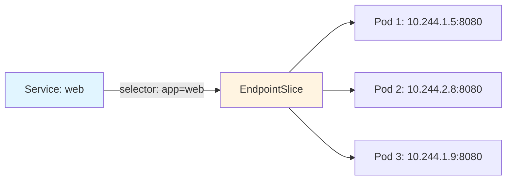
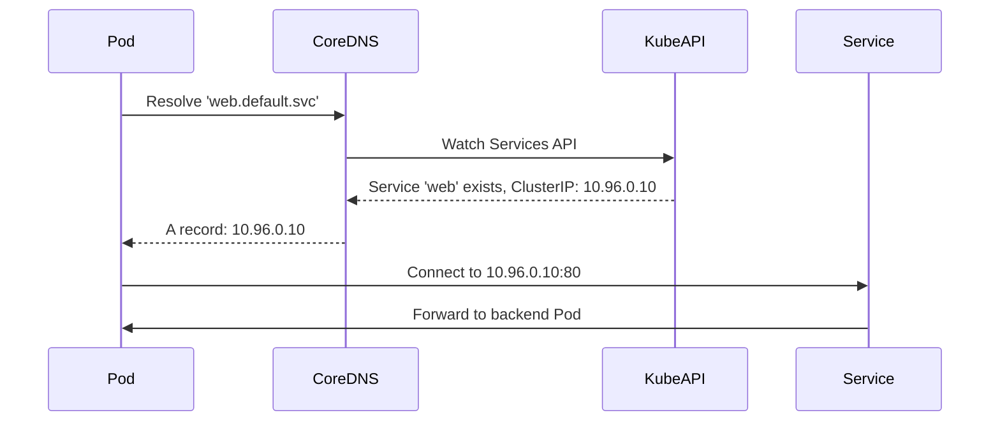
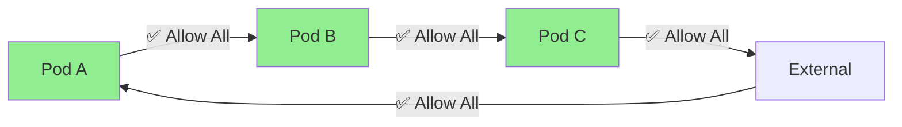
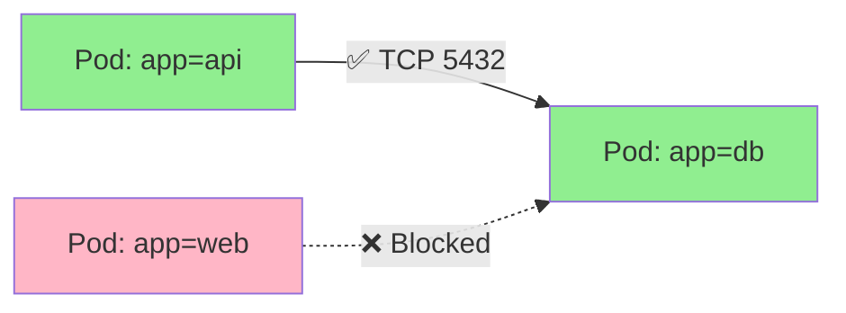
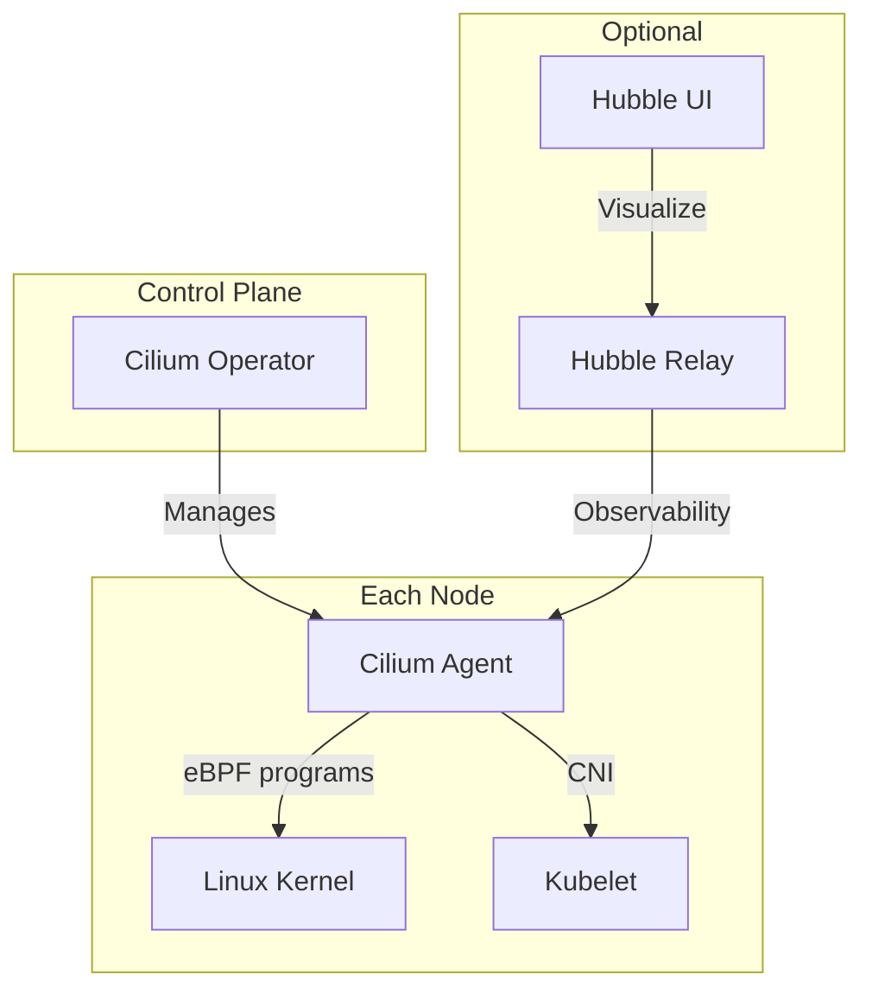
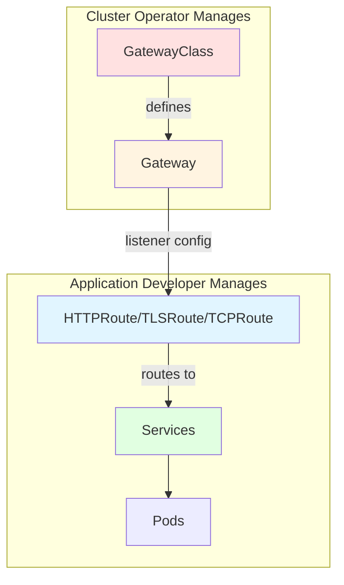
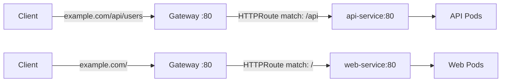

# Services & Networking (CKA 20%)

**Target**: Senior systems engineer with networking background
**Exam Weight**: 20% of CKA exam
**Kubernetes Version**: v1.32+
**Updated**: 2025-11-25

## Overview

Services & Networking domain covers north-south (external) and east-west (internal) traffic management, service discovery, network security policies, and the **Gateway API** (replacing legacy Ingress).

**Critical 2025 Update**: Ingress NGINX [retired November 2025](https://kubernetes.io/blog/2025/11/11/ingress-nginx-retirement/). Gateway API is now the **primary standard** for ingress traffic management.

---

## Service Types

Services provide stable network endpoints for dynamic Pod sets. Four types:

| Type | Scope | Use Case | IP Allocation |
|------|-------|----------|---------------|
| **ClusterIP** | Internal only | Default, inter-service communication | Virtual IP (cluster-internal) |
| **NodePort** | External via node ports | Development, direct node access | ClusterIP + NodePort (30000-32767) |
| **LoadBalancer** | External via cloud LB | Production external access | ClusterIP + NodePort + External IP |
| **ExternalName** | DNS CNAME | External service aliasing | None (DNS only) |

### Traffic Flow Comparison

```mermaid
graph TB
    subgraph "ClusterIP (Internal Only)"
        C1[Pod A] -->|10.96.0.10:80| SVC1[Service ClusterIP]
        SVC1 --> P1[Pod Backend 1]
        SVC1 --> P2[Pod Backend 2]
    end

    subgraph "NodePort (External via Nodes)"
        EXT1[External Client] -->|192.168.1.100:30080| NODE1[Node:30080]
        NODE1 -->|10.96.0.20:80| SVC2[Service NodePort]
        SVC2 --> P3[Pod Backend 1]
        SVC2 --> P4[Pod Backend 2]
    end

    subgraph "LoadBalancer (External via Cloud LB)"
        EXT2[External Client] -->|1.2.3.4:80| LB[Cloud LoadBalancer]
        LB -->|Node:30081| NODE2[Nodes]
        NODE2 -->|10.96.0.30:80| SVC3[Service LB]
        SVC3 --> P5[Pod Backend 1]
        SVC3 --> P6[Pod Backend 2]
    end
```



### ClusterIP Example

```yaml
apiVersion: v1
kind: Service
metadata:
  name: web-internal
spec:
  type: ClusterIP  # Default, can omit
  selector:
    app: web
  ports:
  - protocol: TCP
    port: 80        # Service port
    targetPort: 8080  # Pod container port
```

**Access**: Only from within cluster (Pods, nodes). Use for microservices communication.

```bash
# Test from another Pod
kubectl run test --rm -it --image=busybox -- wget -qO- web-internal:80
```

### NodePort Example

```yaml
apiVersion: v1
kind: Service
metadata:
  name: web-nodeport
spec:
  type: NodePort
  selector:
    app: web
  ports:
  - protocol: TCP
    port: 80
    targetPort: 8080
    nodePort: 30080  # Optional: auto-assigned if omitted (30000-32767)
```

**Access**: `http://<any-node-ip>:30080`

```bash
# Get node IPs
kubectl get nodes -o wide

# Access from outside cluster
curl http://192.168.1.100:30080
```

### LoadBalancer Example

```yaml
apiVersion: v1
kind: Service
metadata:
  name: web-lb
spec:
  type: LoadBalancer
  selector:
    app: web
  ports:
  - protocol: TCP
    port: 80
    targetPort: 8080
  # Cloud provider provisions external LB automatically
```

**Behavior**:
- Cloud provider (AWS/GCP/Azure) creates external load balancer
- Bare metal: Requires MetalLB or similar
- Our setup: VMware Fusion (no cloud LB) - use NodePort or Gateway API with nginx/haproxy

```bash
# Check external IP (cloud only)
kubectl get svc web-lb
# NAME     TYPE           EXTERNAL-IP     PORT(S)
# web-lb   LoadBalancer   34.123.45.67   80:31234/TCP
```

### ExternalName Example

```yaml
apiVersion: v1
kind: Service
metadata:
  name: external-db
spec:
  type: ExternalName
  externalName: db.example.com  # External DNS name
  # No selector, no endpoints
```

**Use Case**: Alias external services (RDS, external APIs) as cluster-internal names.

```bash
# Pods resolve 'external-db' to 'db.example.com'
nslookup external-db.default.svc.cluster.local
```

---

## Endpoints and EndpointSlices

Services route to Pods via **Endpoints** (legacy) or **EndpointSlices** (v1.21+ default, more scalable).

### How It Works



**Automatic Creation**: When Service has `selector`, kube-controller-manager creates Endpoints/EndpointSlices automatically.

### View Endpoints

```bash
# Legacy Endpoints (still works)
kubectl get endpoints web

# Modern EndpointSlices (recommended)
kubectl get endpointslices
kubectl describe endpointslice web-<hash>
```

### Manual Endpoints (Headless Service)

For services **without selectors** (external databases, custom routing):

```yaml
# Service without selector
apiVersion: v1
kind: Service
metadata:
  name: external-svc
spec:
  ports:
  - protocol: TCP
    port: 3306
    targetPort: 3306
---
# Manual Endpoints
apiVersion: v1
kind: Endpoints
metadata:
  name: external-svc  # Must match Service name
subsets:
- addresses:
  - ip: 192.168.100.50  # External IP
  - ip: 192.168.100.51
  ports:
  - port: 3306
```

**Use Case**: Point cluster service to external IPs (legacy databases, third-party APIs).

### EndpointSlice Scalability

| Feature | Endpoints (Legacy) | EndpointSlices (v1.21+) |
|---------|-------------------|-------------------------|
| **Max endpoints per object** | 1000 | 100 (default), multiple slices |
| **Updates** | Full object replacement | Only changed slices |
| **Network overhead** | High (large services) | Low (incremental) |
| **Topology-aware** | No | Yes (zone, region hints) |

**Exam Tip**: Know EndpointSlices exist and why (scalability), but Endpoints commands still work.

---

## DNS for Services and Pods

CoreDNS provides cluster DNS. All Services and Pods get DNS names automatically.

### Service DNS

**Pattern**: `<service-name>.<namespace>.svc.<cluster-domain>`

```bash
# Default cluster domain: cluster.local
# Service 'web' in 'default' namespace:
web.default.svc.cluster.local  # FQDN
web.default.svc                # Short form
web.default                    # Shorter
web                            # Within same namespace

# Service 'api' in 'production' namespace:
api.production.svc.cluster.local
```

### Pod DNS

**Pattern**: `<pod-ip-with-dashes>.<namespace>.pod.<cluster-domain>`

```bash
# Pod IP: 10.244.1.5 in 'default' namespace
10-244-1-5.default.pod.cluster.local

# Not commonly used (Pods are ephemeral)
```

### Headless Service (StatefulSet DNS)

Set `clusterIP: None` to get direct Pod DNS (no load balancing):

```yaml
apiVersion: v1
kind: Service
metadata:
  name: mysql
spec:
  clusterIP: None  # Headless
  selector:
    app: mysql
  ports:
  - port: 3306
---
# StatefulSet using headless service
apiVersion: apps/v1
kind: StatefulSet
metadata:
  name: mysql
spec:
  serviceName: mysql  # Must reference headless service
  replicas: 3
  selector:
    matchLabels:
      app: mysql
  template:
    metadata:
      labels:
        app: mysql
    spec:
      containers:
      - name: mysql
        image: mysql:8.0
```

**DNS for StatefulSet Pods**:
```bash
# Stable DNS names for each Pod
mysql-0.mysql.default.svc.cluster.local
mysql-1.mysql.default.svc.cluster.local
mysql-2.mysql.default.svc.cluster.local
```

### DNS Resolution Flow



### CoreDNS Configuration

```bash
# View CoreDNS config
kubectl get configmap coredns -n kube-system -o yaml

# Common customizations
kubectl edit configmap coredns -n kube-system
```

**Example CoreDNS ConfigMap**:
```yaml
apiVersion: v1
kind: ConfigMap
metadata:
  name: coredns
  namespace: kube-system
data:
  Corefile: |
    .:53 {
        errors
        health {
            launchTimeout 5s
        }
        ready
        kubernetes cluster.local in-addr.arpa ip6.arpa {
            pods insecure  # Enable Pod DNS
            fallthrough in-addr.arpa ip6.arpa
            ttl 30
        }
        prometheus :9153
        forward . /etc/resolv.conf {
            max_concurrent 1000
        }
        cache 30
        loop
        reload
        loadbalance
    }
```

**Troubleshooting DNS**:
```bash
# Test DNS from Pod
kubectl run dnstest --rm -it --image=busybox -- nslookup web.default.svc.cluster.local

# Check CoreDNS Pods
kubectl get pods -n kube-system -l k8s-app=kube-dns

# CoreDNS logs
kubectl logs -n kube-system -l k8s-app=kube-dns
```

---

## Network Policies

Network Policies define **firewall rules** for Pods. Requires CNI with NetworkPolicy support (Cilium, Calico, Weave).

**Our CNI**: Cilium (full NetworkPolicy support including L7)

### Default Behavior (No NetworkPolicies)



**No NetworkPolicies = All traffic allowed** (same as no firewall)

### NetworkPolicy Basics

- **Default deny**: Apply empty NetworkPolicy to block all traffic
- **Whitelist model**: Policies are additive (multiple policies = union of rules)
- **Namespace isolation**: Policies apply to Pods in their namespace
- **Stateful**: Return traffic automatically allowed

### Policy Types

| Type | Direction | Default Behavior |
|------|-----------|------------------|
| **Ingress** | Incoming to Pod | Allow all (if no ingress policy) |
| **Egress** | Outgoing from Pod | Allow all (if no egress policy) |

### Example 1: Default Deny All

```yaml
# Deny all ingress and egress in 'production' namespace
apiVersion: networking.k8s.io/v1
kind: NetworkPolicy
metadata:
  name: default-deny-all
  namespace: production
spec:
  podSelector: {}  # Matches all Pods in namespace
  policyTypes:
  - Ingress
  - Egress
  # Empty ingress/egress = deny all
```

**Effect**: All Pods in `production` namespace isolated (cannot send/receive traffic).

### Example 2: Allow Specific Ingress

```yaml
# Allow ingress to 'db' Pods only from 'api' Pods
apiVersion: networking.k8s.io/v1
kind: NetworkPolicy
metadata:
  name: allow-api-to-db
  namespace: production
spec:
  podSelector:
    matchLabels:
      app: db  # Target Pods
  policyTypes:
  - Ingress
  ingress:
  - from:
    - podSelector:
        matchLabels:
          app: api  # Source Pods (same namespace)
    ports:
    - protocol: TCP
      port: 5432  # PostgreSQL
```

**Traffic Flow**:


### Example 3: Cross-Namespace Access

```yaml
# Allow 'monitoring' namespace Pods to scrape metrics
apiVersion: networking.k8s.io/v1
kind: NetworkPolicy
metadata:
  name: allow-monitoring
  namespace: production
spec:
  podSelector:
    matchLabels:
      metrics: "true"  # Pods with this label
  policyTypes:
  - Ingress
  ingress:
  - from:
    - namespaceSelector:
        matchLabels:
          name: monitoring  # Source namespace
    ports:
    - protocol: TCP
      port: 9090  # Prometheus metrics
```

**Prerequisite**: Label monitoring namespace:
```bash
kubectl label namespace monitoring name=monitoring
```

### Example 4: Egress Control (Database Access Only)

```yaml
# Allow 'api' Pods to access only database and DNS
apiVersion: networking.k8s.io/v1
kind: NetworkPolicy
metadata:
  name: api-egress
  namespace: production
spec:
  podSelector:
    matchLabels:
      app: api
  policyTypes:
  - Egress
  egress:
  # Allow DNS
  - to:
    - namespaceSelector:
        matchLabels:
          name: kube-system
    ports:
    - protocol: UDP
      port: 53
  # Allow database
  - to:
    - podSelector:
        matchLabels:
          app: db
    ports:
    - protocol: TCP
      port: 5432
```

**Effect**: `api` Pods can only reach DNS (kube-system) and `db` Pods. Internet/external access blocked.

### Example 5: External IP Block (CIDR)

```yaml
# Allow ingress from specific IP range (office network)
apiVersion: networking.k8s.io/v1
kind: NetworkPolicy
metadata:
  name: allow-office-network
  namespace: production
spec:
  podSelector:
    matchLabels:
      app: admin-panel
  policyTypes:
  - Ingress
  ingress:
  - from:
    - ipBlock:
        cidr: 203.0.113.0/24  # Office IP range
        except:
        - 203.0.113.50/32     # Exclude specific IP
    ports:
    - protocol: TCP
      port: 443
```

### NetworkPolicy Selectors Summary

| Selector | Scope | Example |
|----------|-------|---------|
| **podSelector** | Same namespace | `matchLabels: {app: api}` |
| **namespaceSelector** | Other namespaces | `matchLabels: {name: monitoring}` |
| **podSelector + namespaceSelector** | Specific Pods in other namespace | Both selectors in same `from` entry |
| **ipBlock** | External IPs (CIDR) | `cidr: 10.0.0.0/8` |

### Testing NetworkPolicies

```bash
# Deploy test Pods
kubectl run web --image=nginx --labels=app=web
kubectl run api --image=nginx --labels=app=api

# Test connectivity before policy
kubectl exec api -- curl -m 3 http://web

# Apply NetworkPolicy
kubectl apply -f deny-all.yaml

# Test connectivity after policy (should timeout)
kubectl exec api -- curl -m 3 http://web

# View policies
kubectl get networkpolicies
kubectl describe networkpolicy allow-api-to-web
```

**Exam Tip**: Practice creating policies with `kubectl run` + `kubectl exec` to verify.

---

## CNI Basics (Cilium)

**Container Network Interface (CNI)**: Plugin that configures Pod networking. Cluster must have CNI for Pod-to-Pod communication.

**Our Choice**: [Cilium](https://cilium.io/) - eBPF-based CNI with advanced features

### Why Cilium?

| Feature | Benefit |
|---------|---------|
| **eBPF-based** | Kernel-level networking (faster than iptables) |
| **L7 NetworkPolicies** | HTTP/gRPC-aware policies (not just IP/port) |
| **Service Mesh** | Observability, load balancing without sidecars |
| **Hubble** | Network flow visualization |
| **IP Address Management** | Scalable IPAM for large clusters |

### Cilium Components



### Cilium Installation (Overview)

```bash
# Install Cilium CLI
CILIUM_CLI_VERSION=$(curl -s https://raw.githubusercontent.com/cilium/cilium-cli/main/stable.txt)
curl -L --fail --remote-name-all https://github.com/cilium/cilium-cli/releases/download/${CILIUM_CLI_VERSION}/cilium-linux-amd64.tar.gz
sudo tar xzvfC cilium-linux-amd64.tar.gz /usr/local/bin

# Install Cilium in cluster
cilium install --version 1.14.5

# Verify installation
cilium status
cilium connectivity test  # Comprehensive network test
```

### Cilium NetworkPolicy Example (L7)

```yaml
# Allow only HTTP GET to /api/public
apiVersion: cilium.io/v2
kind: CiliumNetworkPolicy
metadata:
  name: l7-http-policy
  namespace: production
spec:
  endpointSelector:
    matchLabels:
      app: api
  ingress:
  - fromEndpoints:
    - matchLabels:
        app: web
    toPorts:
    - ports:
      - port: "80"
        protocol: TCP
      rules:
        http:
        - method: "GET"
          path: "/api/public"
```

**CKA Scope**: Know CNI provides Pod networking, basic troubleshooting. L7 policies are bonus.

### Troubleshooting CNI

```bash
# Check Cilium Pods
kubectl get pods -n kube-system -l k8s-app=cilium

# Cilium agent logs
kubectl logs -n kube-system ds/cilium

# Check Pod networking (Cilium endpoint)
cilium endpoint list

# If Pods can't communicate, check CNI
kubectl describe pod <pod-name> | grep -i network
```

**Common CNI Issues**:
- Pods stuck in `ContainerCreating` → CNI not installed/configured
- No Pod-to-Pod connectivity → CNI plugin failure
- DNS not working → Check CoreDNS + CNI

---

## Gateway API (2025 Standard)

**Gateway API** is the **official replacement** for Ingress (v1.0 GA in Oct 2023, v1.4 in Nov 2025).

**Why Replace Ingress?**
- **Role-oriented**: Separate concerns (cluster ops vs app devs)
- **Expressive**: L4/L7 routing, traffic splitting, header manipulation
- **Portable**: Works across implementations (NGINX, Istio, Envoy, Traefik, Cilium)
- **Extensible**: Custom resources, vendor-specific features

### Ingress NGINX Retirement Timeline

**November 2025**: [Official retirement announced](https://kubernetes.io/blog/2025/11/11/ingress-nginx-retirement/)
- **March 2026**: No more updates, security fixes, or releases
- **Reason**: Insufficient maintainership, serious security vulnerabilities
- **Migration**: All users must migrate to Gateway API or alternative Ingress controller

**Recommendation**: Learn Gateway API, not Ingress NGINX (deprecated).

### Gateway API Architecture



**Three-tier hierarchy**:
1. **GatewayClass**: Infrastructure template (managed by cluster admin)
2. **Gateway**: Listener configuration (managed by cluster admin or platform team)
3. **HTTPRoute/TLSRoute**: Routing rules (managed by app developers)

### Resource Comparison

| Resource | Who Manages | Purpose |
|----------|-------------|---------|
| **GatewayClass** | Platform Admin | Define gateway infrastructure (NGINX, Istio, Envoy) |
| **Gateway** | Platform/Ops | Configure listeners (ports, protocols, TLS) |
| **HTTPRoute** | App Developer | HTTP routing rules (host, path, headers) |
| **TLSRoute** | App Developer | TLS routing (SNI-based) |
| **TCPRoute/UDPRoute** | App Developer | L4 routing |

### Gateway API Installation

```bash
# Install Gateway API CRDs (required first)
kubectl apply -f https://github.com/kubernetes-sigs/gateway-api/releases/download/v1.2.1/standard-install.yaml

# Verify CRDs installed
kubectl get crd | grep gateway.networking.k8s.io

# Expected output:
# gatewayclasses.gateway.networking.k8s.io
# gateways.gateway.networking.k8s.io
# httproutes.gateway.networking.k8s.io
# referencegrants.gateway.networking.k8s.io
```

### Step 1: GatewayClass

**GatewayClass** defines the controller implementation (created by admin, once per cluster).

```yaml
apiVersion: gateway.networking.k8s.io/v1
kind: GatewayClass
metadata:
  name: nginx
spec:
  controllerName: k8s-gateway.nginx.org/nginx-gateway-controller
  # Or: istio.io/gateway-controller, cilium.io/gateway-controller, etc.
```

**Popular Implementations**:
- **NGINX Gateway Fabric**: `k8s-gateway.nginx.org/nginx-gateway-controller`
- **Istio**: `istio.io/gateway-controller`
- **Cilium**: `cilium.io/gateway-controller`
- **Envoy Gateway**: `gateway.envoyproxy.io/gatewayclass-controller`
- **Traefik**: `traefik.io/gateway-controller`

```bash
# View available GatewayClasses
kubectl get gatewayclass

# NAME    CONTROLLER                              ACCEPTED
# nginx   k8s-gateway.nginx.org/nginx-gateway     True
```

### Step 2: Gateway

**Gateway** configures listeners (ports, protocols, hostname wildcards).

```yaml
apiVersion: gateway.networking.k8s.io/v1
kind: Gateway
metadata:
  name: web-gateway
  namespace: default
spec:
  gatewayClassName: nginx  # Reference to GatewayClass
  listeners:
  - name: http
    protocol: HTTP
    port: 80
    allowedRoutes:  # Control which routes can attach
      namespaces:
        from: All  # Allow routes from any namespace
  - name: https
    protocol: HTTPS
    port: 443
    tls:
      mode: Terminate
      certificateRefs:
      - name: web-tls-secret  # TLS cert (type: kubernetes.io/tls)
    allowedRoutes:
      namespaces:
        from: All
```

**Check Gateway status**:
```bash
kubectl get gateway web-gateway

# NAME          CLASS   ADDRESS        READY
# web-gateway   nginx   34.123.45.67   True
```

**ADDRESS**: External IP (LoadBalancer) or Node IP (NodePort) depending on implementation.

### Step 3: HTTPRoute

**HTTPRoute** defines HTTP routing rules (path, headers, query params).

```yaml
apiVersion: gateway.networking.k8s.io/v1
kind: HTTPRoute
metadata:
  name: web-route
  namespace: default
spec:
  parentRefs:
  - name: web-gateway  # Attach to Gateway
    namespace: default
  hostnames:
  - "example.com"
  - "www.example.com"
  rules:
  # Rule 1: /api/* → api service
  - matches:
    - path:
        type: PathPrefix
        value: /api
    backendRefs:
    - name: api-service
      port: 80

  # Rule 2: / → web service
  - matches:
    - path:
        type: PathPrefix
        value: /
    backendRefs:
    - name: web-service
      port: 80
```

**Traffic Flow**:


### HTTPRoute Advanced Features

#### Header-based Routing

```yaml
apiVersion: gateway.networking.k8s.io/v1
kind: HTTPRoute
metadata:
  name: header-route
spec:
  parentRefs:
  - name: web-gateway
  rules:
  - matches:
    - headers:
      - name: X-Version
        value: v2
    backendRefs:
    - name: app-v2
      port: 80
  - backendRefs:  # Default: no header match
    - name: app-v1
      port: 80
```

**Use Case**: Canary deployments, A/B testing, version-based routing.

#### Traffic Splitting (Weighted)

```yaml
apiVersion: gateway.networking.k8s.io/v1
kind: HTTPRoute
metadata:
  name: canary-route
spec:
  parentRefs:
  - name: web-gateway
  rules:
  - backendRefs:
    - name: app-v1
      port: 80
      weight: 90  # 90% traffic
    - name: app-v2
      port: 80
      weight: 10  # 10% traffic (canary)
```

#### Request/Response Modification

```yaml
apiVersion: gateway.networking.k8s.io/v1
kind: HTTPRoute
metadata:
  name: header-manipulation
spec:
  parentRefs:
  - name: web-gateway
  rules:
  - filters:
    - type: RequestHeaderModifier
      requestHeaderModifier:
        add:
        - name: X-Custom-Header
          value: "added-by-gateway"
        remove:
        - X-Internal-Header
    - type: ResponseHeaderModifier
      responseHeaderModifier:
        add:
        - name: X-Cache-Status
          value: "HIT"
    backendRefs:
    - name: app-service
      port: 80
```

#### URL Rewrite

```yaml
apiVersion: gateway.networking.k8s.io/v1
kind: HTTPRoute
metadata:
  name: rewrite-route
spec:
  parentRefs:
  - name: web-gateway
  rules:
  - matches:
    - path:
        type: PathPrefix
        value: /v1/api
    filters:
    - type: URLRewrite
      urlRewrite:
        path:
          type: ReplacePrefixMatch
          replacePrefixMatch: /api  # /v1/api/* → /api/*
    backendRefs:
    - name: api-service
      port: 80
```

### TLS Configuration

```yaml
# Create TLS secret (certificate + key)
kubectl create secret tls web-tls-secret \
  --cert=cert.pem \
  --key=key.pem

# Gateway with TLS termination (YAML above)
# HTTPRoute automatically inherits TLS from Gateway
```

**TLS Modes**:
- **Terminate**: Gateway terminates TLS, forwards HTTP to backend
- **Passthrough**: Gateway forwards encrypted traffic (backend terminates)

### Cross-Namespace Routes (ReferenceGrant)

Allow HTTPRoute in one namespace to attach to Gateway in another:

```yaml
# Gateway in 'infrastructure' namespace
apiVersion: gateway.networking.k8s.io/v1
kind: Gateway
metadata:
  name: shared-gateway
  namespace: infrastructure
spec:
  gatewayClassName: nginx
  listeners:
  - name: http
    protocol: HTTP
    port: 80
    allowedRoutes:
      namespaces:
        from: Selector
        selector:
          matchLabels:
            shared-gateway: "true"
---
# ReferenceGrant: Allow 'production' namespace to use gateway
apiVersion: gateway.networking.k8s.io/v1beta1
kind: ReferenceGrant
metadata:
  name: allow-production-routes
  namespace: infrastructure
spec:
  from:
  - group: gateway.networking.k8s.io
    kind: HTTPRoute
    namespace: production
  to:
  - group: gateway.networking.k8s.io
    kind: Gateway
    name: shared-gateway
---
# HTTPRoute in 'production' namespace
apiVersion: gateway.networking.k8s.io/v1
kind: HTTPRoute
metadata:
  name: app-route
  namespace: production
spec:
  parentRefs:
  - name: shared-gateway
    namespace: infrastructure  # Cross-namespace reference
  rules:
  - backendRefs:
    - name: app-service
      port: 80
```

**Prerequisite**: Label `production` namespace:
```bash
kubectl label namespace production shared-gateway=true
```

### Gateway API vs Ingress

| Feature | Ingress (Legacy) | Gateway API (2025) |
|---------|------------------|-------------------|
| **Role separation** | ❌ Single resource | ✅ GatewayClass, Gateway, Route |
| **Protocols** | HTTP/HTTPS only | HTTP, HTTPS, TCP, UDP, TLS |
| **Traffic splitting** | ❌ Vendor annotations | ✅ Native weighted backends |
| **Header manipulation** | ❌ Vendor annotations | ✅ Native filters |
| **Cross-namespace** | ❌ Complex | ✅ ReferenceGrant |
| **Portability** | ⚠️ Annotation hell | ✅ Standard spec |
| **Status** | Deprecated (2025) | GA, actively developed |

---

## Ingress (Legacy - Being Deprecated)

**Status**: Legacy API, [NGINX implementation retired Nov 2025](https://kubernetes.io/blog/2025/11/11/ingress-nginx-retirement/). **Migrate to Gateway API**.

### Why Ingress Is Being Replaced

1. **Limited expressiveness**: Only HTTP/HTTPS, no L4/UDP/TCP
2. **Annotation overload**: Vendor-specific configs (not portable)
3. **No role separation**: Cluster ops and app devs manage same resource
4. **Security issues**: NGINX Ingress had [critical CVEs in 2025](https://kubernetes.io/blog/2025/11/11/ingress-nginx-retirement/)
5. **Maintenance burden**: Insufficient maintainership led to retirement

### Basic Ingress Example (For Reference Only)

```yaml
apiVersion: networking.k8s.io/v1
kind: Ingress
metadata:
  name: web-ingress
  annotations:
    nginx.ingress.kubernetes.io/rewrite-target: /  # Vendor-specific!
spec:
  ingressClassName: nginx  # Ingress controller
  rules:
  - host: example.com
    http:
      paths:
      - path: /api
        pathType: Prefix
        backend:
          service:
            name: api-service
            port:
              number: 80
      - path: /
        pathType: Prefix
        backend:
          service:
            name: web-service
            port:
              number: 80
  tls:
  - hosts:
    - example.com
    secretName: web-tls-secret
```

### Migration Path: Ingress → Gateway API

**Tool**: Use [ingress2gateway](https://github.com/kubernetes-sigs/ingress2gateway) for automated conversion:

```bash
# Install ingress2gateway
go install github.com/kubernetes-sigs/ingress2gateway@latest

# Convert Ingress to Gateway API
ingress2gateway print --input-file ingress.yaml

# Apply converted resources
ingress2gateway print --input-file ingress.yaml | kubectl apply -f -
```

**Manual Migration Steps**:
1. Install Gateway API CRDs
2. Deploy Gateway controller (NGINX Gateway Fabric, Cilium, Istio, etc.)
3. Create GatewayClass and Gateway resources
4. Convert Ingress rules to HTTPRoute
5. Test Gateway API routes
6. Delete old Ingress resources

**Exam Relevance**: Know Ingress exists (might still appear in exam), but focus on Gateway API.

---

## Quick Reference

### Essential Commands

```bash
# Services
kubectl expose deployment web --port=80 --target-port=8080 --type=ClusterIP
kubectl get svc
kubectl describe svc web
kubectl get endpoints web

# NetworkPolicies
kubectl get networkpolicies
kubectl describe networkpolicy allow-api-to-db
kubectl apply -f network-policy.yaml

# Gateway API
kubectl get gatewayclass
kubectl get gateway
kubectl get httproute
kubectl describe gateway web-gateway
kubectl describe httproute web-route

# DNS Testing
kubectl run dnstest --rm -it --image=busybox -- nslookup web.default.svc.cluster.local

# Connectivity Testing
kubectl run test --rm -it --image=busybox -- wget -qO- http://web:80
kubectl exec pod-a -- curl -m 3 http://pod-b

# CNI (Cilium)
cilium status
cilium connectivity test
kubectl get pods -n kube-system -l k8s-app=cilium
```

### Common Service YAML Patterns

```yaml
# ClusterIP (default)
apiVersion: v1
kind: Service
metadata:
  name: my-service
spec:
  selector:
    app: my-app
  ports:
  - protocol: TCP
    port: 80
    targetPort: 8080

# NodePort
apiVersion: v1
kind: Service
metadata:
  name: my-nodeport
spec:
  type: NodePort
  selector:
    app: my-app
  ports:
  - port: 80
    targetPort: 8080
    nodePort: 30080

# LoadBalancer
apiVersion: v1
kind: Service
metadata:
  name: my-lb
spec:
  type: LoadBalancer
  selector:
    app: my-app
  ports:
  - port: 80
    targetPort: 8080
```

### NetworkPolicy Patterns

```yaml
# Default deny all
apiVersion: networking.k8s.io/v1
kind: NetworkPolicy
metadata:
  name: default-deny
spec:
  podSelector: {}
  policyTypes:
  - Ingress
  - Egress

# Allow from specific Pods
apiVersion: networking.k8s.io/v1
kind: NetworkPolicy
metadata:
  name: allow-from-api
spec:
  podSelector:
    matchLabels:
      app: db
  policyTypes:
  - Ingress
  ingress:
  - from:
    - podSelector:
        matchLabels:
          app: api
    ports:
    - protocol: TCP
      port: 5432

# Allow DNS + specific egress
apiVersion: networking.k8s.io/v1
kind: NetworkPolicy
metadata:
  name: allow-dns-and-db
spec:
  podSelector:
    matchLabels:
      app: api
  policyTypes:
  - Egress
  egress:
  - to:
    - namespaceSelector:
        matchLabels:
          name: kube-system
    ports:
    - protocol: UDP
      port: 53
  - to:
    - podSelector:
        matchLabels:
          app: db
    ports:
    - protocol: TCP
      port: 5432
```

### Gateway API Quick Deploy

```bash
# 1. Install CRDs
kubectl apply -f https://github.com/kubernetes-sigs/gateway-api/releases/download/v1.2.1/standard-install.yaml

# 2. Create GatewayClass (admin)
cat <<EOF | kubectl apply -f -
apiVersion: gateway.networking.k8s.io/v1
kind: GatewayClass
metadata:
  name: nginx
spec:
  controllerName: k8s-gateway.nginx.org/nginx-gateway-controller
EOF

# 3. Create Gateway (ops)
cat <<EOF | kubectl apply -f -
apiVersion: gateway.networking.k8s.io/v1
kind: Gateway
metadata:
  name: web-gateway
spec:
  gatewayClassName: nginx
  listeners:
  - name: http
    protocol: HTTP
    port: 80
EOF

# 4. Create HTTPRoute (dev)
cat <<EOF | kubectl apply -f -
apiVersion: gateway.networking.k8s.io/v1
kind: HTTPRoute
metadata:
  name: app-route
spec:
  parentRefs:
  - name: web-gateway
  hostnames:
  - "example.com"
  rules:
  - matches:
    - path:
        type: PathPrefix
        value: /
    backendRefs:
    - name: app-service
      port: 80
EOF
```

---

## CKA Exam Tips

### High-Probability Topics

1. **Create Services**: ClusterIP, NodePort (imperative and declarative)
2. **NetworkPolicies**: Default deny, allow specific ingress/egress
3. **DNS Resolution**: Troubleshoot CoreDNS, resolve service names
4. **Gateway API Basics**: Create Gateway + HTTPRoute for HTTP routing
5. **Connectivity Testing**: Use `kubectl exec` + `curl`/`wget` to verify

### Time-Saving Tricks

```bash
# Quick Service creation
kubectl expose deployment web --port=80 --type=NodePort --dry-run=client -o yaml > svc.yaml

# Quick NetworkPolicy template
kubectl create deployment web --image=nginx
kubectl label pod -l app=web role=frontend
cat <<EOF | kubectl apply -f -
apiVersion: networking.k8s.io/v1
kind: NetworkPolicy
metadata:
  name: allow-frontend
spec:
  podSelector:
    matchLabels:
      role: frontend
  policyTypes:
  - Ingress
  ingress:
  - from:
    - podSelector:
        matchLabels:
          role: backend
EOF

# Test DNS quickly
kubectl run -it --rm debug --image=busybox --restart=Never -- nslookup kubernetes.default

# Test connectivity
kubectl run -it --rm debug --image=busybox --restart=Never -- wget -qO- http://web:80
```

### Common Mistakes

- ❌ Forgetting `policyTypes` in NetworkPolicy (won't apply)
- ❌ Using `kubectl expose` without verifying port/targetPort
- ❌ Creating Gateway without installing CRDs first
- ❌ NetworkPolicy `podSelector: {}` means **all Pods**, not none
- ❌ Assuming LoadBalancer works in bare-metal (need MetalLB or cloud)

### Practice Scenarios

1. Create ClusterIP service, test DNS resolution from another Pod
2. Create NodePort service, access from outside cluster via `curl`
3. Apply default deny NetworkPolicy, verify traffic blocked
4. Create allow NetworkPolicy for specific Pods, verify traffic allowed
5. Install Gateway API CRDs, create Gateway + HTTPRoute for path-based routing
6. Troubleshoot CoreDNS (check Pods, logs, ConfigMap)

---

## Resources

### Official Documentation

- [Services, Load Balancing, and Networking](https://kubernetes.io/docs/concepts/services-networking/)
- [Gateway API](https://gateway-api.sigs.k8s.io/) - Primary ingress standard (2025)
- [Network Policies](https://kubernetes.io/docs/concepts/services-networking/network-policies/)
- [DNS for Services and Pods](https://kubernetes.io/docs/concepts/services-networking/dns-pod-service/)
- [EndpointSlices](https://kubernetes.io/docs/concepts/services-networking/endpoint-slices/)

### Gateway API Migration

- [Ingress NGINX Retirement Announcement](https://kubernetes.io/blog/2025/11/11/ingress-nginx-retirement/)
- [Gateway API v1.4 Release](https://kubernetes.io/blog/2025/11/06/gateway-api-v1-4/)
- [ingress2gateway Tool](https://github.com/kubernetes-sigs/ingress2gateway)
- [Gateway API Implementations](https://gateway-api.sigs.k8s.io/implementations/)

### CNI and Cilium

- [Cilium Documentation](https://docs.cilium.io/)
- [CNI Specification](https://github.com/containernetworking/cni)
- [Comparing Kubernetes CNI Providers](https://www.cncf.io/blog/2021/09/21/comparing-kubernetes-cni-providers/)

### CKA Curriculum

- [CKA Exam Curriculum](https://training.linuxfoundation.org/certification/certified-kubernetes-administrator-cka/)
- [CKA Study Guide 2025](https://devopscube.com/cka-exam-study-guide/)

---

**Next Document**: `04-storage.md` (PersistentVolumes, StorageClasses, CSI)
**Related**: `01-core-concepts.md` (Pods, Deployments), `05-security.md` (RBAC, Secrets)
