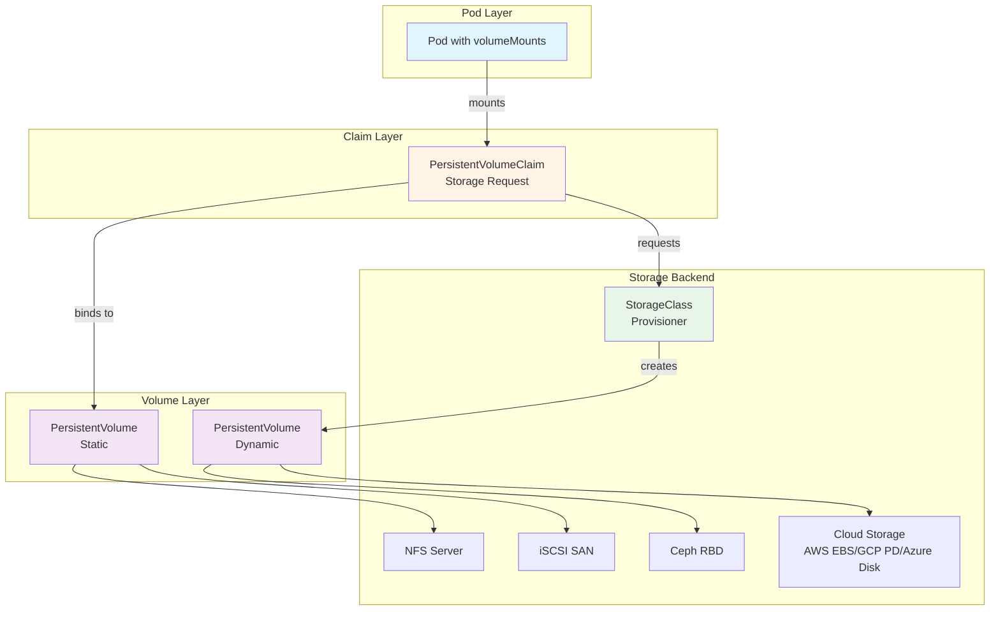
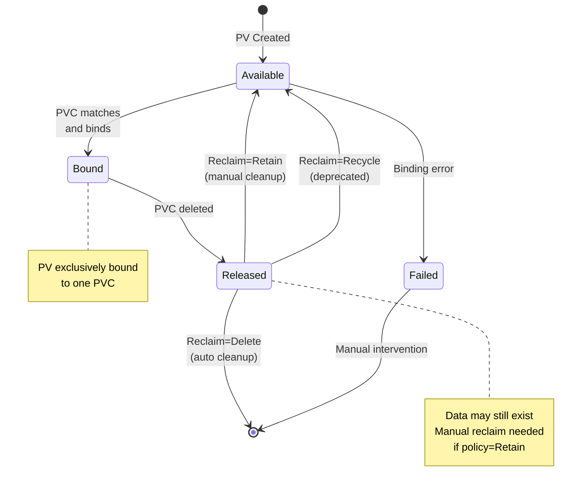
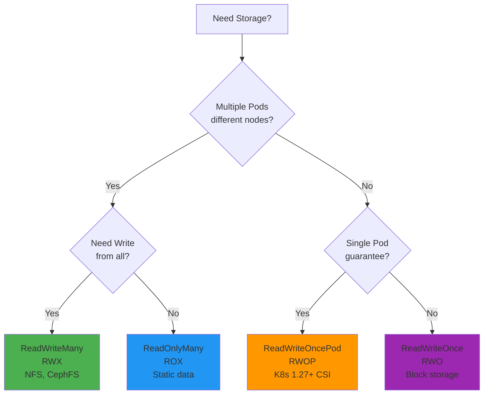
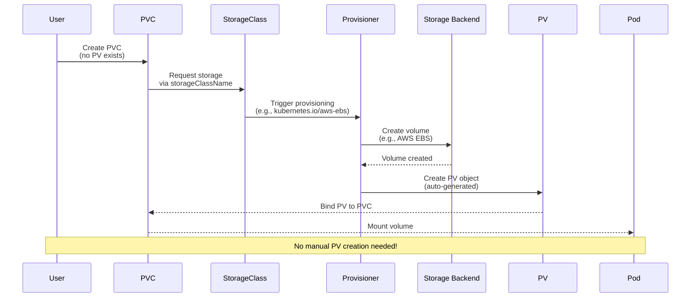
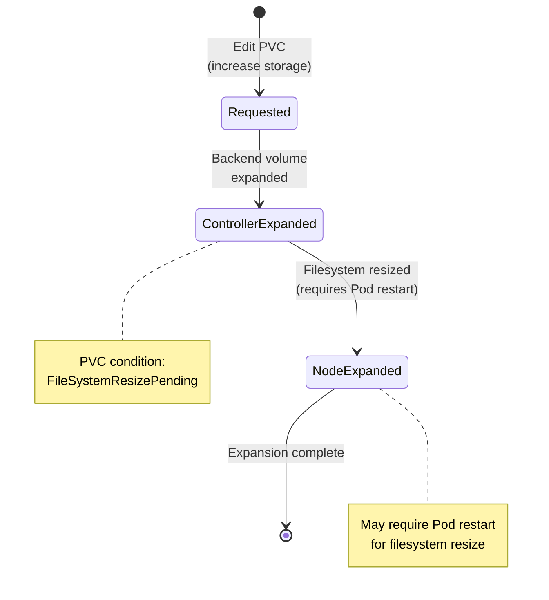

# Storage (CKA 10%)

**Exam Weight**: 10% of CKA certification (K8s v1.34+)

**Key Topics**: Volume types, PV/PVC lifecycle, StorageClasses, dynamic provisioning, access modes, reclaim policies, volume expansion.

---

## Storage Architecture Overview



---

## Volume Types

### Ephemeral vs Persistent

| Type | Lifecycle | Use Cases | CKA Topics |
|------|-----------|-----------|------------|
| **Ephemeral** | Pod lifetime | Temp data, cache, shared config | emptyDir, configMap, secret |
| **Persistent** | Independent of Pod | Databases, user data, stateful apps | PV, PVC, StorageClass |

### CKA-Required Volume Types

#### 1. emptyDir (Ephemeral)
```yaml
apiVersion: v1
kind: Pod
metadata:
  name: cache-pod
spec:
  containers:
  - name: app
    image: nginx
    volumeMounts:
    - mountPath: /cache
      name: cache-volume
  volumes:
  - name: cache-volume
    emptyDir: {}           # Deleted when Pod is removed
    # emptyDir:
    #   medium: Memory     # RAM-backed (tmpfs) for high-speed cache
    #   sizeLimit: 1Gi     # Optional size limit
```

**Use Cases**:
- Scratch space for computations
- Cache between containers in same Pod
- Shared data between init containers and app containers

**Exam Tip**: emptyDir is **node-local** and **ephemeral** - data lost when Pod deleted.

#### 2. hostPath (Node Storage)
```yaml
apiVersion: v1
kind: Pod
metadata:
  name: hostpath-pod
spec:
  containers:
  - name: logger
    image: busybox
    command: ["/bin/sh", "-c", "tail -f /host-logs/system.log"]
    volumeMounts:
    - mountPath: /host-logs
      name: host-logs
  volumes:
  - name: host-logs
    hostPath:
      path: /var/log          # Path on node filesystem
      type: Directory         # Must exist
      # type: DirectoryOrCreate  # Create if missing
      # type: File, FileOrCreate, Socket, etc.
```

**Security Warning**: hostPath exposes node filesystem - avoid in multi-tenant clusters.

**Use Cases**:
- DaemonSet accessing node logs/metrics
- Development/testing (NOT production)
- Node-level debugging

**Exam Tip**: Know `type` options: `Directory`, `DirectoryOrCreate`, `File`, `FileOrCreate`, `Socket`.

#### 3. configMap (Configuration Data)
```yaml
apiVersion: v1
kind: ConfigMap
metadata:
  name: app-config
data:
  database.conf: |
    host=postgres.default.svc.cluster.local
    port=5432
  app.properties: |
    log.level=INFO
---
apiVersion: v1
kind: Pod
metadata:
  name: config-pod
spec:
  containers:
  - name: app
    image: myapp:1.0
    volumeMounts:
    - name: config-volume
      mountPath: /etc/config
      readOnly: true
  volumes:
  - name: config-volume
    configMap:
      name: app-config
      # Optional: select specific keys
      # items:
      # - key: database.conf
      #   path: db.conf
```

**Exam Tip**: ConfigMap volumes are **read-only** and **automatically updated** (with ~60s propagation delay).

#### 4. secret (Sensitive Data)
```yaml
apiVersion: v1
kind: Secret
metadata:
  name: db-credentials
type: Opaque
data:
  username: YWRtaW4=       # base64 encoded
  password: cGFzc3dvcmQxMjM=
---
apiVersion: v1
kind: Pod
metadata:
  name: secret-pod
spec:
  containers:
  - name: app
    image: myapp:1.0
    volumeMounts:
    - name: secret-volume
      mountPath: /etc/secrets
      readOnly: true        # ALWAYS read-only for secrets
  volumes:
  - name: secret-volume
    secret:
      secretName: db-credentials
      defaultMode: 0400     # Read-only by owner
```

**Security Best Practices**:
- Always mount secrets as `readOnly: true`
- Use `defaultMode: 0400` or `0440` (restrictive permissions)
- Prefer environment variables for single-value secrets
- Use external secret managers (Vault, etc.) for production

---

## Persistent Volumes (PV)

### PV/PVC Binding Lifecycle



### PV States
| State | Description | Next Actions |
|-------|-------------|--------------|
| **Available** | Free PV, ready for binding | Waits for matching PVC |
| **Bound** | PV bound to PVC | Used by Pod via PVC |
| **Released** | PVC deleted, data may remain | Reclaim per policy |
| **Failed** | Automatic reclaim failed | Manual intervention required |

### Static Provisioning Example

#### Step 1: Create PersistentVolume
```yaml
apiVersion: v1
kind: PersistentVolume
metadata:
  name: nfs-pv-001
  labels:
    type: nfs
    tier: production
spec:
  capacity:
    storage: 10Gi
  volumeMode: Filesystem        # or Block
  accessModes:
    - ReadWriteMany             # RWX: Multiple nodes read/write
  persistentVolumeReclaimPolicy: Retain
  storageClassName: nfs-storage # Must match PVC
  mountOptions:
    - hard
    - nfsvers=4.1
  nfs:
    path: /export/k8s/volumes/pv001
    server: 192.168.1.100
```

#### Step 2: Create PersistentVolumeClaim
```yaml
apiVersion: v1
kind: PersistentVolumeClaim
metadata:
  name: nfs-pvc-app1
  namespace: production
spec:
  accessModes:
    - ReadWriteMany             # Must match or be subset of PV
  volumeMode: Filesystem
  resources:
    requests:
      storage: 10Gi             # Must be <= PV capacity
  storageClassName: nfs-storage # Must match PV
  # Optional: selector for specific PV
  selector:
    matchLabels:
      type: nfs
      tier: production
```

#### Step 3: Use PVC in Pod
```yaml
apiVersion: v1
kind: Pod
metadata:
  name: app-with-storage
  namespace: production
spec:
  containers:
  - name: app
    image: nginx
    volumeMounts:
    - mountPath: /data
      name: persistent-storage
  volumes:
  - name: persistent-storage
    persistentVolumeClaim:
      claimName: nfs-pvc-app1   # References PVC in same namespace
```

### Binding Requirements

For PV/PVC binding to succeed, **ALL** must match:
1. ✅ **StorageClassName** (exact match or both empty)
2. ✅ **AccessModes** (PVC ⊆ PV)
3. ✅ **Capacity** (PVC request ≤ PV capacity)
4. ✅ **VolumeMode** (Filesystem or Block)
5. ✅ **Selector** (if PVC defines label selector)

**Exam Tip**: If PVC stuck in `Pending`, check these 5 binding requirements.

---

## Access Modes

| Mode | Abbreviation | Description | Supported By |
|------|--------------|-------------|--------------|
| **ReadWriteOnce** | RWO | Single node read/write | Most storage (EBS, iSCSI, Ceph RBD, local) |
| **ReadOnlyMany** | ROX | Multiple nodes read-only | NFS, CephFS, AzureFile |
| **ReadWriteMany** | RWX | Multiple nodes read/write | NFS, CephFS, GlusterFS, AzureFile |
| **ReadWriteOncePod** | RWOP | Single Pod read/write (K8s 1.27+) | CSI volumes only |

### Access Mode Selection Guide



### Practical Example: Multi-Pod Access
```yaml
# Scenario: 3 web servers sharing static content
apiVersion: v1
kind: PersistentVolumeClaim
metadata:
  name: web-content-pvc
spec:
  accessModes:
    - ReadOnlyMany          # ROX: Multiple Pods can read
  resources:
    requests:
      storage: 5Gi
  storageClassName: nfs-storage
---
apiVersion: apps/v1
kind: Deployment
metadata:
  name: web-frontend
spec:
  replicas: 3               # 3 Pods across nodes
  selector:
    matchLabels:
      app: web
  template:
    metadata:
      labels:
        app: web
    spec:
      containers:
      - name: nginx
        image: nginx
        volumeMounts:
        - mountPath: /usr/share/nginx/html
          name: content
          readOnly: true    # Enforce read-only
      volumes:
      - name: content
        persistentVolumeClaim:
          claimName: web-content-pvc
```

**Exam Tip**: StatefulSets with local/EBS storage use **RWO** (each Pod gets own volume). Web frontends sharing content use **ROX**. Shared databases/file servers use **RWX**.

---

## StorageClasses and Dynamic Provisioning

### Dynamic Provisioning Flow



### StorageClass Example (NFS Dynamic Provisioning)

```yaml
# Requires NFS external provisioner (e.g., nfs-subdir-external-provisioner)
apiVersion: storage.k8s.io/v1
kind: StorageClass
metadata:
  name: nfs-dynamic
provisioner: k8s-sigs.io/nfs-subdir-external-provisioner
parameters:
  archiveOnDelete: "true"   # Rename PV on delete (don't delete data)
  pathPattern: "${.PVC.namespace}/${.PVC.name}"  # Dynamic path
reclaimPolicy: Delete       # Default: Delete, can override to Retain
volumeBindingMode: Immediate
allowVolumeExpansion: true  # Enable PVC resize
mountOptions:
  - hard
  - nfsvers=4.1
```

### StorageClass Example (Cloud - AWS EBS)

```yaml
apiVersion: storage.k8s.io/v1
kind: StorageClass
metadata:
  name: fast-ssd
provisioner: ebs.csi.aws.com
parameters:
  type: gp3               # EBS volume type (gp3, io2, etc.)
  iops: "3000"           # Provisioned IOPS
  throughput: "125"      # MB/s
  encrypted: "true"      # Encryption at rest
  fsType: ext4
reclaimPolicy: Delete
volumeBindingMode: WaitForFirstConsumer  # Delay binding until Pod scheduled
allowVolumeExpansion: true
```

### Using StorageClass

```yaml
# PVC automatically provisions PV via StorageClass
apiVersion: v1
kind: PersistentVolumeClaim
metadata:
  name: dynamic-pvc
spec:
  accessModes:
    - ReadWriteOnce
  storageClassName: fast-ssd    # References StorageClass
  resources:
    requests:
      storage: 20Gi
# No need to create PV manually - provisioner creates it!
```

### Volume Binding Modes

| Mode | Behavior | Use Case |
|------|----------|----------|
| **Immediate** | Bind PVC immediately when created | Network storage (NFS, Ceph) |
| **WaitForFirstConsumer** | Delay binding until Pod scheduled | Node-local storage, topology-aware provisioning |

**Exam Tip**: Use `WaitForFirstConsumer` for **local volumes** and **zone-aware cloud storage** to ensure volume created in same zone as Pod.

---

## Reclaim Policies

| Policy | Behavior | Use Case | Supported By |
|--------|----------|----------|--------------|
| **Retain** | Keep PV and data after PVC deleted<br/>Manual cleanup required | Production data, backups | All storage types |
| **Delete** | Delete PV and backend storage<br/>Automatic cleanup | Development, ephemeral data | Cloud storage (EBS, PD, Azure Disk), Ceph |
| **Recycle** | ⚠️ **DEPRECATED**<br/>Scrub data (`rm -rf`), reuse PV | (Don't use) | NFS, hostPath (legacy) |

### Reclaim Policy Example

```yaml
apiVersion: v1
kind: PersistentVolume
metadata:
  name: important-data-pv
spec:
  capacity:
    storage: 50Gi
  accessModes:
    - ReadWriteOnce
  persistentVolumeReclaimPolicy: Retain  # Keep data after PVC deleted
  storageClassName: manual
  hostPath:
    path: /mnt/data/important
```

**Exam Scenario**:
1. PVC deleted → PV enters `Released` state
2. If `Retain`: Data still exists, PV unavailable for new claims (must manually delete PV or recover data)
3. If `Delete`: PV and backend storage automatically deleted

**Best Practice**: Use `Retain` for production databases, `Delete` for dev/test.

---

## Volume Expansion

### Enable Expansion in StorageClass

```yaml
apiVersion: storage.k8s.io/v1
kind: StorageClass
metadata:
  name: expandable-storage
provisioner: kubernetes.io/aws-ebs
parameters:
  type: gp3
allowVolumeExpansion: true    # REQUIRED for expansion
reclaimPolicy: Delete
```

### Expand PVC (Edit spec.resources.requests.storage)

```yaml
# Original PVC
apiVersion: v1
kind: PersistentVolumeClaim
metadata:
  name: database-pvc
spec:
  accessModes:
    - ReadWriteOnce
  storageClassName: expandable-storage
  resources:
    requests:
      storage: 10Gi    # Original size
```

```bash
# Expand PVC from 10Gi to 20Gi
kubectl patch pvc database-pvc -p '{"spec":{"resources":{"requests":{"storage":"20Gi"}}}}'

# Or edit directly
kubectl edit pvc database-pvc
# Change storage: 10Gi → storage: 20Gi

# Check expansion status
kubectl get pvc database-pvc
# Look for conditions: FileSystemResizePending → Resizing → (none)
```

### Expansion Process



**Important Notes**:
- ✅ Can **only grow** volumes (no shrinking)
- ✅ Requires `allowVolumeExpansion: true` in StorageClass
- ✅ Some filesystems require **Pod restart** to complete resize
- ❌ Cannot expand **static PVs** without backend storage support

**Exam Tip**: Check PVC conditions with `kubectl describe pvc <name>` to see expansion status.

---

## Volume Modes

| Mode | Description | Use Cases |
|------|-------------|-----------|
| **Filesystem** | (Default) Mounted as filesystem (ext4, xfs, etc.) | Databases, app data, logs |
| **Block** | Raw block device (no filesystem) | High-performance databases, custom filesystems |

### Block Volume Example

```yaml
apiVersion: v1
kind: PersistentVolume
metadata:
  name: block-pv
spec:
  capacity:
    storage: 100Gi
  volumeMode: Block        # Raw block device
  accessModes:
    - ReadWriteOnce
  persistentVolumeReclaimPolicy: Delete
  storageClassName: iscsi-block
  iscsi:
    targetPortal: 192.168.1.50:3260
    iqn: iqn.2001-04.com.example:storage.kube.sys1.xyz
    lun: 0
    fsType: ""             # No filesystem
---
apiVersion: v1
kind: Pod
metadata:
  name: block-pod
spec:
  containers:
  - name: db
    image: postgres:14
    volumeDevices:        # Use volumeDevices (not volumeMounts) for Block
    - name: data
      devicePath: /dev/xvda  # Raw block device path
  volumes:
  - name: data
    persistentVolumeClaim:
      claimName: block-pvc
```

**Exam Tip**: `volumeMode: Block` uses **volumeDevices** in Pod, `volumeMode: Filesystem` uses **volumeMounts**.

---

## Complete Working Example (StatefulSet with Dynamic Storage)

```yaml
# StorageClass for dynamic provisioning
apiVersion: storage.k8s.io/v1
kind: StorageClass
metadata:
  name: fast-storage
provisioner: kubernetes.io/gce-pd  # GCE Persistent Disk (use your provisioner)
parameters:
  type: pd-ssd
  replication-type: regional-pd
allowVolumeExpansion: true
reclaimPolicy: Delete
volumeBindingMode: WaitForFirstConsumer
---
# StatefulSet with PVC template (dynamic PVCs)
apiVersion: apps/v1
kind: StatefulSet
metadata:
  name: postgres-cluster
spec:
  serviceName: postgres
  replicas: 3
  selector:
    matchLabels:
      app: postgres
  template:
    metadata:
      labels:
        app: postgres
    spec:
      containers:
      - name: postgres
        image: postgres:14
        ports:
        - containerPort: 5432
        env:
        - name: POSTGRES_PASSWORD
          valueFrom:
            secretKeyRef:
              name: db-secret
              key: password
        volumeMounts:
        - name: data
          mountPath: /var/lib/postgresql/data
          subPath: postgres  # Important: avoid lost+found issues
  volumeClaimTemplates:    # Dynamic PVC creation
  - metadata:
      name: data
    spec:
      accessModes:
        - ReadWriteOnce
      storageClassName: fast-storage
      resources:
        requests:
          storage: 20Gi
# Creates 3 PVCs: data-postgres-cluster-0, data-postgres-cluster-1, data-postgres-cluster-2
```

---

## Quick Reference Commands

### PersistentVolumes
```bash
# List PVs with details
kubectl get pv
kubectl get pv -o wide

# Describe PV (shows binding, capacity, reclaim policy)
kubectl describe pv <pv-name>

# Delete PV (requires no PVC bound)
kubectl delete pv <pv-name>

# Check PV reclaim policy
kubectl get pv <pv-name> -o jsonpath='{.spec.persistentVolumeReclaimPolicy}'
```

### PersistentVolumeClaims
```bash
# List PVCs in namespace
kubectl get pvc
kubectl get pvc -A  # All namespaces

# Describe PVC (shows binding status, events)
kubectl describe pvc <pvc-name>

# Check which PV is bound
kubectl get pvc <pvc-name> -o jsonpath='{.spec.volumeName}'

# Expand PVC
kubectl patch pvc <pvc-name> -p '{"spec":{"resources":{"requests":{"storage":"30Gi"}}}}'

# Delete PVC (releases PV per reclaim policy)
kubectl delete pvc <pvc-name>
```

### StorageClasses
```bash
# List StorageClasses
kubectl get sc
kubectl get storageclass

# Describe StorageClass
kubectl describe sc <sc-name>

# Check default StorageClass
kubectl get sc -o jsonpath='{.items[?(@.metadata.annotations.storageclass\.kubernetes\.io/is-default-class=="true")].metadata.name}'

# Set default StorageClass
kubectl patch storageclass <sc-name> -p '{"metadata": {"annotations":{"storageclass.kubernetes.io/is-default-class":"true"}}}'
```

### Debugging Storage Issues
```bash
# Check PVC events (binding errors)
kubectl describe pvc <pvc-name> | grep -A5 Events

# Check Pod volume mounts
kubectl describe pod <pod-name> | grep -A10 Volumes

# Exec into Pod to verify mount
kubectl exec -it <pod-name> -- df -h
kubectl exec -it <pod-name> -- ls -la /data

# Check PV/PVC binding status
kubectl get pv,pvc -o wide

# View PVC conditions (expansion status)
kubectl get pvc <pvc-name> -o jsonpath='{.status.conditions}'
```

---

## CKA Exam Tips

### Common Exam Scenarios

1. **Create Static PV/PVC**
   - Define PV with specific capacity, accessMode, storageClassName
   - Create matching PVC
   - Verify binding with `kubectl get pv,pvc`

2. **Configure Dynamic Provisioning**
   - Create or modify StorageClass with `allowVolumeExpansion: true`
   - Create PVC referencing StorageClass
   - Verify automatic PV creation

3. **Expand PVC**
   - Edit PVC to increase `spec.resources.requests.storage`
   - Verify expansion with `kubectl describe pvc`

4. **Mount Volume in Pod**
   - Add volume definition (PVC, configMap, secret, emptyDir, hostPath)
   - Add volumeMount to container spec
   - Verify mount in running Pod

5. **Troubleshoot PVC Pending**
   - Check PVC/PV mismatch (storageClassName, accessModes, capacity)
   - Check if StorageClass provisioner is available
   - Review PVC events

### Time-Saving kubectl Commands

```bash
# Create PVC imperatively (requires default StorageClass)
kubectl create pvc my-pvc --storageclass=standard --size=10Gi --access-mode=ReadWriteOnce

# Dry-run PV/PVC YAML generation
kubectl run test-pod --image=nginx --dry-run=client -o yaml > pod.yaml
# Edit pod.yaml to add volumes/volumeMounts

# Quick volume mount test
kubectl run busybox --image=busybox --restart=Never --rm -it \
  --overrides='{"spec":{"volumes":[{"name":"test","persistentVolumeClaim":{"claimName":"my-pvc"}}],"containers":[{"name":"busybox","image":"busybox","command":["sh"],"volumeMounts":[{"name":"test","mountPath":"/data"}]}]}}' \
  -- sh
```

### Must-Know for Exam

| Topic | Key Points |
|-------|------------|
| **Volume Types** | emptyDir (ephemeral), hostPath (node), configMap/secret (read-only), PV/PVC (persistent) |
| **Access Modes** | RWO (single node), ROX (multi-node read), RWX (multi-node read/write), RWOP (single Pod) |
| **Reclaim Policies** | Retain (keep data), Delete (auto-delete), Recycle (deprecated) |
| **Volume Modes** | Filesystem (default, mounted fs), Block (raw device) |
| **StorageClass** | provisioner, parameters, allowVolumeExpansion, volumeBindingMode |
| **Binding** | PV/PVC must match: storageClassName, accessModes, capacity, volumeMode |
| **Expansion** | Edit PVC storage, requires allowVolumeExpansion: true, can only grow (not shrink) |

---

## Resources

**Official Kubernetes Documentation**:
- [Persistent Volumes](https://kubernetes.io/docs/concepts/storage/persistent-volumes/)
- [Storage Classes](https://kubernetes.io/docs/concepts/storage/storage-classes/)
- [Volumes](https://kubernetes.io/docs/concepts/storage/volumes/)
- [Dynamic Volume Provisioning](https://kubernetes.io/docs/concepts/storage/dynamic-provisioning/)

**CKA Study Resources**:
- [Certified Kubernetes Administrator Exam Guide](https://kodekloud.com/blog/certified-kubernetes-administrator-exam-storage/)
- [KodeKloud CKA Notes - Volumes](https://notes.kodekloud.com/docs/CKA-Certification-Course-Certified-Kubernetes-Administrator/Storage/Volumes)
- [CKA Exam Updates 2025](https://devoriales.com/post/377/certified-kubernetes-administrator-cka-exam-updates-for-2025)

**Best Practices**:
- [Kubernetes PVC Guide & Best Practices](https://www.plural.sh/blog/kubernetes-pvc-guide/)
- [Persistent Volumes Best Practices](https://www.loft.sh/blog/kubernetes-persistent-volumes-examples-and-best-practices)

---

**Document Version**: 1.0
**Last Updated**: 2025-11-25
**Kubernetes Version**: v1.34
**Target**: CKA Certification Preparation
