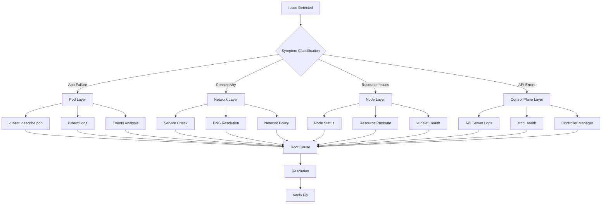
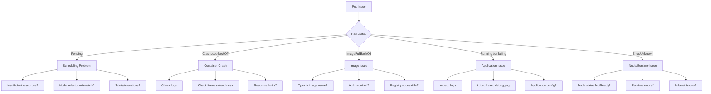
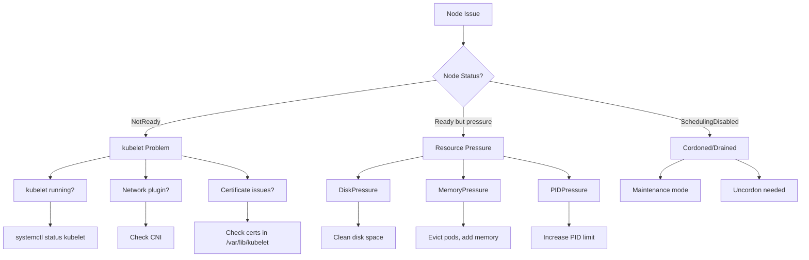
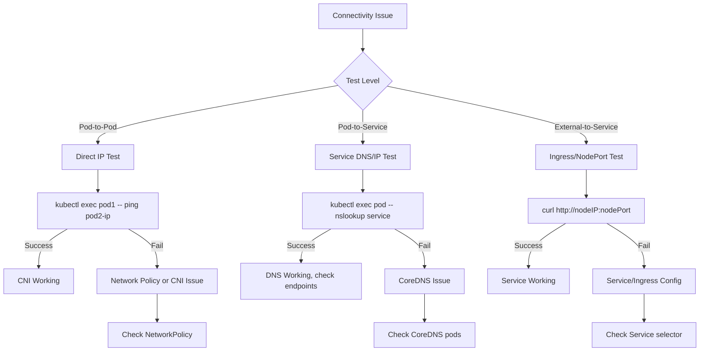
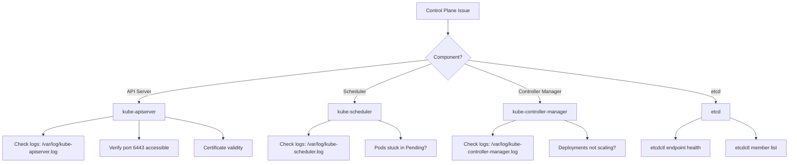

# Troubleshooting (CKA 30%)

**Exam Weight**: 30% (Largest section)
**Time Strategy**: ~36 minutes of 120-minute exam
**Mindset**: Systematic triage, outside-in approach, evidence-based diagnosis

## Debugging Framework

### Systematic Approach



### Triage Priority

1. **Classify**: Compute, storage, network, or control plane?
2. **Scope**: Single pod, multiple pods, node, or cluster-wide?
3. **Evidence**: Gather logs, events, metrics
4. **Analyze**: Identify root cause
5. **Fix**: Apply minimal intervention
6. **Verify**: Confirm resolution

**Outside-In Debugging**: Ingress → Service → Endpoints → Pod → Container

## Pod Troubleshooting

### Pod States Decision Tree



### Essential Pod Debugging Commands

```bash
# Quick status overview
kubectl get pods -o wide --show-labels -A

# Detailed pod information
kubectl describe pod <pod-name> -n <namespace>

# Application logs
kubectl logs <pod-name> -n <namespace>
kubectl logs <pod-name> -c <container-name>  # Multi-container pod
kubectl logs <pod-name> --previous             # Crashed container logs
kubectl logs <pod-name> --tail=50 --follow     # Tail logs

# Events (last hour of cluster activity)
kubectl get events -n <namespace> --sort-by='.lastTimestamp'
kubectl get events --field-selector involvedObject.name=<pod-name>

# Pod YAML validation
kubectl get pod <pod-name> -o yaml | less

# Interactive debugging
kubectl exec -it <pod-name> -- /bin/bash
kubectl exec <pod-name> -- env                 # Check environment variables
kubectl exec <pod-name> -- cat /etc/resolv.conf  # DNS config

# Resource usage
kubectl top pod <pod-name>
kubectl top pod --containers                   # Per-container usage
```

### Common Pod Issues & Fixes

#### 1. Pending State

**Symptoms**: Pod stuck in `Pending`, no container created

**Diagnosis**:
```bash
kubectl describe pod <pod-name>

# Check for:
# - "FailedScheduling" event
# - "Insufficient cpu/memory"
# - "No nodes available"
# - "node(s) didn't match node selector"
```

**Common Causes**:
- **Insufficient Resources**: Node capacity exhausted
- **Node Selector Mismatch**: `spec.nodeSelector` doesn't match any node labels
- **Taints**: Nodes tainted, pod lacks tolerations
- **PVC Issues**: PersistentVolumeClaim not bound

**Fixes**:
```bash
# Check node resources
kubectl top nodes
kubectl describe nodes | grep -A 5 "Allocated resources"

# Check node labels
kubectl get nodes --show-labels

# Check taints
kubectl describe node <node-name> | grep Taints

# Check PVC status
kubectl get pvc -n <namespace>
```

#### 2. CrashLoopBackOff

**Symptoms**: Pod repeatedly crashes and restarts, restart count increasing

**Diagnosis**:
```bash
kubectl describe pod <pod-name>
kubectl logs <pod-name> --previous  # Critical: see crashed container logs

# Check restart count and last state
kubectl get pod <pod-name> -o jsonpath='{.status.containerStatuses[0].restartCount}'
kubectl get pod <pod-name> -o jsonpath='{.status.containerStatuses[0].lastState}'
```

**Common Causes**:
- **Application Error**: App exits immediately (wrong CMD/ENTRYPOINT)
- **Config Error**: Missing ConfigMap/Secret
- **Resource Limits**: OOMKilled (memory limit too low)
- **Probe Failure**: Liveness probe killing healthy container

**Fixes**:
```bash
# Check for OOMKilled
kubectl describe pod <pod-name> | grep -i oom

# Increase memory limits
kubectl set resources deployment <name> --limits=memory=512Mi

# Disable liveness probe temporarily to test
kubectl edit pod <pod-name>  # Remove livenessProbe section

# Check ConfigMap/Secret existence
kubectl get configmap,secret -n <namespace>
```

#### 3. ImagePullBackOff

**Symptoms**: Container image cannot be pulled

**Diagnosis**:
```bash
kubectl describe pod <pod-name>

# Look for:
# - "Failed to pull image"
# - "manifest unknown"
# - "unauthorized"
```

**Common Causes**:
- **Typo**: Incorrect image name or tag
- **Private Registry**: Missing imagePullSecrets
- **Network Issue**: Registry unreachable from node

**Fixes**:
```bash
# Verify image name/tag
kubectl get pod <pod-name> -o jsonpath='{.spec.containers[0].image}'

# Check if image exists (test from node)
docker pull <image-name>

# Create docker-registry secret
kubectl create secret docker-registry regcred \
  --docker-server=<registry> \
  --docker-username=<user> \
  --docker-password=<pass> \
  --docker-email=<email>

# Add imagePullSecrets to pod
kubectl patch serviceaccount default -p '{"imagePullSecrets":[{"name":"regcred"}]}'
```

#### 4. Running but Not Working

**Symptoms**: Pod shows `Running` but application not responding

**Diagnosis**:
```bash
# Check readiness
kubectl get pod <pod-name> -o jsonpath='{.status.conditions[?(@.type=="Ready")].status}'

# Check probe failures
kubectl describe pod <pod-name> | grep -A 10 "Readiness probe failed"

# Application logs
kubectl logs <pod-name> --tail=100

# Test connectivity from inside pod
kubectl exec <pod-name> -- curl localhost:<port>/healthz
```

**Common Causes**:
- **Readiness Probe**: Not passing, pod not added to service endpoints
- **Port Mismatch**: Container listening on different port than configured
- **App Not Ready**: Slow startup, database connection pending

**Fixes**:
```bash
# Check if pod is in service endpoints
kubectl get endpoints <service-name>

# Verify port configuration
kubectl get pod <pod-name> -o jsonpath='{.spec.containers[0].ports}'

# Adjust readiness probe timing
kubectl edit pod <pod-name>
# Increase initialDelaySeconds, periodSeconds
```

## Node Troubleshooting

### Node Status Decision Tree



### Node Diagnostic Commands

```bash
# Node status overview
kubectl get nodes
kubectl get nodes -o wide

# Detailed node information
kubectl describe node <node-name>

# Node resource usage
kubectl top nodes

# Node conditions
kubectl get nodes -o jsonpath='{range .items[*]}{.metadata.name}{"\t"}{.status.conditions[?(@.type=="Ready")].status}{"\n"}{end}'

# SSH to node (if accessible)
ssh <node-name>

# On the node: kubelet health
sudo systemctl status kubelet
sudo journalctl -u kubelet -f
sudo journalctl -u kubelet --since "10 minutes ago"

# Container runtime
sudo systemctl status containerd  # or docker
sudo crictl ps                    # List containers
sudo crictl pods                  # List pods

# Node logs
sudo cat /var/log/syslog | grep kubelet
sudo cat /var/log/messages | grep kubelet
```

### Common Node Issues & Fixes

#### 1. NotReady State

**Diagnosis**:
```bash
kubectl describe node <node-name>

# Check conditions:
# - Ready: False
# - Reason: KubeletNotReady
# - Message: "runtime network not ready" or "kubelet stopped posting node status"
```

**Common Causes**:
- **kubelet Crashed**: Service stopped or failing
- **Network Plugin**: CNI not working
- **Certificate Expired**: kubelet can't authenticate
- **Disk Full**: Node out of space

**Fixes**:
```bash
# SSH to node
ssh <node-name>

# Restart kubelet
sudo systemctl restart kubelet
sudo systemctl status kubelet

# Check kubelet logs
sudo journalctl -u kubelet -n 100 --no-pager

# CNI plugin check
ls -la /etc/cni/net.d/
ls -la /opt/cni/bin/

# Certificate check
sudo openssl x509 -in /var/lib/kubelet/pki/kubelet-client-current.pem -noout -text | grep "Not After"

# Disk space
df -h
sudo du -sh /var/lib/kubelet/* | sort -h
```

#### 2. DiskPressure

**Symptoms**: Node shows `DiskPressure` condition, pods evicted

**Diagnosis**:
```bash
kubectl describe node <node-name> | grep -i disk

# On node
df -h
sudo du -sh /var/lib/* | sort -h
```

**Fixes**:
```bash
# Clean up unused images
sudo crictl rmi --prune

# Clean up stopped containers
sudo crictl rm $(sudo crictl ps -a -q --state=Exited)

# Clean up pod logs
sudo truncate -s 0 /var/log/pods/*/*/*.log

# Increase disk size (cloud provider)
# Or add volume for /var/lib/kubelet
```

#### 3. MemoryPressure

**Symptoms**: Node shows `MemoryPressure`, pods evicted by kubelet

**Diagnosis**:
```bash
kubectl describe node <node-name> | grep -i memory

# On node
free -h
sudo crictl stats
```

**Fixes**:
```bash
# Identify memory-heavy pods
kubectl top pods --all-namespaces --sort-by=memory

# Evict non-critical pods
kubectl drain <node-name> --ignore-daemonsets --delete-emptydir-data

# Add more memory (scale up node or add nodes)
# Review pod resource requests/limits
```

## Service & Network Troubleshooting

### Network Debugging Flowchart



### Network Diagnostic Commands

```bash
# Service information
kubectl get svc -n <namespace>
kubectl describe svc <service-name>

# Check service endpoints (must match pod IPs)
kubectl get endpoints <service-name>
kubectl get pods -o wide | grep <app-label>

# DNS debugging (from pod)
kubectl run netshoot --rm -it --image=nicolaka/netshoot -- bash
# Inside netshoot:
nslookup <service-name>
nslookup <service-name>.<namespace>.svc.cluster.local
dig <service-name>
curl http://<service-name>:<port>

# Test pod-to-pod connectivity
kubectl exec <pod1> -- ping <pod2-ip>
kubectl exec <pod1> -- curl http://<pod2-ip>:<port>

# Check CoreDNS
kubectl get pods -n kube-system -l k8s-app=kube-dns
kubectl logs -n kube-system -l k8s-app=kube-dns

# Network policies
kubectl get networkpolicy -n <namespace>
kubectl describe networkpolicy <policy-name>
```

### Common Network Issues & Fixes

#### 1. Service Not Routing to Pods

**Symptoms**: Service exists but requests timeout or fail

**Diagnosis**:
```bash
# Check if endpoints exist
kubectl get endpoints <service-name>

# If empty, check selector match
kubectl get svc <service-name> -o jsonpath='{.spec.selector}'
kubectl get pods --show-labels | grep <label>
```

**Common Causes**:
- **Selector Mismatch**: Service selector doesn't match pod labels
- **No Ready Pods**: All pods failing readiness probe
- **Port Mismatch**: Service targetPort != container port

**Fixes**:
```bash
# Fix selector
kubectl edit svc <service-name>
# Ensure spec.selector matches pod labels

# Check pod readiness
kubectl get pods -o jsonpath='{.items[*].status.conditions[?(@.type=="Ready")].status}'

# Verify port mapping
kubectl get svc <service-name> -o yaml
kubectl get pod <pod-name> -o yaml | grep -A 5 ports
```

#### 2. DNS Resolution Failing

**Symptoms**: `nslookup` fails, service FQDN doesn't resolve

**Diagnosis**:
```bash
# Test DNS from pod
kubectl exec <pod> -- nslookup kubernetes.default

# Check CoreDNS pods
kubectl get pods -n kube-system -l k8s-app=kube-dns

# Check pod's DNS config
kubectl exec <pod> -- cat /etc/resolv.conf
```

**Common Causes**:
- **CoreDNS Down**: CoreDNS pods not running
- **Firewall**: DNS port (53) blocked
- **Wrong DNS Policy**: Pod using host DNS instead of cluster

**Fixes**:
```bash
# Restart CoreDNS
kubectl rollout restart deployment coredns -n kube-system

# Check CoreDNS ConfigMap
kubectl get configmap coredns -n kube-system -o yaml

# Verify pod DNS policy
kubectl get pod <pod-name> -o jsonpath='{.spec.dnsPolicy}'
# Should be "ClusterFirst" for service discovery
```

#### 3. NetworkPolicy Blocking Traffic

**Symptoms**: Connectivity worked before, now blocked

**Diagnosis**:
```bash
# List network policies
kubectl get networkpolicy -n <namespace>

# Check if policy affects pod
kubectl describe networkpolicy <policy-name>
```

**Fixes**:
```bash
# Temporarily delete policy to test
kubectl delete networkpolicy <policy-name>

# Fix policy rules
kubectl edit networkpolicy <policy-name>
# Ensure correct podSelector, ingress/egress rules
```

## Cluster Component Troubleshooting

### Control Plane Components



### Control Plane Diagnostic Commands

```bash
# Check control plane pods
kubectl get pods -n kube-system

# Static pod manifests (on control plane node)
sudo ls -la /etc/kubernetes/manifests/

# Component logs (if pods)
kubectl logs -n kube-system kube-apiserver-<node>
kubectl logs -n kube-system kube-scheduler-<node>
kubectl logs -n kube-system kube-controller-manager-<node>
kubectl logs -n kube-system etcd-<node>

# If running as systemd services
sudo journalctl -u kube-apiserver
sudo journalctl -u kube-scheduler
sudo journalctl -u kube-controller-manager

# etcd health
sudo ETCDCTL_API=3 etcdctl \
  --endpoints=https://127.0.0.1:2379 \
  --cacert=/etc/kubernetes/pki/etcd/ca.crt \
  --cert=/etc/kubernetes/pki/etcd/server.crt \
  --key=/etc/kubernetes/pki/etcd/server.key \
  endpoint health
```

### Expected Transient Errors During Cluster Bootstrap

**Critical Knowledge**: During `kubeadm init` and `kubeadm join`, you will see errors in kubelet logs that are **NORMAL** and **self-resolving**. Don't panic!

#### During kubeadm init (First Control Plane)

**Expected Errors**:
```
# Before control plane components start
"node X not found" - Node not yet registered with API server
"Container runtime network not ready" - CNI not installed yet
"failed to sync pod" - Static pods still starting

# These resolve within 1-2 minutes
```

#### During Control Plane Join (Additional Masters)

**Expected Errors**:
```bash
# etcd learner promotion messages (NORMAL during HA setup)
"etcdserver: can only promote a learner member which is in sync with leader"
"etcd cluster is not healthy"
"too many learner members in cluster"

# These occur because:
# 1. New etcd node joins as "learner"
# 2. Must sync data from leader before becoming voter
# 3. Takes 30-60 seconds depending on cluster size

# Resolution: Wait 1-2 minutes, errors resolve automatically
# Verify: kubectl get nodes shows all masters Ready
```

#### During Worker Join

**Expected Errors**:
```
"Unable to register node with API server" - Transient during join
"node X not found" - Before registration completes
"Certificate rotation" warnings - Normal kubelet certificate handling
```

#### Real Problems vs Transient Errors

| Error Type | Transient (OK) | Real Problem |
|------------|----------------|--------------|
| "node not found" | During join | Persists after 5 minutes |
| "etcd not healthy" | During master join | After all masters joined |
| "CNI not ready" | Before CNI install | After CNI deployment |
| "certificate" errors | During bootstrap | After cluster stable |

**Rule of Thumb**: If error persists more than 5 minutes after operation completes, investigate further.

```bash
# Verify cluster health after all nodes joined
kubectl get nodes                    # All should be Ready
kubectl get pods -n kube-system      # All should be Running
kubectl get cs                       # All components Healthy

# API server connectivity
kubectl cluster-info
kubectl get --raw /healthz
curl -k https://localhost:6443/healthz
```

### Common Control Plane Issues

#### 1. API Server Unreachable

**Symptoms**: `kubectl` commands fail with connection errors

**Diagnosis**:
```bash
# Test API server
curl -k https://<master-ip>:6443/healthz

# On control plane node
sudo systemctl status kube-apiserver  # If systemd
kubectl get pod kube-apiserver-<node> -n kube-system  # If static pod
```

**Fixes**:
```bash
# Check API server logs
sudo journalctl -u kube-apiserver -f

# Verify certificate validity
sudo openssl x509 -in /etc/kubernetes/pki/apiserver.crt -noout -text | grep "Not After"

# Check manifest
sudo cat /etc/kubernetes/manifests/kube-apiserver.yaml

# Restart static pod (edit manifest to trigger restart)
sudo mv /etc/kubernetes/manifests/kube-apiserver.yaml /tmp/
sleep 5
sudo mv /tmp/kube-apiserver.yaml /etc/kubernetes/manifests/
```

#### 2. etcd Unhealthy

**Symptoms**: API server errors, cluster state issues

**Diagnosis**:
```bash
sudo ETCDCTL_API=3 etcdctl endpoint health \
  --endpoints=https://127.0.0.1:2379 \
  --cacert=/etc/kubernetes/pki/etcd/ca.crt \
  --cert=/etc/kubernetes/pki/etcd/server.crt \
  --key=/etc/kubernetes/pki/etcd/server.key
```

**Fixes**:
```bash
# Check etcd logs
kubectl logs etcd-<node> -n kube-system

# Verify etcd members
sudo ETCDCTL_API=3 etcdctl member list

# Check disk space (etcd is disk I/O sensitive)
df -h
```

## Resource Monitoring

### Metrics Server

```bash
# Check metrics-server deployment
kubectl get deployment metrics-server -n kube-system

# If not installed
kubectl apply -f https://github.com/kubernetes-sigs/metrics-server/releases/latest/download/components.yaml

# Resource usage
kubectl top nodes
kubectl top pods -A
kubectl top pods -n <namespace> --sort-by=memory
kubectl top pods -n <namespace> --sort-by=cpu
kubectl top pods --containers  # Per-container metrics
```

### Resource Quotas & Limits

```bash
# Check namespace quotas
kubectl get resourcequota -n <namespace>
kubectl describe resourcequota <quota-name> -n <namespace>

# Check limit ranges
kubectl get limitrange -n <namespace>
kubectl describe limitrange <limit-name> -n <namespace>

# If pod rejected due to quota
kubectl describe resourcequota -n <namespace>
# Check: Used vs Hard limits
```

## Essential Commands Quick Reference

### Investigation Commands

```bash
# Status checks
kubectl get pods -A -o wide --show-labels
kubectl get nodes -o wide
kubectl get events --sort-by='.lastTimestamp' -A
kubectl cluster-info
kubectl cluster-info dump

# Detailed inspection
kubectl describe pod <name> -n <ns>
kubectl describe node <name>
kubectl describe svc <name> -n <ns>

# Logs
kubectl logs <pod> -n <ns>
kubectl logs <pod> -c <container> -n <ns>
kubectl logs <pod> --previous -n <ns>
kubectl logs -f <pod> -n <ns>  # Follow
kubectl logs --tail=50 <pod>

# Interactive debugging
kubectl exec -it <pod> -- /bin/sh
kubectl exec <pod> -- <command>
kubectl run debug --rm -it --image=busybox -- sh
kubectl run netshoot --rm -it --image=nicolaka/netshoot -- bash

# Resource usage
kubectl top nodes
kubectl top pods -A
kubectl top pod <name> --containers

# YAML extraction
kubectl get pod <name> -o yaml
kubectl get pod <name> -o json | jq '.status.conditions'
```

### Rapid Diagnosis Patterns

```bash
# Pod won't start - check in order:
kubectl get pod <name>
kubectl describe pod <name>  # Events section
kubectl logs <name>
kubectl get events --field-selector involvedObject.name=<name>

# Service not working - check in order:
kubectl get svc <name>
kubectl get endpoints <name>  # Should list pod IPs
kubectl get pods -l <service-selector>
kubectl exec <pod> -- curl http://<service>:<port>

# Node issues - check in order:
kubectl get nodes
kubectl describe node <name>
ssh <node> "sudo systemctl status kubelet"
ssh <node> "sudo journalctl -u kubelet -n 50"

# DNS issues - test from pod:
kubectl exec <pod> -- nslookup kubernetes.default
kubectl exec <pod> -- nslookup <service>.<namespace>.svc.cluster.local
kubectl get pods -n kube-system -l k8s-app=kube-dns
```

## CKA Exam Tips

### Time Management
- **Budget 2 minutes per troubleshooting task**
- Use `kubectl describe` first (fastest info)
- Use `kubectl logs --previous` for crashed containers
- Don't SSH to nodes unless necessary

### Efficient Workflows

```bash
# Set namespace to avoid -n flag
kubectl config set-context --current --namespace=<namespace>

# Use aliases (already set in exam)
k=kubectl
kg='kubectl get'
kd='kubectl describe'
kdel='kubectl delete'

# Wide output by default
alias kgp='kubectl get pods -o wide'
alias kgn='kubectl get nodes -o wide'

# Quick pod logs
alias kl='kubectl logs'
alias klf='kubectl logs -f'
```

### Common Exam Scenarios

**Scenario 1**: Pod stuck Pending
1. `kubectl describe pod` → Check Events
2. Look for "FailedScheduling"
3. Check node resources: `kubectl top nodes`
4. Fix: Adjust requests or add node capacity

**Scenario 2**: Service not accessible
1. `kubectl get endpoints <svc>` → Empty?
2. `kubectl get pods --show-labels` → Match selector?
3. `kubectl describe pod` → Ready?
4. Fix: Correct labels or readiness probe

**Scenario 3**: Node NotReady
1. `kubectl describe node` → Check conditions
2. SSH to node: `systemctl status kubelet`
3. Check logs: `journalctl -u kubelet`
4. Fix: Restart kubelet or fix config

**Scenario 4**: DNS broken
1. Test: `kubectl exec <pod> -- nslookup kubernetes.default`
2. Check CoreDNS: `kubectl get pods -n kube-system`
3. Fix: Restart CoreDNS deployment

### Documentation Access

**Allowed**: kubernetes.io/docs
**Quick navigation**:
- Search for error messages
- Use page search (Ctrl+F) for specific terms
- Bookmark common pages:
  - Debug Pods: `/docs/tasks/debug/debug-application/debug-pods/`
  - Debug Services: `/docs/tasks/debug/debug-application/debug-service/`
  - Troubleshooting Clusters: `/docs/tasks/debug/debug-cluster/`

### Debugging Tools

**Utility Images**:
```bash
# BusyBox (minimal, fast)
kubectl run debug --rm -it --image=busybox -- sh

# netshoot (network troubleshooting Swiss Army knife)
kubectl run netshoot --rm -it --image=nicolaka/netshoot -- bash
# Has: curl, wget, nslookup, dig, ping, traceroute, netstat, tcpdump

# Alpine (good balance)
kubectl run debug --rm -it --image=alpine -- sh
```

## Troubleshooting Cheat Sheet

| Symptom | First Check | Common Fix |
|---------|-------------|------------|
| **Pod Pending** | `kubectl describe pod` → Events | Increase node capacity or adjust requests |
| **CrashLoopBackOff** | `kubectl logs <pod> --previous` | Fix app error or increase memory limit |
| **ImagePullBackOff** | `kubectl describe pod` → Image pull error | Fix image name or add imagePullSecret |
| **Pod Running, not working** | `kubectl logs <pod>` | Check readiness probe, verify port |
| **Service no endpoints** | `kubectl get endpoints <svc>` | Fix service selector to match pod labels |
| **DNS not working** | `kubectl exec <pod> -- nslookup kubernetes.default` | Restart CoreDNS pods |
| **Node NotReady** | `kubectl describe node` | SSH and restart kubelet |
| **DiskPressure** | `df -h` on node | Clean images: `crictl rmi --prune` |
| **API Server down** | `curl -k https://master:6443/healthz` | Check certs, restart API server |
| **etcd unhealthy** | `etcdctl endpoint health` | Check disk space, restart etcd |

## Practice Exercises

### Exercise 1: Fix Pending Pod
```bash
# Pod is stuck in Pending state
kubectl get pod webapp -o wide
kubectl describe pod webapp
# Expected issue: Insufficient CPU on nodes
# Fix: Edit deployment to reduce CPU request or add nodes
```

### Exercise 2: Debug CrashLoopBackOff
```bash
# Container keeps crashing
kubectl get pod api-pod
kubectl logs api-pod --previous
# Expected issue: Missing environment variable
# Fix: Add ConfigMap and mount as env
```

### Exercise 3: Service Connectivity
```bash
# Service exists but curl times out
kubectl get svc frontend
kubectl get endpoints frontend
# Expected issue: No endpoints (selector mismatch)
# Fix: Update service selector to match pod labels
```

### Exercise 4: Node Troubleshooting
```bash
# Node shows NotReady
kubectl get nodes
kubectl describe node worker-1
# Expected issue: kubelet stopped
# Fix: SSH to node, systemctl restart kubelet
```

## Sources

- [CKA Prep: Troubleshooting - Support Tools](https://support.tools/training/cka-prep/08-troubleshooting/)
- [Certified Kubernetes Administrator (CKA) - Linux Foundation](https://training.linuxfoundation.org/certification/certified-kubernetes-administrator-cka/)
- [CKA Study Notes - Troubleshooting - rudimartinsen.com](https://rudimartinsen.com/2021/01/14/cka-notes-troubleshooting/)
- [Certified Kubernetes Administrator Exam: Troubleshooting - KodeKloud](https://kodekloud.com/blog/certified-kubernetes-administrator-exam-troubleshooting/)
- [Troubleshooting Clusters - Kubernetes Official Docs](https://kubernetes.io/docs/tasks/debug/debug-cluster/)
- [CKA Exam Verification Guide - KodeKloud](https://kodekloud.com/blog/cka-exam-verification-guide/)
- [Pass the CKA Certification Exam: Study Guide - DevOpsCube](https://devopscube.com/cka-exam-study-guide/)
