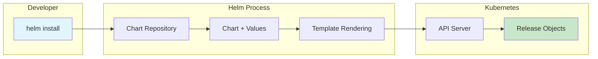
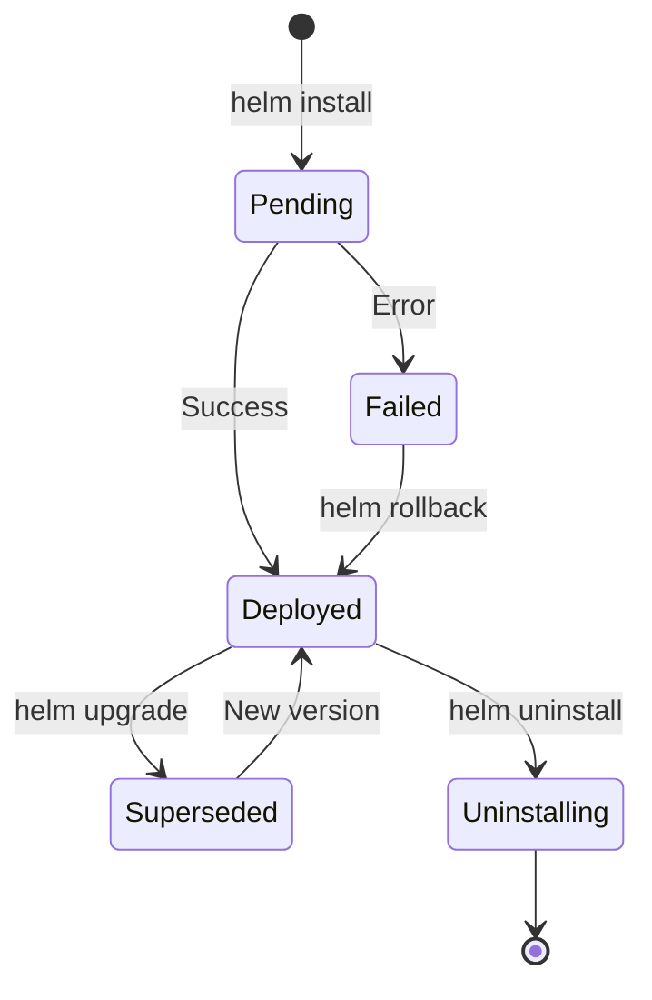
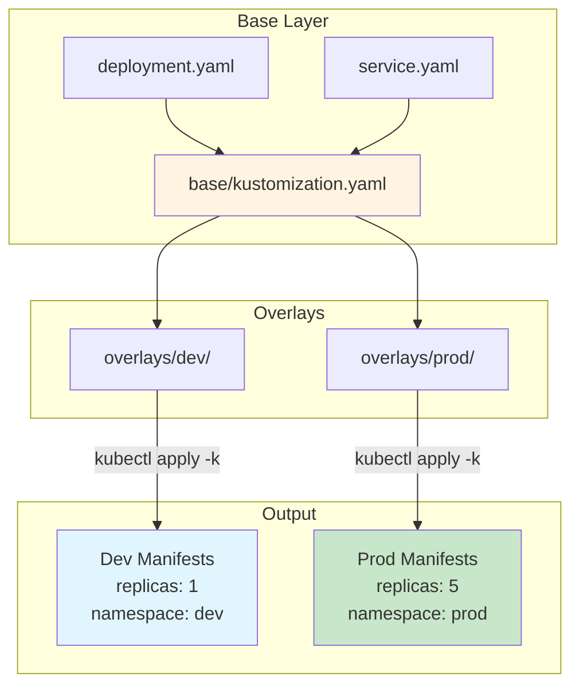
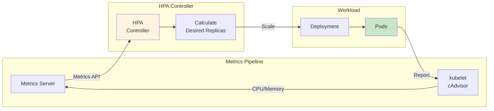
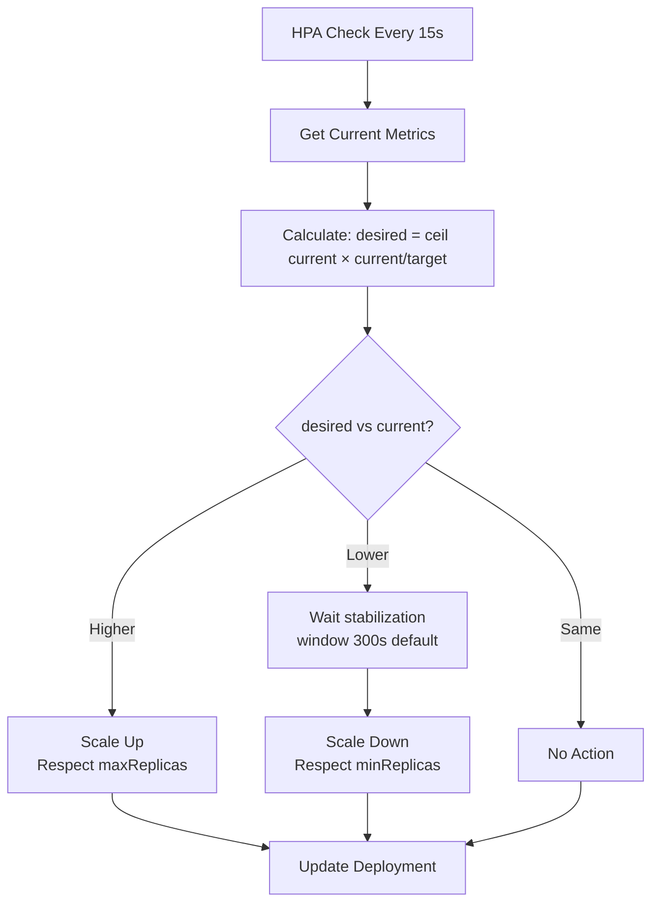
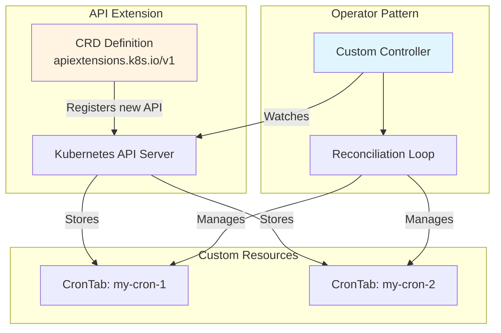
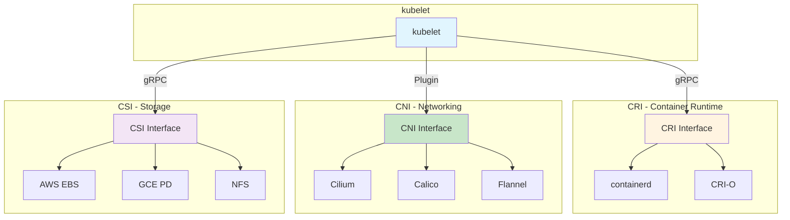

# CKA 2025 New Topics (February 2025 Curriculum Update)

**Effective**: February 18, 2025
**Exam Version**: Kubernetes v1.32+
**Pass Score**: 74% | **Duration**: 2 hours

---

## What Changed in 2025?

The CKA exam domains remain the same, but competencies were updated:

| Domain | Weight | Key 2025 Additions |
|--------|--------|-------------------|
| Troubleshooting | 30% | Expanded network diagnostics |
| Cluster Architecture | 25% | CRDs, Operators, Extension interfaces |
| Services & Networking | 20% | **Gateway API** (replaces Ingress) |
| Workloads & Scheduling | 15% | **HPA/VPA**, Helm, Kustomize |
| Storage | 10% | Dynamic provisioning emphasis |

### New Topics Added:
- Gateway API (covered in 03-services-networking.md)
- **Helm & Kustomize** (this document)
- **CRDs and Operators** (this document)
- **HPA/VPA Autoscaling** (this document)
- **CNI/CSI/CRI Interfaces** (this document)
- **etcdutl** (replaces etcdctl for snapshots)

### Removed:
- "Provision underlying infrastructure" (managed K8s is now standard)

---

## 1. Helm Package Manager

Helm is the package manager for Kubernetes. Charts are packages of pre-configured Kubernetes resources.

### Key Concepts

```
Chart         = Package of K8s manifests + templates
Repository    = Collection of charts (like apt/yum repos)
Release       = Instance of a chart running in cluster
Values        = Configuration for a chart
```

### Helm Architecture



### Helm Release Lifecycle



### Essential Commands

```bash
# Repository management
helm repo add bitnami https://charts.bitnami.com/bitnami
helm repo update
helm repo list
helm search repo nginx              # Search in added repos
helm search hub prometheus          # Search Artifact Hub

# Install/Upgrade
helm install myrelease bitnami/nginx                    # Install chart
helm install myrelease bitnami/nginx -f values.yaml    # With custom values
helm install myrelease bitnami/nginx --set service.type=NodePort
helm install myrelease bitnami/nginx -n mynamespace --create-namespace

# Upgrade and rollback
helm upgrade myrelease bitnami/nginx --set replicaCount=3
helm rollback myrelease 1           # Rollback to revision 1
helm history myrelease              # Show revision history

# Inspect and manage
helm list                           # List releases
helm list -A                        # All namespaces
helm status myrelease               # Release status
helm get values myrelease           # Get configured values
helm get manifest myrelease         # Get rendered manifests

# Uninstall
helm uninstall myrelease
helm uninstall myrelease --keep-history  # Keep history for rollback
```

### CKA Exam Scenario: Install nginx-ingress

```bash
# Add the ingress-nginx repo
helm repo add ingress-nginx https://kubernetes.github.io/ingress-nginx
helm repo update

# Install with custom values
helm install nginx-ingress ingress-nginx/ingress-nginx \
  --namespace ingress-nginx \
  --create-namespace \
  --set controller.service.type=NodePort

# Verify installation
helm list -n ingress-nginx
kubectl get pods -n ingress-nginx
```

### Values File Example

```yaml
# values.yaml
replicaCount: 3
image:
  repository: nginx
  tag: "1.25"
service:
  type: LoadBalancer
  port: 80
resources:
  limits:
    cpu: 100m
    memory: 128Mi
  requests:
    cpu: 50m
    memory: 64Mi
```

---

## 2. Kustomize

Kustomize provides template-free customization of Kubernetes manifests using overlays and patches.

### Key Concepts

```
Base          = Original manifests (reusable)
Overlay       = Environment-specific customizations
Patch         = Modifications to base resources
Generator     = Create ConfigMaps/Secrets from files
```

### Kustomize Architecture



### Directory Structure

```
├── base/
│   ├── kustomization.yaml
│   ├── deployment.yaml
│   └── service.yaml
└── overlays/
    ├── dev/
    │   └── kustomization.yaml
    └── prod/
        ├── kustomization.yaml
        └── replica-patch.yaml
```

### Essential Commands

```bash
# View rendered manifests
kubectl kustomize ./base/
kubectl kustomize ./overlays/prod/

# Apply with kustomize
kubectl apply -k ./base/
kubectl apply -k ./overlays/prod/

# Get/Describe resources from kustomize directory
kubectl get -k ./
kubectl describe -k ./

# Delete resources
kubectl delete -k ./overlays/dev/
```

### Base kustomization.yaml

```yaml
# base/kustomization.yaml
apiVersion: kustomize.config.k8s.io/v1beta1
kind: Kustomization

resources:
  - deployment.yaml
  - service.yaml

commonLabels:
  app: myapp
```

### Overlay with Patches

```yaml
# overlays/prod/kustomization.yaml
apiVersion: kustomize.config.k8s.io/v1beta1
kind: Kustomization

resources:
  - ../../base

namePrefix: prod-
namespace: production

replicas:
  - name: myapp
    count: 5

images:
  - name: nginx
    newTag: "1.25-alpine"

patches:
  - path: replica-patch.yaml
```

```yaml
# overlays/prod/replica-patch.yaml
apiVersion: apps/v1
kind: Deployment
metadata:
  name: myapp
spec:
  replicas: 5
```

### ConfigMap Generator

```yaml
# kustomization.yaml
configMapGenerator:
  - name: app-config
    files:
      - config.properties
    literals:
      - LOG_LEVEL=INFO
      - DEBUG=false

secretGenerator:
  - name: app-secrets
    literals:
      - DB_PASSWORD=secret123
    type: Opaque
```

### CKA Exam Scenario: Deploy to Multiple Environments

```bash
# View what would be applied to dev
kubectl kustomize overlays/dev/

# Apply to dev
kubectl apply -k overlays/dev/

# Apply to prod
kubectl apply -k overlays/prod/

# Compare environments
diff <(kubectl kustomize overlays/dev/) <(kubectl kustomize overlays/prod/)
```

---

## 3. Horizontal Pod Autoscaler (HPA)

HPA automatically scales workloads based on CPU, memory, or custom metrics.

### HPA Scaling Loop



### HPA Decision Process



### Prerequisites

```bash
# Metrics Server must be installed (provides CPU/memory metrics)
kubectl top nodes                    # Verify metrics-server works
kubectl top pods
```

### Create HPA with kubectl

```bash
# Basic HPA (CPU-based)
kubectl autoscale deployment nginx --cpu-percent=50 --min=1 --max=10

# View HPA
kubectl get hpa
kubectl describe hpa nginx

# Delete HPA
kubectl delete hpa nginx
```

### HPA v2 YAML (Multiple Metrics)

```yaml
apiVersion: autoscaling/v2
kind: HorizontalPodAutoscaler
metadata:
  name: nginx-hpa
spec:
  scaleTargetRef:
    apiVersion: apps/v1
    kind: Deployment
    name: nginx
  minReplicas: 2
  maxReplicas: 10
  metrics:
  # CPU utilization
  - type: Resource
    resource:
      name: cpu
      target:
        type: Utilization
        averageUtilization: 50
  # Memory (average value)
  - type: Resource
    resource:
      name: memory
      target:
        type: AverageValue
        averageValue: 500Mi
  # Scaling behavior (optional)
  behavior:
    scaleDown:
      stabilizationWindowSeconds: 300  # Wait 5 min before scale down
      policies:
      - type: Percent
        value: 10
        periodSeconds: 60
    scaleUp:
      stabilizationWindowSeconds: 0
      policies:
      - type: Percent
        value: 100
        periodSeconds: 15
      - type: Pods
        value: 4
        periodSeconds: 15
      selectPolicy: Max
```

### CKA Exam Scenario: Create HPA

```bash
# Ensure deployment has resource requests (required for HPA)
kubectl set resources deployment nginx --requests=cpu=100m,memory=128Mi

# Create HPA
kubectl autoscale deployment nginx --cpu-percent=50 --min=2 --max=5

# Generate load to trigger scaling
kubectl run load-generator --image=busybox --restart=Never -- \
  /bin/sh -c "while true; do wget -q -O- http://nginx; done"

# Watch scaling
kubectl get hpa nginx -w
kubectl get pods -w
```

### Troubleshooting HPA

```bash
# Check HPA status
kubectl describe hpa nginx

# Common issues:
# - "unknown" metrics: Metrics Server not installed
# - No scaling: Deployment missing resource requests
# - "<unknown>/50%" for TARGETS: Pod not generating load
```

---

## 4. Vertical Pod Autoscaler (VPA)

VPA adjusts CPU and memory requests automatically (requires VPA addon).

### VPA Modes

| Mode | Effect |
|------|--------|
| `Off` | Only provides recommendations |
| `Initial` | Sets requests at pod creation only |
| `Auto` | Updates running pods (recreates them) |

### VPA YAML

```yaml
apiVersion: autoscaling.k8s.io/v1
kind: VerticalPodAutoscaler
metadata:
  name: nginx-vpa
spec:
  targetRef:
    apiVersion: apps/v1
    kind: Deployment
    name: nginx
  updatePolicy:
    updateMode: "Auto"
  resourcePolicy:
    containerPolicies:
    - containerName: "*"
      minAllowed:
        cpu: 50m
        memory: 64Mi
      maxAllowed:
        cpu: 1
        memory: 1Gi
```

---

## 5. Custom Resource Definitions (CRDs)

CRDs extend the Kubernetes API with custom resources.

### CRD Relationship Diagram



### CRD Structure

```yaml
apiVersion: apiextensions.k8s.io/v1
kind: CustomResourceDefinition
metadata:
  name: crontabs.stable.example.com  # <plural>.<group>
spec:
  group: stable.example.com          # API group
  versions:
    - name: v1
      served: true                   # Enable this version
      storage: true                  # Storage version (only one!)
      schema:
        openAPIV3Schema:             # Validation schema
          type: object
          properties:
            spec:
              type: object
              properties:
                cronSpec:
                  type: string
                  pattern: '^(\d+|\*)(/\d+)?(\s+(\d+|\*)(/\d+)?){4}$'
                image:
                  type: string
                replicas:
                  type: integer
                  minimum: 1
                  maximum: 10
                  default: 1
              required:
                - cronSpec
                - image
  scope: Namespaced                  # or Cluster
  names:
    plural: crontabs
    singular: crontab
    kind: CronTab
    shortNames:
      - ct
```

### Create and Use CRD

```bash
# Apply CRD
kubectl apply -f crd.yaml

# Verify CRD created
kubectl get crd crontabs.stable.example.com

# Create custom resource
kubectl apply -f - <<EOF
apiVersion: stable.example.com/v1
kind: CronTab
metadata:
  name: my-cron
spec:
  cronSpec: "* * * * */5"
  image: my-cron-image
  replicas: 3
EOF

# Use custom resource
kubectl get crontabs
kubectl get ct                       # Short name
kubectl describe ct my-cron
kubectl delete ct my-cron
```

### CRD with Scale Subresource (for HPA)

```yaml
apiVersion: apiextensions.k8s.io/v1
kind: CustomResourceDefinition
metadata:
  name: scalableapps.example.com
spec:
  group: example.com
  versions:
    - name: v1
      served: true
      storage: true
      subresources:
        scale:
          specReplicasPath: .spec.replicas
          statusReplicasPath: .status.replicas
          labelSelectorPath: .status.labelSelector
      schema:
        openAPIV3Schema:
          type: object
          properties:
            spec:
              type: object
              properties:
                replicas:
                  type: integer
            status:
              type: object
              properties:
                replicas:
                  type: integer
                labelSelector:
                  type: string
  scope: Namespaced
  names:
    plural: scalableapps
    singular: scalableapp
    kind: ScalableApp
```

---

## 6. Kubernetes Extension Interfaces

### Extension Interfaces Overview



### CRI (Container Runtime Interface)

The CRI is a plugin interface enabling kubelet to use various container runtimes.

```
kubelet <--gRPC--> CRI <--> Container Runtime (containerd, CRI-O)
```

**Key Points**:
- Defined as gRPC protocol
- kubelet flag: `--container-runtime-endpoint`
- Default: `unix:///run/containerd/containerd.sock`
- K8s v1.26+ requires CRI v1 API

```bash
# Check container runtime
kubectl get nodes -o wide  # Shows CONTAINER-RUNTIME

# On node, check runtime endpoint
cat /var/lib/kubelet/kubeadm-flags.env
# Contains: --container-runtime-endpoint=unix:///run/containerd/containerd.sock

# Use crictl to interact with CRI
sudo crictl ps                       # List containers
sudo crictl pods                     # List pods
sudo crictl images                   # List images
sudo crictl logs <container-id>      # Container logs
```

### CNI (Container Network Interface)

CNI plugins configure pod networking.

```
kubelet --> CRI --> CNI Plugin --> Pod Network
```

**Key Points**:
- CNI plugins in: `/opt/cni/bin/`
- CNI config in: `/etc/cni/net.d/`
- Common plugins: Cilium, Calico, Flannel, Weave

```bash
# Check CNI plugin
ls /etc/cni/net.d/                   # CNI config files
ls /opt/cni/bin/                     # CNI binaries

# Example CNI config
cat /etc/cni/net.d/10-cilium.conflist

# Troubleshoot CNI issues
kubectl get pods -n kube-system | grep -E 'cilium|calico|flannel'
kubectl logs -n kube-system -l k8s-app=cilium
```

### CSI (Container Storage Interface)

CSI is the standard for exposing storage systems to Kubernetes.

```
PVC --> StorageClass --> CSI Driver --> Storage Backend
```

**Key Points**:
- CSI drivers run as pods in kube-system
- Enables dynamic provisioning
- Replaces in-tree volume plugins

```bash
# List CSI drivers
kubectl get csidrivers

# Example: AWS EBS CSI driver pods
kubectl get pods -n kube-system -l app=ebs-csi-controller

# CSI driver creates StorageClass
kubectl get storageclass
```

---

## 7. etcdutl (Replaces etcdctl for Snapshots)

**Important**: `etcdctl snapshot` is deprecated since etcd v3.5.x. Use `etcdutl` instead.

### Backup with etcdutl

```bash
# etcdctl snapshot save is DEPRECATED
# Use etcdutl for snapshot operations

# Check etcd pod for certificates
kubectl -n kube-system get pod etcd-master1 -o yaml | grep -A5 volumes

# Certificate locations (typical kubeadm setup)
# --cacert=/etc/kubernetes/pki/etcd/ca.crt
# --cert=/etc/kubernetes/pki/etcd/server.crt
# --key=/etc/kubernetes/pki/etcd/server.key

# Backup using etcdctl (still works for backup, deprecated for restore)
ETCDCTL_API=3 etcdctl \
  --endpoints=https://127.0.0.1:2379 \
  --cacert=/etc/kubernetes/pki/etcd/ca.crt \
  --cert=/etc/kubernetes/pki/etcd/server.crt \
  --key=/etc/kubernetes/pki/etcd/server.key \
  snapshot save /backup/etcd-snapshot.db

# Verify snapshot
ETCDCTL_API=3 etcdctl snapshot status /backup/etcd-snapshot.db --write-out=table
```

### Restore with etcdutl (NEW RECOMMENDED METHOD)

```bash
# Stop API server and etcd
sudo mv /etc/kubernetes/manifests/kube-apiserver.yaml /tmp/
sudo mv /etc/kubernetes/manifests/etcd.yaml /tmp/

# Restore using etcdutl (NOT etcdctl)
etcdutl --data-dir=/var/lib/etcd-restored snapshot restore /backup/etcd-snapshot.db

# Update etcd manifest to use new data directory
sudo vi /tmp/etcd.yaml
# Change: --data-dir=/var/lib/etcd-restored
# Change volume hostPath to /var/lib/etcd-restored

# Move manifests back
sudo mv /tmp/etcd.yaml /etc/kubernetes/manifests/
sudo mv /tmp/kube-apiserver.yaml /etc/kubernetes/manifests/

# Wait for pods to restart
kubectl get pods -n kube-system
```

### etcdctl vs etcdutl

| Operation | etcdctl | etcdutl |
|-----------|---------|---------|
| Snapshot save | Supported | Not available |
| Snapshot restore | **Deprecated** | **Recommended** |
| Snapshot status | Supported | Supported |
| Defragment | Supported | Supported |

---

## 8. kubectl debug (Expanded)

Debug running pods and nodes with ephemeral containers.

### Debug a Running Pod

```bash
# Add debug container to running pod
kubectl debug mypod -it --image=busybox --target=mycontainer

# Debug with specific tools
kubectl debug mypod -it --image=nicolaka/netshoot -- bash

# Copy pod for debugging (creates new pod with modified config)
kubectl debug mypod -it --image=busybox --copy-to=mypod-debug
```

### Debug a Node

```bash
# Create debugging pod on a node (with host access)
kubectl debug node/mynode -it --image=busybox

# Inside the debug container, access host filesystem at /host
chroot /host
# Now you're in the node's filesystem

# Check kubelet
systemctl status kubelet
journalctl -xeu kubelet

# Check container runtime
crictl ps
crictl pods
```

### Debug CrashLoopBackOff Pod

```bash
# Create copy with command override
kubectl debug mypod --copy-to=mypod-debug --container=mycontainer -- sleep infinity

# Now exec into the non-crashing copy
kubectl exec -it mypod-debug -- sh
```

---

## Quick Reference: CKA 2025 Commands

```bash
# Helm
helm install myapp bitnami/nginx --set replicaCount=3
helm upgrade myapp bitnami/nginx --set replicaCount=5
helm rollback myapp 1

# Kustomize
kubectl apply -k ./overlays/prod/
kubectl kustomize ./base/

# HPA
kubectl autoscale deployment nginx --cpu-percent=50 --min=2 --max=10
kubectl get hpa

# CRDs
kubectl get crd
kubectl get <custom-resource>

# etcd backup/restore
ETCDCTL_API=3 etcdctl snapshot save /backup/snapshot.db
etcdutl --data-dir=/var/lib/etcd-new snapshot restore /backup/snapshot.db

# Debug
kubectl debug mypod -it --image=busybox
kubectl debug node/mynode -it --image=busybox

# Extension interfaces
crictl ps                            # CRI
ls /etc/cni/net.d/                   # CNI
kubectl get csidrivers               # CSI
```

---

## Sources

- [CKA Exam Updates 2025](https://blog.techiescamp.com/cka-exam-updates/)
- [Linux Foundation CKA Program Changes](https://training.linuxfoundation.org/certified-kubernetes-administrator-cka-program-changes/)
- [CNCF CKA Curriculum GitHub](https://github.com/cncf/curriculum)
- [Kubernetes Official Documentation](https://kubernetes.io/docs/)
