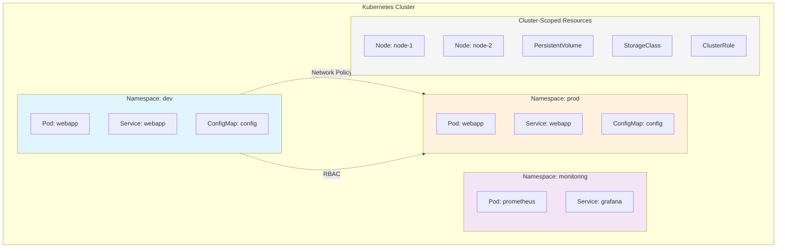
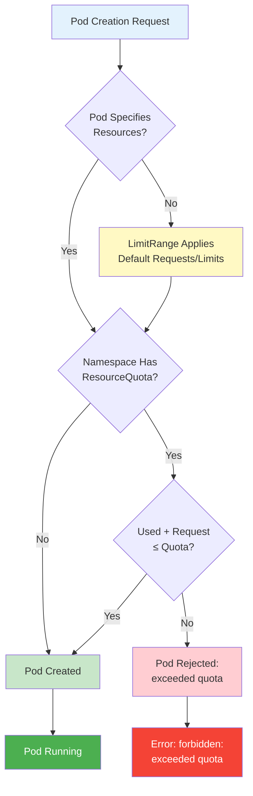
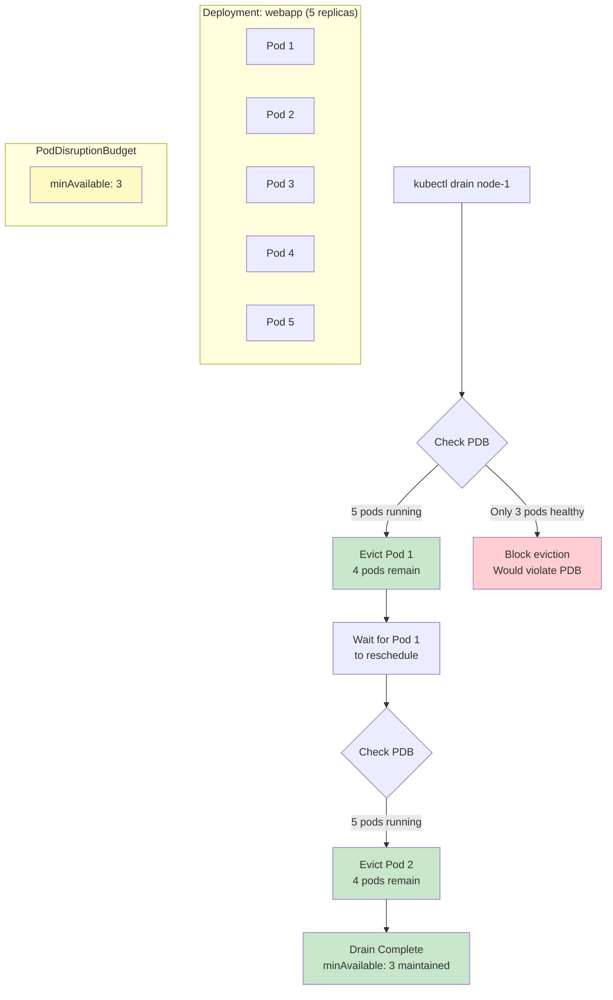

# Resource Management & Namespaces (CKA Supplementary)

**CKA Exam Coverage**: Workloads & Scheduling (15%), Cluster Architecture (25%)
**Kubernetes Version**: v1.32+
**Last Updated**: 2025-11-27

## Overview

This document covers resource management topics that span multiple CKA domains:

- **Namespaces**: Logical cluster partitioning and isolation
- **ResourceQuota**: Aggregate resource limits per namespace
- **LimitRange**: Default and constrained resource specifications
- **PodDisruptionBudget**: Availability guarantees during maintenance

**Key Concepts**:
- **Namespace**: Virtual cluster boundary providing resource isolation
- **ResourceQuota**: Limits aggregate resource consumption per namespace
- **LimitRange**: Sets default resource requests/limits and enforces min/max constraints
- **PodDisruptionBudget**: Ensures minimum availability during voluntary disruptions

---

## 1. Namespace Fundamentals

### Default Namespaces

Kubernetes creates four default namespaces:

| Namespace | Purpose | Usage |
|-----------|---------|-------|
| **default** | Default namespace for objects without a specified namespace | User workloads |
| **kube-system** | Objects created by the Kubernetes system | Control plane components, DNS, metrics |
| **kube-public** | Readable by all users (including unauthenticated) | Cluster information, public ConfigMaps |
| **kube-node-lease** | Lease objects for node heartbeats | Node health monitoring |

### Namespace Isolation

Namespaces provide **soft multi-tenancy** through:

1. **Name Scoping**: Resources with the same name can exist in different namespaces
2. **RBAC Scoping**: Roles and RoleBindings apply within a namespace
3. **Network Policies**: Can restrict traffic between namespaces
4. **Resource Quotas**: Limit resource consumption per namespace



**Important**: Namespaces do NOT provide strong isolation:
- Pods in different namespaces can communicate by default
- Network Policies are required for traffic restrictions
- RBAC must be configured for access control

### Namespaced vs Cluster-Scoped Resources

**Namespaced Resources** (scoped to a namespace):
```bash
kubectl api-resources --namespaced=true
```

Common namespaced resources:
- Pods, Deployments, StatefulSets, DaemonSets
- Services, Endpoints, Ingresses
- ConfigMaps, Secrets
- ServiceAccounts, Roles, RoleBindings
- ResourceQuotas, LimitRanges, NetworkPolicies
- PersistentVolumeClaims (PVCs)

**Cluster-Scoped Resources** (not bound to a namespace):
```bash
kubectl api-resources --namespaced=false
```

Common cluster-scoped resources:
- Nodes
- PersistentVolumes (PVs)
- StorageClasses
- ClusterRoles, ClusterRoleBindings
- CustomResourceDefinitions (CRDs)
- Namespaces themselves

### Namespace Management Commands

#### Create Namespaces

```bash
# Create namespace imperatively
kubectl create namespace dev

# Create namespace declaratively
cat <<EOF | kubectl apply -f -
apiVersion: v1
kind: Namespace
metadata:
  name: production
  labels:
    env: prod
    team: platform
EOF
```

#### View Namespaces

```bash
# List all namespaces
kubectl get namespaces
kubectl get ns  # shorthand

# Describe namespace
kubectl describe namespace dev

# View namespace YAML
kubectl get namespace dev -o yaml
```

#### Set Default Namespace Context

```bash
# View current context
kubectl config current-context

# Set default namespace for current context
kubectl config set-context --current --namespace=dev

# Verify current namespace
kubectl config view --minify | grep namespace:

# Switch back to default namespace
kubectl config set-context --current --namespace=default
```

#### Delete Namespaces

```bash
# Delete namespace (WARNING: deletes all resources in namespace)
kubectl delete namespace dev

# Delete with confirmation
kubectl delete namespace dev --wait=true

# Check stuck namespace deletion (finalizers)
kubectl get namespace dev -o json | jq .spec.finalizers
```

### Working Across Namespaces

```bash
# Specify namespace with -n flag
kubectl get pods -n kube-system

# Get resources from all namespaces
kubectl get pods --all-namespaces
kubectl get pods -A  # shorthand

# Create resource in specific namespace
kubectl run nginx --image=nginx -n dev

# Apply manifest to specific namespace
kubectl apply -f deployment.yaml -n production
```

### Quick Reference: Namespace Commands

| Task | Command |
|------|---------|
| Create namespace | `kubectl create ns <name>` |
| List namespaces | `kubectl get ns` |
| Describe namespace | `kubectl describe ns <name>` |
| Set default namespace | `kubectl config set-context --current --namespace=<name>` |
| View current namespace | `kubectl config view --minify \| grep namespace:` |
| Delete namespace | `kubectl delete ns <name>` |
| Get resources in namespace | `kubectl get <resource> -n <name>` |
| Get resources in all namespaces | `kubectl get <resource> -A` |
| Check if resource is namespaced | `kubectl api-resources --namespaced=true` |

---

## 2. ResourceQuota

### Overview

**ResourceQuota** limits the aggregate resource consumption in a namespace. It prevents a single namespace from monopolizing cluster resources and enables resource sharing across teams.

### ResourceQuota Types

1. **Compute Resource Quotas**: CPU, memory, GPU
2. **Storage Resource Quotas**: Storage requests, PersistentVolumeClaims
3. **Object Count Quotas**: Number of objects (Pods, Services, etc.)
4. **Scoped Quotas**: Apply to specific Pod states or PriorityClasses

### Complete ResourceQuota Example

```yaml
apiVersion: v1
kind: ResourceQuota
metadata:
  name: compute-resources
  namespace: development
spec:
  hard:
    # Compute quotas (total across all pods)
    requests.cpu: "10"              # Total CPU requests
    requests.memory: "20Gi"         # Total memory requests
    limits.cpu: "20"                # Total CPU limits
    limits.memory: "40Gi"           # Total memory limits

    # Object count quotas
    pods: "50"                      # Maximum number of pods
    services: "10"                  # Maximum number of services
    services.loadbalancers: "2"     # Maximum LoadBalancer services
    services.nodeports: "5"         # Maximum NodePort services
    configmaps: "20"                # Maximum ConfigMaps
    secrets: "20"                   # Maximum Secrets
    persistentvolumeclaims: "10"    # Maximum PVCs

    # Storage quotas
    requests.storage: "100Gi"       # Total storage requests
```

### Scoped ResourceQuotas

ResourceQuotas can be scoped to specific Pod states or PriorityClasses:

#### PriorityClass Scoping

```yaml
apiVersion: v1
kind: ResourceQuota
metadata:
  name: high-priority-quota
  namespace: production
spec:
  hard:
    cpu: "1000"
    memory: "200Gi"
    pods: "10"
  scopeSelector:
    matchExpressions:
    - operator: In
      scopeName: PriorityClass
      values: ["high"]
```

#### QoS Class Scoping

```yaml
apiVersion: v1
kind: ResourceQuota
metadata:
  name: besteffort-quota
  namespace: dev
spec:
  hard:
    pods: "5"  # Only 5 BestEffort pods allowed
  scopes:
  - BestEffort
```

**Available Scopes**:
- `Terminating`: Pods with `activeDeadlineSeconds` set
- `NotTerminating`: Pods without `activeDeadlineSeconds`
- `BestEffort`: Pods with QoS class BestEffort
- `NotBestEffort`: Pods with QoS class Burstable or Guaranteed
- `PriorityClass`: Pods with specific PriorityClass (use `scopeSelector`)

### Resource Management Flow



### ResourceQuota Commands

```bash
# Create quota from YAML
kubectl apply -f quota.yaml

# Create quota imperatively
kubectl create quota my-quota --hard=cpu=10,memory=20Gi,pods=50 -n dev

# List quotas in namespace
kubectl get quota -n dev
kubectl get resourcequota -n dev  # full name

# Describe quota (shows usage)
kubectl describe quota my-quota -n dev

# View quota YAML
kubectl get quota my-quota -n dev -o yaml

# Edit quota
kubectl edit quota my-quota -n dev

# Delete quota
kubectl delete quota my-quota -n dev
```

### Quick Reference: ResourceQuota

| Resource Type | Quota Key | Description |
|---------------|-----------|-------------|
| CPU requests | `requests.cpu` | Sum of CPU requests |
| Memory requests | `requests.memory` | Sum of memory requests |
| CPU limits | `limits.cpu` | Sum of CPU limits |
| Memory limits | `limits.memory` | Sum of memory limits |
| Storage | `requests.storage` | Sum of PVC storage requests |
| Pods | `pods` or `count/pods` | Number of pods |
| Services | `services` or `count/services` | Number of services |
| ConfigMaps | `configmaps` or `count/configmaps` | Number of ConfigMaps |
| Secrets | `secrets` or `count/secrets` | Number of Secrets |
| PVCs | `persistentvolumeclaims` | Number of PVCs |

---

## 3. LimitRange

### Overview

**LimitRange** sets default resource requests/limits for Pods and containers, and enforces minimum/maximum resource constraints within a namespace.

**Purpose**:
- Apply default `requests` and `limits` to containers without explicit values
- Enforce minimum and maximum resource boundaries
- Prevent resource-intensive workloads from consuming excessive resources

### LimitRange vs ResourceQuota

| Feature | LimitRange | ResourceQuota |
|---------|-----------|---------------|
| **Scope** | Individual containers/pods | Aggregate across namespace |
| **Applies defaults** | Yes | No |
| **Enforces min/max** | Yes | No |
| **Limits total usage** | No | Yes |
| **Enforcement** | At pod admission | At pod admission |

**Together**: LimitRange sets defaults -> ResourceQuota validates totals

### Complete LimitRange Example

```yaml
apiVersion: v1
kind: LimitRange
metadata:
  name: resource-constraints
  namespace: development
spec:
  limits:
  # Container-level limits
  - type: Container
    default:              # Default limits (if not specified)
      cpu: "500m"
      memory: "512Mi"
    defaultRequest:       # Default requests (if not specified)
      cpu: "250m"
      memory: "256Mi"
    max:                  # Maximum allowed
      cpu: "2"
      memory: "2Gi"
    min:                  # Minimum required
      cpu: "100m"
      memory: "128Mi"
    maxLimitRequestRatio: # Max ratio of limit/request
      cpu: "4"            # limit can be at most 4x request
      memory: "2"         # limit can be at most 2x request

  # Pod-level limits (sum of all containers)
  - type: Pod
    max:
      cpu: "4"
      memory: "4Gi"
    min:
      cpu: "200m"
      memory: "256Mi"

  # PersistentVolumeClaim limits
  - type: PersistentVolumeClaim
    max:
      storage: "10Gi"
    min:
      storage: "1Gi"
```

### How Defaults Are Applied

```yaml
# Original Pod spec (no resources specified)
apiVersion: v1
kind: Pod
metadata:
  name: myapp
spec:
  containers:
  - name: app
    image: nginx

# After LimitRange defaults applied
apiVersion: v1
kind: Pod
metadata:
  name: myapp
spec:
  containers:
  - name: app
    image: nginx
    resources:
      requests:
        cpu: "250m"      # From defaultRequest
        memory: "256Mi"  # From defaultRequest
      limits:
        cpu: "500m"      # From default
        memory: "512Mi"  # From default
```

### Limit/Request Ratio

```yaml
apiVersion: v1
kind: LimitRange
metadata:
  name: ratio-limits
  namespace: dev
spec:
  limits:
  - type: Container
    maxLimitRequestRatio:
      cpu: "4"       # limits.cpu <= 4 x requests.cpu
      memory: "2"    # limits.memory <= 2 x requests.memory
```

**Example**:
```yaml
# Valid: limit is 4x request
resources:
  requests:
    cpu: "250m"
  limits:
    cpu: "1000m"  # 4x request - OK

# Invalid: limit is 8x request
resources:
  requests:
    cpu: "250m"
  limits:
    cpu: "2000m"  # 8x request - REJECTED
```

### LimitRange Commands

```bash
# Create LimitRange from YAML
kubectl apply -f limitrange.yaml

# List LimitRanges
kubectl get limitrange -n dev
kubectl get limits -n dev  # shorthand

# Describe LimitRange (shows all constraints)
kubectl describe limitrange resource-constraints -n dev

# View LimitRange YAML
kubectl get limitrange resource-constraints -n dev -o yaml

# Delete LimitRange
kubectl delete limitrange resource-constraints -n dev
```

### Quick Reference: LimitRange

| Type | Field | Purpose |
|------|-------|---------|
| Container | `default` | Default limits if not specified |
| Container | `defaultRequest` | Default requests if not specified |
| Container | `max` | Maximum allowed limits |
| Container | `min` | Minimum required requests |
| Container | `maxLimitRequestRatio` | Max ratio of limit/request |
| Pod | `max` | Maximum sum of all containers |
| Pod | `min` | Minimum sum of all containers |
| PVC | `max` | Maximum storage request |
| PVC | `min` | Minimum storage request |

---

## 4. PodDisruptionBudget (PDB)

### Overview

**PodDisruptionBudget** ensures a minimum number of pods remain available during **voluntary disruptions** such as:
- Node drains (`kubectl drain`)
- Cluster upgrades
- Node maintenance
- Deployments/rollouts (with eviction API)

**Does NOT protect against**:
- Hardware failures
- Node crashes
- Involuntary disruptions

### minAvailable vs maxUnavailable

```yaml
# Example 1: minAvailable (absolute number)
apiVersion: policy/v1
kind: PodDisruptionBudget
metadata:
  name: zk-pdb
  namespace: production
spec:
  minAvailable: 2       # At least 2 pods must be available
  selector:
    matchLabels:
      app: zookeeper

---
# Example 2: minAvailable (percentage)
apiVersion: policy/v1
kind: PodDisruptionBudget
metadata:
  name: web-pdb
spec:
  minAvailable: "75%"   # At least 75% of pods must be available
  selector:
    matchLabels:
      app: webapp

---
# Example 3: maxUnavailable (absolute number)
apiVersion: policy/v1
kind: PodDisruptionBudget
metadata:
  name: cache-pdb
spec:
  maxUnavailable: 1     # At most 1 pod can be unavailable
  selector:
    matchLabels:
      app: redis

---
# Example 4: maxUnavailable (percentage)
apiVersion: policy/v1
kind: PodDisruptionBudget
metadata:
  name: api-pdb
spec:
  maxUnavailable: "25%"  # At most 25% of pods can be unavailable
  selector:
    matchLabels:
      app: api-server
```

### Understanding the Difference

| Scenario | Replicas | minAvailable: 2 | maxUnavailable: 1 |
|----------|----------|-----------------|-------------------|
| Normal state | 3 | 2+ must stay up | <=1 can be down |
| During drain | 3 | Can evict 1 pod | Can evict 1 pod |
| Scaled to 5 | 5 | Can evict 3 pods | Can evict 1 pod |
| Scaled to 2 | 2 | Can evict 0 pods | Can evict 1 pod |

**Key Insight**:
- `minAvailable` is **static** (always requires 2+ pods available)
- `maxUnavailable` is **dynamic** (scales with replica count)

### PDB Protection During Node Drain



### unhealthyPodEvictionPolicy (v1.26+)

```yaml
apiVersion: policy/v1
kind: PodDisruptionBudget
metadata:
  name: advanced-pdb
spec:
  minAvailable: 2
  selector:
    matchLabels:
      app: myapp
  unhealthyPodEvictionPolicy: IfHealthyBudget
```

**Options**:
- **`IfHealthyBudget`** (default): Unhealthy pods count toward PDB
- **`AlwaysAllow`**: Unhealthy pods can always be evicted regardless of PDB

### PDB Commands

```bash
# Create PDB from YAML
kubectl apply -f pdb.yaml

# Create PDB imperatively
kubectl create pdb my-pdb --selector=app=nginx --min-available=2

# Create PDB with percentage
kubectl create pdb my-pdb --selector=app=nginx --min-available=75%

# List PDBs
kubectl get pdb -n production
kubectl get poddisruptionbudget -n production  # full name

# Describe PDB (shows current status)
kubectl describe pdb my-pdb -n production

# View PDB with status
kubectl get pdb my-pdb -n production -o yaml

# Delete PDB
kubectl delete pdb my-pdb -n production
```

### Quick Reference: PodDisruptionBudget

| Field | Type | Description |
|-------|------|-------------|
| `minAvailable` | int or string | Minimum pods that must be available (absolute or %) |
| `maxUnavailable` | int or string | Maximum pods that can be unavailable (absolute or %) |
| `selector` | LabelSelector | Pods targeted by this PDB |
| `unhealthyPodEvictionPolicy` | string | `IfHealthyBudget` or `AlwaysAllow` |

**Status Fields**:
| Field | Description |
|-------|-------------|
| `currentHealthy` | Current number of healthy pods |
| `desiredHealthy` | Minimum required healthy pods |
| `expectedPods` | Expected total pods |
| `disruptionsAllowed` | Number of pods that can be disrupted now |

---

## 5. Container Probes (Health Checks)

### Overview

Kubernetes uses probes to determine container health and readiness:

| Probe | Purpose | Action on Failure |
|-------|---------|-------------------|
| **Liveness** | Is container alive? | Restart container |
| **Readiness** | Can it serve traffic? | Remove from Service endpoints |
| **Startup** | Has it finished starting? | Wait before liveness/readiness |

### Probe Mechanisms

```yaml
# HTTP GET probe
livenessProbe:
  httpGet:
    path: /healthz
    port: 8080
    httpHeaders:
    - name: Custom-Header
      value: Awesome
  initialDelaySeconds: 15
  periodSeconds: 10

# TCP Socket probe
readinessProbe:
  tcpSocket:
    port: 3306
  initialDelaySeconds: 5
  periodSeconds: 5

# Exec probe
livenessProbe:
  exec:
    command:
    - cat
    - /tmp/healthy
  initialDelaySeconds: 5
  periodSeconds: 5

# gRPC probe (v1.24+)
livenessProbe:
  grpc:
    port: 50051
    service: health
  initialDelaySeconds: 10
  periodSeconds: 10
```

### Complete Probe Example

```yaml
apiVersion: v1
kind: Pod
metadata:
  name: probes-demo
spec:
  containers:
  - name: app
    image: myapp:1.0
    ports:
    - containerPort: 8080

    # Startup probe: wait for slow-starting container
    startupProbe:
      httpGet:
        path: /startup
        port: 8080
      initialDelaySeconds: 0
      periodSeconds: 10
      failureThreshold: 30   # 30 x 10s = 5 min max startup

    # Liveness probe: restart if unhealthy
    livenessProbe:
      httpGet:
        path: /healthz
        port: 8080
      initialDelaySeconds: 0  # Starts after startup probe succeeds
      periodSeconds: 10
      timeoutSeconds: 5
      failureThreshold: 3
      successThreshold: 1

    # Readiness probe: control traffic routing
    readinessProbe:
      httpGet:
        path: /ready
        port: 8080
      initialDelaySeconds: 0  # Starts after startup probe succeeds
      periodSeconds: 5
      timeoutSeconds: 3
      failureThreshold: 3
      successThreshold: 1
```

### Probe Timing Parameters

| Parameter | Description | Default |
|-----------|-------------|---------|
| `initialDelaySeconds` | Seconds to wait before first probe | 0 |
| `periodSeconds` | How often to probe | 10 |
| `timeoutSeconds` | Probe timeout | 1 |
| `successThreshold` | Consecutive successes to be healthy | 1 |
| `failureThreshold` | Consecutive failures to be unhealthy | 3 |

### Startup Probe Use Case

For slow-starting applications (e.g., Java apps with large classpath):

```yaml
startupProbe:
  httpGet:
    path: /healthz
    port: 8080
  failureThreshold: 30
  periodSeconds: 10
# Total startup time allowed: 30 x 10s = 300 seconds (5 minutes)
# Liveness/readiness probes don't start until startup probe succeeds
```

---

## CKA Exam Scenarios

### Scenario 1: Create Namespace with Resource Constraints

**Task**: Create a namespace `test-env` with:
- Maximum 10 pods
- Maximum 5 CPU cores (requests)
- Default container CPU request: 100m

**Solution**:
```bash
# Step 1: Create namespace
kubectl create namespace test-env

# Step 2: Create ResourceQuota
cat <<EOF | kubectl apply -f -
apiVersion: v1
kind: ResourceQuota
metadata:
  name: test-quota
  namespace: test-env
spec:
  hard:
    pods: "10"
    requests.cpu: "5"
EOF

# Step 3: Create LimitRange for defaults
cat <<EOF | kubectl apply -f -
apiVersion: v1
kind: LimitRange
metadata:
  name: test-limits
  namespace: test-env
spec:
  limits:
  - type: Container
    defaultRequest:
      cpu: "100m"
EOF

# Verify
kubectl get quota,limitrange -n test-env
```

### Scenario 2: Troubleshoot ResourceQuota Rejection

**Problem**: Pod creation fails with "exceeded quota"

**Investigation**:
```bash
# Step 1: Check current quota usage
kubectl describe quota -n production

# Step 2: Check existing pods
kubectl get pods -n production -o custom-columns=\
NAME:.metadata.name,\
CPU:.spec.containers[*].resources.limits.cpu

# Step 3: Options to resolve:
# A) Increase quota
kubectl edit quota compute-quota -n production

# B) Delete unused pods
kubectl delete pod <unused-pod> -n production

# C) Reduce pod resource request
```

### Scenario 3: Configure PDB for Zero-Downtime Maintenance

**Task**: Configure PDB for Deployment with 5 replicas ensuring at least 4 always available.

**Solution**:
```bash
cat <<EOF | kubectl apply -f -
apiVersion: policy/v1
kind: PodDisruptionBudget
metadata:
  name: web-app-pdb
  namespace: production
spec:
  minAvailable: 4
  selector:
    matchLabels:
      app: web-app
EOF

# Verify PDB
kubectl get pdb web-app-pdb -n production

# Check allowed disruptions
kubectl get pdb -n production -o wide
```

### Scenario 4: Switch Namespace Context

**Task**:
1. Switch to `dev` namespace
2. Create nginx pods
3. Switch back to `default`

**Solution**:
```bash
# Step 1: Switch to dev
kubectl config set-context --current --namespace=dev

# Step 2: Create pods (now in dev namespace)
kubectl run nginx-1 --image=nginx
kubectl run nginx-2 --image=nginx

# Step 3: Verify
kubectl get pods  # Shows pods in dev

# Step 4: Switch back
kubectl config set-context --current --namespace=default
```

### Scenario 5: Identify Namespaced Resources

**Task**: Determine if these resources are namespaced: Pods, Nodes, PVs, ConfigMaps, ClusterRoles

**Solution**:
```bash
kubectl api-resources | grep -E 'pods|nodes|persistentvolumes|configmaps|clusterroles'

# Results:
# Namespaced: Pods, ConfigMaps
# Cluster-scoped: Nodes, PersistentVolumes, ClusterRoles
```

---

## Cross-References

**Related Documents**:
- **01-cluster-architecture.md**: RBAC (Roles are namespace-scoped)
- **02-workloads-scheduling.md**: Pod resource specifications
- **03-services-networking.md**: Network Policies (namespace isolation)
- **05-troubleshooting.md**: Quota troubleshooting

---

## Summary

| Topic | Key Points |
|-------|------------|
| **Namespaces** | Logical isolation, 4 defaults, soft multi-tenancy |
| **ResourceQuota** | Aggregate limits, scopes, admission enforcement |
| **LimitRange** | Defaults + min/max, works with ResourceQuota |
| **PodDisruptionBudget** | Voluntary disruption protection, minAvailable vs maxUnavailable |
| **Probes** | Liveness (restart), Readiness (traffic), Startup (slow apps) |

---

## Sources

- [Kubernetes Namespaces Documentation](https://kubernetes.io/docs/concepts/overview/working-with-objects/namespaces/)
- [Resource Quotas](https://kubernetes.io/docs/concepts/policy/resource-quotas/)
- [Limit Ranges](https://kubernetes.io/docs/concepts/policy/limit-range/)
- [Pod Disruption Budgets](https://kubernetes.io/docs/concepts/workloads/pods/disruptions/)
- [Container Probes](https://kubernetes.io/docs/tasks/configure-pod-container/configure-liveness-readiness-startup-probes/)
- [CKA Exam Study Guide 2025](https://devopscube.com/cka-exam-study-guide/)
- [CKA Curriculum Changes February 2025](https://techwithmohamed.com/blog/cka-exam-study/)

---

**Document Version**: 1.0
**Last Updated**: 2025-11-27
**Target Kubernetes Version**: v1.32+
**CKA Exam Domains**: Workloads & Scheduling (15%), Cluster Architecture (25%)
