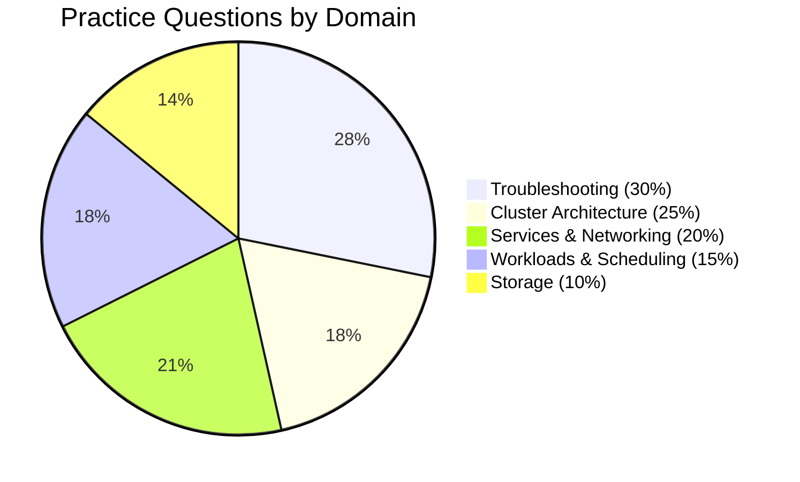

# CKA Practice Exam Questions

**Target**: Certified Kubernetes Administrator (CKA)
**Kubernetes Version**: v1.32+
**Last Updated**: 2025-11-27
**Total Scenarios**: 71 hands-on practice questions

## Overview



| Domain | Weight | Scenarios | Est. Time |
|--------|--------|-----------|-----------|
| [Troubleshooting](#1-troubleshooting-30) | 30% | 20 | 90 min |
| [Cluster Architecture](#2-cluster-architecture-25) | 25% | 13 | 80 min |
| [Services & Networking](#3-services--networking-20) | 20% | 15 | 75 min |
| [Workloads & Scheduling](#4-workloads--scheduling-15) | 15% | 13 | 65 min |
| [Storage](#5-storage-10) | 10% | 10 | 45 min |
| **TOTAL** | **100%** | **71** | **~6 hours** |

## Exam Simulation Tips

1. **Time Management**: Real exam is 2 hours with ~15-20 tasks. Practice completing 3-4 scenarios per 30 minutes
2. **Use `kubectl explain`**: Built-in documentation - `kubectl explain pod.spec.containers`
3. **Generate YAML**: Use `--dry-run=client -o yaml` to create templates quickly
4. **Bookmark kubernetes.io**: Only allowed reference during exam
5. **Practice on killer.sh**: Included with exam registration (2 free sessions)

## Resources Used

- [Linux Foundation CKA](https://training.linuxfoundation.org/certification/certified-kubernetes-administrator-cka/)
- [GitHub - CKA-Exercises](https://github.com/chadmcrowell/CKA-Exercises)
- [GitHub - CKA-practice-exercises](https://github.com/alijahnas/CKA-practice-exercises)
- [Killer Shell CKA Simulator](https://killer.sh/cka)
- [Killercoda Free Labs](https://killercoda.com/killer-shell-cka)
- [DevOpsCube CKA Scenarios](https://courses.devopscube.com/p/cka-exam-practice-scenarios-explanations)

---

# 1. Troubleshooting (30%)

The largest and most critical domain. Focus on systematic debugging methodology.

## Quick Reference Commands

```bash
# Pod debugging
kubectl describe pod <pod> -n <ns>
kubectl logs <pod> [-c container] [--previous]
kubectl exec -it <pod> -- /bin/sh
kubectl debug pod/<pod> -it --image=busybox

# Node debugging
kubectl describe node <node>
kubectl get events --sort-by='.lastTimestamp'
kubectl debug node/<node> -it --image=busybox

# Network debugging
kubectl run test --image=busybox --rm -it -- wget -qO- <service>
kubectl get endpoints <service>
kubectl exec <pod> -- nslookup kubernetes.default
```

## Scenario T1: Fix CrashLoopBackOff Pod

**Difficulty**: Medium | **Time**: 5 min

**Task**: Pod `webapp` in namespace `production` is in CrashLoopBackOff. Identify and fix the issue.

**Solution**:
```bash
# Check events and logs
kubectl describe pod webapp -n production
kubectl logs webapp -n production --previous

# Common causes:
# 1. Wrong command/args - check spec.containers[].command
# 2. Missing ConfigMap/Secret - check volumeMounts
# 3. Liveness probe failure - check probes
# 4. Application error - check logs

# Fix example (wrong image)
kubectl set image pod/webapp webapp=nginx:1.24 -n production
```

**Key Concepts**: CrashLoopBackOff, `--previous` flag, event analysis

---

## Scenario T2: Resolve ImagePullBackOff

**Difficulty**: Easy | **Time**: 3 min

**Task**: Deployment `api-server` in namespace `dev` has pods in ImagePullBackOff. Fix it.

**Solution**:
```bash
# Check error details
kubectl describe pod -l app=api-server -n dev | grep -A5 Events

# Fix 1: Correct image name
kubectl set image deployment/api-server api=myregistry.io/api:v2.1 -n dev

# Fix 2: Add imagePullSecret
kubectl create secret docker-registry regcred \
  --docker-server=myregistry.io \
  --docker-username=user --docker-password=pass -n dev
kubectl patch deployment api-server -n dev \
  -p '{"spec":{"template":{"spec":{"imagePullSecrets":[{"name":"regcred"}]}}}}'
```

**Key Concepts**: ImagePullBackOff, imagePullSecrets, registry authentication

---

## Scenario T3: Debug OOMKilled Container

**Difficulty**: Medium | **Time**: 4 min

**Task**: Pod `data-processor` in `analytics` keeps getting OOMKilled. Fix the resource limits.

**Solution**:
```bash
# Confirm OOM
kubectl describe pod data-processor -n analytics | grep -A5 "Last State"
# Shows: Reason: OOMKilled, Exit Code: 137

# Check current limits
kubectl get pod data-processor -n analytics -o yaml | grep -A10 resources

# Increase memory limit
kubectl patch deployment data-processor -n analytics \
  -p '{"spec":{"template":{"spec":{"containers":[{"name":"processor","resources":{"limits":{"memory":"512Mi"},"requests":{"memory":"256Mi"}}}]}}}}'
```

**Key Concepts**: OOMKilled, Exit Code 137, resource limits/requests

---

## Scenario T4: Fix Pending Pod (Resource Constraints)

**Difficulty**: Medium | **Time**: 5 min

**Task**: Pod `large-app` is stuck in Pending state. Diagnose and resolve.

**Solution**:
```bash
# Check why pending
kubectl describe pod large-app | grep -A10 Events
# Look for: "Insufficient cpu/memory", "no nodes available"

# Check node resources
kubectl describe nodes | grep -A5 "Allocated resources"
kubectl top nodes

# Solutions:
# 1. Reduce resource requests
kubectl edit pod large-app
# Change resources.requests.cpu/memory

# 2. Add more nodes or scale down other workloads
kubectl scale deployment other-app --replicas=1
```

**Key Concepts**: Pending state, resource scheduling, node capacity

---

## Scenario T5: Troubleshoot Node NotReady

**Difficulty**: Hard | **Time**: 8 min

**Task**: Node `worker-2` is in NotReady state. Investigate and fix.

**Solution**:
```bash
# Check node status
kubectl describe node worker-2

# SSH to node and check kubelet
ssh worker-2
sudo systemctl status kubelet
sudo journalctl -u kubelet -n 100 --no-pager

# Common fixes:
# 1. Restart kubelet
sudo systemctl restart kubelet

# 2. Fix CNI issues
ls /etc/cni/net.d/
sudo systemctl restart containerd

# 3. Check disk pressure
df -h
sudo rm -rf /var/log/*.gz  # Clear old logs

# Verify recovery
kubectl get node worker-2
```

**Key Concepts**: Node conditions (Ready, DiskPressure, MemoryPressure), kubelet debugging

---

## Scenario T6: DNS Resolution Failure

**Difficulty**: Medium | **Time**: 5 min

**Task**: Pods cannot resolve service names. Debug CoreDNS.

**Solution**:
```bash
# Test DNS from pod
kubectl run test --image=busybox --rm -it -- nslookup kubernetes.default
# If fails: "server can't find kubernetes.default: NXDOMAIN"

# Check CoreDNS pods
kubectl get pods -n kube-system -l k8s-app=kube-dns
kubectl logs -n kube-system -l k8s-app=kube-dns

# Check CoreDNS service
kubectl get svc kube-dns -n kube-system
kubectl get endpoints kube-dns -n kube-system

# Fix: Restart CoreDNS
kubectl rollout restart deployment coredns -n kube-system
```

**Key Concepts**: CoreDNS, kube-dns service, DNS debugging

---

## Scenario T7: Service Not Accessible

**Difficulty**: Medium | **Time**: 5 min

**Task**: Service `web-svc` exists but returns no response. Debug connectivity.

**Solution**:
```bash
# Check service and endpoints
kubectl get svc web-svc
kubectl get endpoints web-svc
# If endpoints empty: selector mismatch!

# Check service selector
kubectl get svc web-svc -o yaml | grep -A2 selector

# Check pod labels
kubectl get pods --show-labels | grep web

# Fix selector mismatch
kubectl patch svc web-svc -p '{"spec":{"selector":{"app":"web"}}}'

# Verify endpoints populated
kubectl get endpoints web-svc
```

**Key Concepts**: Service selectors, endpoints, label matching

---

## Scenario T8: Control Plane - API Server Down

**Difficulty**: Hard | **Time**: 10 min

**Task**: API server is not responding. Fix the control plane.

**Solution**:
```bash
# Check if kubelet is running
sudo systemctl status kubelet

# Check static pod manifests
sudo ls /etc/kubernetes/manifests/

# Check API server logs with crictl
sudo crictl ps -a | grep kube-apiserver
sudo crictl logs <container-id>

# Common fixes:
# 1. Certificate issues
sudo kubeadm certs check-expiration
sudo kubeadm certs renew all

# 2. etcd connectivity (check manifest)
sudo cat /etc/kubernetes/manifests/kube-apiserver.yaml | grep etcd-servers
# Fix: --etcd-servers=https://127.0.0.1:2379

# Restart by moving manifest
sudo mv /etc/kubernetes/manifests/kube-apiserver.yaml /tmp/
sleep 10
sudo mv /tmp/kube-apiserver.yaml /etc/kubernetes/manifests/
```

**Key Concepts**: Static pods, crictl, control plane recovery

---

## Scenario T9: Network Policy Blocking Traffic

**Difficulty**: Hard | **Time**: 7 min

**Task**: Pods in namespace `frontend` cannot communicate with `backend` namespace. Debug NetworkPolicy.

**Solution**:
```bash
# List NetworkPolicies
kubectl get networkpolicy -A

# Check policy details
kubectl describe networkpolicy -n backend

# Test connectivity
kubectl exec -n frontend deploy/web -- wget -qO- --timeout=3 backend-svc.backend

# Fix: Add ingress rule
cat <<EOF | kubectl apply -f -
apiVersion: networking.k8s.io/v1
kind: NetworkPolicy
metadata:
  name: allow-frontend
  namespace: backend
spec:
  podSelector: {}
  ingress:
  - from:
    - namespaceSelector:
        matchLabels:
          name: frontend
EOF

# Label namespace
kubectl label namespace frontend name=frontend
```

**Key Concepts**: NetworkPolicy debugging, namespace selectors

---

## Scenario T10: Application Logs Analysis

**Difficulty**: Easy | **Time**: 3 min

**Task**: Extract error logs from multi-container pod `app-pod` and save to `/tmp/errors.log`.

**Solution**:
```bash
# List containers
kubectl get pod app-pod -o jsonpath='{.spec.containers[*].name}'

# Get logs from specific container
kubectl logs app-pod -c app-container | grep -i error > /tmp/errors.log

# Get previous container logs
kubectl logs app-pod -c app-container --previous | grep -i error >> /tmp/errors.log

# Stream logs with timestamp
kubectl logs app-pod -c app-container --timestamps | grep -i error
```

**Key Concepts**: Multi-container pods, `-c` flag, `--previous`

---

*Additional Troubleshooting scenarios (T11-T20) cover: cordon/drain operations, kubelet failures, etcd issues, scheduler problems, PV binding failures, and more. See full documentation in claudedocs/cka-troubleshooting-practice-questions.md*

---

# 2. Cluster Architecture (25%)

Focus on kubeadm, etcd backup/restore (CRITICAL), and RBAC.

## Critical Commands to Memorize

```bash
# etcd backup (MUST KNOW)
ETCDCTL_API=3 etcdctl snapshot save /backup/etcd.db \
  --endpoints=https://127.0.0.1:2379 \
  --cacert=/etc/kubernetes/pki/etcd/ca.crt \
  --cert=/etc/kubernetes/pki/etcd/server.crt \
  --key=/etc/kubernetes/pki/etcd/server.key

# etcd restore (MUST KNOW)
ETCDCTL_API=3 etcdctl snapshot restore /backup/etcd.db \
  --data-dir=/var/lib/etcd-restore

# kubeadm operations
kubeadm init --pod-network-cidr=10.244.0.0/16
kubeadm token create --print-join-command
kubeadm upgrade plan
kubeadm upgrade apply v1.32.0
kubeadm certs check-expiration
```

## Scenario C1: Initialize Kubernetes Cluster

**Difficulty**: Medium | **Time**: 8 min

**Task**: Initialize a new cluster with pod CIDR `10.244.0.0/16`, service CIDR `10.96.0.0/12`.

**Solution**:
```bash
sudo kubeadm init \
  --pod-network-cidr=10.244.0.0/16 \
  --service-cidr=10.96.0.0/12 \
  --kubernetes-version=1.32.0

# Configure kubectl
mkdir -p $HOME/.kube
sudo cp -i /etc/kubernetes/admin.conf $HOME/.kube/config
sudo chown $(id -u):$(id -g) $HOME/.kube/config

# Verify
kubectl cluster-info
kubectl get nodes
```

---

## Scenario C2: Backup etcd (CRITICAL)

**Difficulty**: Hard | **Time**: 7 min

**Task**: Create etcd snapshot at `/var/backups/etcd-snapshot.db`. Verify the backup.

**Solution**:
```bash
# Find certificate paths
sudo cat /etc/kubernetes/manifests/etcd.yaml | grep -E 'cert|key|trusted'

# Create backup
sudo ETCDCTL_API=3 etcdctl snapshot save /var/backups/etcd-snapshot.db \
  --endpoints=https://127.0.0.1:2379 \
  --cacert=/etc/kubernetes/pki/etcd/ca.crt \
  --cert=/etc/kubernetes/pki/etcd/server.crt \
  --key=/etc/kubernetes/pki/etcd/server.key

# Verify backup
sudo ETCDCTL_API=3 etcdctl snapshot status /var/backups/etcd-snapshot.db --write-out=table
```

**Key Concepts**: ETCDCTL_API=3, certificate paths, snapshot verification

---

## Scenario C3: Restore etcd (CRITICAL)

**Difficulty**: Hard | **Time**: 10 min

**Task**: Restore etcd from `/var/backups/etcd-snapshot.db` to `/var/lib/etcd-restore`.

**Solution**:
```bash
# Stop etcd by moving manifest
sudo mv /etc/kubernetes/manifests/etcd.yaml /tmp/

# Restore snapshot
sudo ETCDCTL_API=3 etcdctl snapshot restore /var/backups/etcd-snapshot.db \
  --data-dir=/var/lib/etcd-restore

# Update etcd manifest to use new data directory
sudo vi /tmp/etcd.yaml
# Change: --data-dir=/var/lib/etcd-restore
# Change volume hostPath: /var/lib/etcd-restore

# Restore manifest
sudo mv /tmp/etcd.yaml /etc/kubernetes/manifests/

# Verify cluster recovery
kubectl get nodes
kubectl get pods -A
```

---

## Scenario C4: Create RBAC Role and RoleBinding

**Difficulty**: Medium | **Time**: 6 min

**Task**: Create Role `developer` in namespace `dev` allowing all operations on pods and deployments. Bind to user `john`.

**Solution**:
```bash
# Create namespace
kubectl create namespace dev

# Create Role
kubectl create role developer \
  --verb=get,list,watch,create,update,patch,delete \
  --resource=pods,deployments \
  -n dev

# Create RoleBinding
kubectl create rolebinding developer-binding \
  --role=developer \
  --user=john \
  -n dev

# Verify
kubectl auth can-i create pods -n dev --as=john  # yes
kubectl auth can-i delete nodes --as=john        # no
```

---

## Scenario C5: ClusterRole for Cluster-Wide Access

**Difficulty**: Medium | **Time**: 5 min

**Task**: Create ClusterRole `cluster-viewer` with read access to pods, nodes, and services. Bind to ServiceAccount `monitoring-sa` in `monitoring` namespace.

**Solution**:
```bash
# Create ClusterRole
kubectl create clusterrole cluster-viewer \
  --verb=get,list,watch \
  --resource=pods,nodes,services

# Create ServiceAccount
kubectl create namespace monitoring
kubectl create serviceaccount monitoring-sa -n monitoring

# Create ClusterRoleBinding
kubectl create clusterrolebinding cluster-viewer-binding \
  --clusterrole=cluster-viewer \
  --serviceaccount=monitoring:monitoring-sa

# Test
kubectl auth can-i list pods --as=system:serviceaccount:monitoring:monitoring-sa  # yes
```

---

## Scenario C6: Join Worker Node

**Difficulty**: Easy | **Time**: 5 min

**Task**: Generate join command and add worker node to cluster.

**Solution**:
```bash
# On control plane: generate join command
kubeadm token create --print-join-command

# On worker node: run the join command
sudo kubeadm join <control-plane>:6443 \
  --token <token> \
  --discovery-token-ca-cert-hash sha256:<hash>

# Verify on control plane
kubectl get nodes
```

---

## Scenario C7: Upgrade Cluster

**Difficulty**: Hard | **Time**: 10 min

**Task**: Upgrade cluster from v1.31.0 to v1.32.0.

**Solution**:
```bash
# Upgrade kubeadm
sudo apt-mark unhold kubeadm
sudo apt-get update && sudo apt-get install -y kubeadm=1.32.0-00
sudo apt-mark hold kubeadm

# Plan upgrade
sudo kubeadm upgrade plan

# Apply upgrade
sudo kubeadm upgrade apply v1.32.0

# Drain node
kubectl drain <node> --ignore-daemonsets

# Upgrade kubelet and kubectl
sudo apt-mark unhold kubelet kubectl
sudo apt-get install -y kubelet=1.32.0-00 kubectl=1.32.0-00
sudo apt-mark hold kubelet kubectl
sudo systemctl daemon-reload
sudo systemctl restart kubelet

# Uncordon node
kubectl uncordon <node>

# Verify
kubectl get nodes
```

---

*Additional Architecture scenarios (C8-C13) cover: certificate renewal, HA etcd configuration, kubeconfig management, troubleshooting control plane. See full documentation.*

---

# 3. Services & Networking (20%)

Focus on Services, NetworkPolicy, and Gateway API (new in 2025).

## Scenario N1: Create Multi-Port Service

**Difficulty**: Easy | **Time**: 4 min

**Task**: Create ClusterIP service `web-svc` exposing ports 80 (http) and 443 (https).

**Solution**:
```yaml
apiVersion: v1
kind: Service
metadata:
  name: web-svc
spec:
  type: ClusterIP
  selector:
    app: web
  ports:
  - name: http
    port: 80
    targetPort: 80
  - name: https
    port: 443
    targetPort: 443
```

---

## Scenario N2: NodePort Service

**Difficulty**: Easy | **Time**: 3 min

**Task**: Expose deployment on NodePort 30080.

**Solution**:
```bash
kubectl expose deployment api-server \
  --type=NodePort \
  --port=8080 \
  --target-port=3000 \
  --name=api-nodeport

# Set specific NodePort
kubectl patch svc api-nodeport -p '{"spec":{"ports":[{"port":8080,"nodePort":30080}]}}'
```

---

## Scenario N3: NetworkPolicy - Deny All Ingress

**Difficulty**: Medium | **Time**: 5 min

**Task**: Create NetworkPolicy to deny all ingress traffic to namespace `secure-zone`.

**Solution**:
```yaml
apiVersion: networking.k8s.io/v1
kind: NetworkPolicy
metadata:
  name: deny-all-ingress
  namespace: secure-zone
spec:
  podSelector: {}  # All pods
  policyTypes:
  - Ingress
  # Empty ingress = deny all
```

---

## Scenario N4: NetworkPolicy - Allow Specific Pods

**Difficulty**: Medium | **Time**: 6 min

**Task**: Allow ingress to `backend` pods only from `frontend` pods on port 8080.

**Solution**:
```yaml
apiVersion: networking.k8s.io/v1
kind: NetworkPolicy
metadata:
  name: backend-ingress
  namespace: production
spec:
  podSelector:
    matchLabels:
      tier: backend
  policyTypes:
  - Ingress
  ingress:
  - from:
    - podSelector:
        matchLabels:
          tier: frontend
    ports:
    - protocol: TCP
      port: 8080
```

---

## Scenario N5: NetworkPolicy - Cross-Namespace

**Difficulty**: Hard | **Time**: 8 min

**Task**: Allow pods from namespace labeled `env=production` to access redis on port 6379.

**Solution**:
```yaml
apiVersion: networking.k8s.io/v1
kind: NetworkPolicy
metadata:
  name: redis-access
  namespace: data-layer
spec:
  podSelector:
    matchLabels:
      app: redis
  policyTypes:
  - Ingress
  ingress:
  - from:
    - namespaceSelector:
        matchLabels:
          env: production
      podSelector:
        matchLabels:
          tier: backend
    ports:
    - protocol: TCP
      port: 6379
```

---

## Scenario N6: DNS Troubleshooting

**Difficulty**: Medium | **Time**: 5 min

**Task**: Service `payment-api` in `payments` namespace not resolving. Fix DNS issue.

**Solution**:
```bash
# Check endpoints (empty = selector mismatch)
kubectl get endpoints payment-api -n payments

# Check service selector vs pod labels
kubectl get svc payment-api -n payments -o yaml | grep -A2 selector
kubectl get pods -n payments --show-labels

# Fix selector
kubectl patch svc payment-api -n payments -p '{"spec":{"selector":{"app":"payment-api"}}}'

# Test DNS
kubectl run test --image=busybox --rm -it -- nslookup payment-api.payments
```

---

## Scenario N7: Headless Service for StatefulSet

**Difficulty**: Medium | **Time**: 5 min

**Task**: Create headless service for StatefulSet with DNS `pod-0.svc.namespace.svc.cluster.local`.

**Solution**:
```yaml
apiVersion: v1
kind: Service
metadata:
  name: mongodb-headless
  namespace: databases
spec:
  clusterIP: None  # Headless
  selector:
    app: mongodb
  ports:
  - port: 27017
---
apiVersion: apps/v1
kind: StatefulSet
metadata:
  name: mongodb
spec:
  serviceName: mongodb-headless  # Links to headless service
  replicas: 3
  # ... rest of StatefulSet spec
```

---

## Scenario N8: Gateway API HTTPRoute (NEW 2025)

**Difficulty**: Hard | **Time**: 8 min

**Task**: Create Gateway and HTTPRoute for path-based routing: `/v1/*` → `api-v1`, `/v2/*` → `api-v2`.

**Solution**:
```yaml
apiVersion: gateway.networking.k8s.io/v1
kind: Gateway
metadata:
  name: api-gateway
spec:
  gatewayClassName: standard
  listeners:
  - name: http
    protocol: HTTP
    port: 80
---
apiVersion: gateway.networking.k8s.io/v1
kind: HTTPRoute
metadata:
  name: api-routes
spec:
  parentRefs:
  - name: api-gateway
  rules:
  - matches:
    - path:
        type: PathPrefix
        value: /v1
    backendRefs:
    - name: api-v1
      port: 8080
  - matches:
    - path:
        type: PathPrefix
        value: /v2
    backendRefs:
    - name: api-v2
      port: 8080
```

---

*Additional Networking scenarios (N9-N15) cover: ExternalName services, Ingress with TLS, egress policies, session affinity. See full documentation.*

---

# 4. Workloads & Scheduling (15%)

Focus on Pods, Deployments, and new 2025 topics (HPA, VPA, Helm, Kustomize).

## Scenario W1: Multi-Container Pod with Init Container

**Difficulty**: Medium | **Time**: 5 min

**Task**: Create Pod with init container that prepares config, main container serving content.

**Solution**:
```yaml
apiVersion: v1
kind: Pod
metadata:
  name: web-app
spec:
  initContainers:
  - name: init-config
    image: busybox:1.35
    command: ['sh', '-c', 'echo "Ready" > /data/status']
    volumeMounts:
    - name: shared
      mountPath: /data
  containers:
  - name: web
    image: nginx:1.24
    volumeMounts:
    - name: shared
      mountPath: /usr/share/nginx/html
  volumes:
  - name: shared
    emptyDir: {}
```

---

## Scenario W2: Deployment Rolling Update and Rollback

**Difficulty**: Medium | **Time**: 6 min

**Task**: Update deployment image, check rollout status, rollback to previous version.

**Solution**:
```bash
# Update image
kubectl set image deployment/api nginx=nginx:1.25 --record

# Check rollout status
kubectl rollout status deployment/api

# View history
kubectl rollout history deployment/api

# Rollback
kubectl rollout undo deployment/api

# Rollback to specific revision
kubectl rollout undo deployment/api --to-revision=2
```

---

## Scenario W3: Node Affinity

**Difficulty**: Medium | **Time**: 5 min

**Task**: Schedule pod only on nodes with label `disktype=ssd`.

**Solution**:
```yaml
apiVersion: v1
kind: Pod
metadata:
  name: ssd-pod
spec:
  affinity:
    nodeAffinity:
      requiredDuringSchedulingIgnoredDuringExecution:
        nodeSelectorTerms:
        - matchExpressions:
          - key: disktype
            operator: In
            values:
            - ssd
  containers:
  - name: app
    image: nginx
```

---

## Scenario W4: Taints and Tolerations

**Difficulty**: Medium | **Time**: 5 min

**Task**: Taint node, create pod with toleration to run on tainted node.

**Solution**:
```bash
# Taint node
kubectl taint nodes worker-1 dedicated=special:NoSchedule

# Pod with toleration
```
```yaml
apiVersion: v1
kind: Pod
metadata:
  name: special-pod
spec:
  tolerations:
  - key: "dedicated"
    operator: "Equal"
    value: "special"
    effect: "NoSchedule"
  containers:
  - name: app
    image: nginx
```

---

## Scenario W5: HPA (Horizontal Pod Autoscaler) - NEW 2025

**Difficulty**: Medium | **Time**: 5 min

**Task**: Create HPA for deployment scaling 2-10 replicas at 50% CPU.

**Solution**:
```bash
# Imperative
kubectl autoscale deployment api --cpu-percent=50 --min=2 --max=10

# Or declarative (v2 API)
```
```yaml
apiVersion: autoscaling/v2
kind: HorizontalPodAutoscaler
metadata:
  name: api-hpa
spec:
  scaleTargetRef:
    apiVersion: apps/v1
    kind: Deployment
    name: api
  minReplicas: 2
  maxReplicas: 10
  metrics:
  - type: Resource
    resource:
      name: cpu
      target:
        type: Utilization
        averageUtilization: 50
```

---

## Scenario W6: VPA (Vertical Pod Autoscaler) - NEW 2025

**Difficulty**: Hard | **Time**: 6 min

**Task**: Create VPA to automatically adjust resource requests.

**Solution**:
```yaml
apiVersion: autoscaling.k8s.io/v1
kind: VerticalPodAutoscaler
metadata:
  name: api-vpa
spec:
  targetRef:
    apiVersion: apps/v1
    kind: Deployment
    name: api
  updatePolicy:
    updateMode: "Auto"  # Auto, Initial, Off
  resourcePolicy:
    containerPolicies:
    - containerName: "*"
      minAllowed:
        cpu: 100m
        memory: 128Mi
      maxAllowed:
        cpu: 2
        memory: 2Gi
```

---

## Scenario W7: Helm Chart Operations - NEW 2025

**Difficulty**: Medium | **Time**: 6 min

**Task**: Install redis chart, customize values, upgrade release.

**Solution**:
```bash
# Add repo
helm repo add bitnami https://charts.bitnami.com/bitnami
helm repo update

# Search for chart
helm search repo redis

# Install with custom values
helm install my-redis bitnami/redis \
  --namespace caching \
  --create-namespace \
  --set auth.password=secretpass \
  --set replica.replicaCount=2

# Generate template (dry-run)
helm template my-redis bitnami/redis --values custom-values.yaml > redis.yaml

# Upgrade release
helm upgrade my-redis bitnami/redis --set replica.replicaCount=3

# Rollback
helm rollback my-redis 1

# List releases
helm list -A
```

---

## Scenario W8: Kustomize - NEW 2025

**Difficulty**: Medium | **Time**: 5 min

**Task**: Use Kustomize to deploy with environment-specific overlays.

**Solution**:
```bash
# Directory structure
# base/
#   deployment.yaml
#   kustomization.yaml
# overlays/
#   production/
#     kustomization.yaml
#     replica-patch.yaml

# base/kustomization.yaml
```
```yaml
resources:
- deployment.yaml
```

```bash
# overlays/production/kustomization.yaml
```
```yaml
resources:
- ../../base
patches:
- replica-patch.yaml
namePrefix: prod-
namespace: production
```

```bash
# Apply with kustomize
kubectl apply -k overlays/production/

# Preview output
kubectl kustomize overlays/production/
```

---

*Additional Workloads scenarios (W9-W13) cover: StatefulSets, DaemonSets, Jobs/CronJobs, ConfigMaps/Secrets mounting. See full documentation.*

---

# 5. Storage (10%)

Focus on PV, PVC, StorageClasses, and volume expansion.

## Scenario S1: Create PersistentVolume

**Difficulty**: Easy | **Time**: 4 min

**Task**: Create 2Gi hostPath PV with Retain policy.

**Solution**:
```yaml
apiVersion: v1
kind: PersistentVolume
metadata:
  name: local-pv
spec:
  capacity:
    storage: 2Gi
  accessModes:
  - ReadWriteOnce
  persistentVolumeReclaimPolicy: Retain
  storageClassName: ""
  hostPath:
    path: /mnt/data
    type: DirectoryOrCreate
```

---

## Scenario S2: Create PVC and Bind to PV

**Difficulty**: Easy | **Time**: 5 min

**Task**: Create PVC requesting 1Gi storage, verify binding.

**Solution**:
```yaml
apiVersion: v1
kind: PersistentVolumeClaim
metadata:
  name: local-claim
spec:
  accessModes:
  - ReadWriteOnce
  resources:
    requests:
      storage: 1Gi
  storageClassName: ""
```

```bash
# Verify binding
kubectl get pvc local-claim
kubectl get pv local-pv
```

---

## Scenario S3: Mount PVC in Pod

**Difficulty**: Medium | **Time**: 6 min

**Task**: Create pod mounting PVC, verify data persistence across pod restarts.

**Solution**:
```yaml
apiVersion: v1
kind: Pod
metadata:
  name: data-pod
spec:
  containers:
  - name: app
    image: nginx
    volumeMounts:
    - name: data
      mountPath: /usr/share/nginx/html
  volumes:
  - name: data
    persistentVolumeClaim:
      claimName: local-claim
```

```bash
# Write data
kubectl exec data-pod -- sh -c 'echo "test" > /usr/share/nginx/html/test.txt'

# Delete and recreate pod
kubectl delete pod data-pod
kubectl apply -f pod.yaml

# Verify data persists
kubectl exec data-pod -- cat /usr/share/nginx/html/test.txt
```

---

## Scenario S4: Create StorageClass

**Difficulty**: Medium | **Time**: 5 min

**Task**: Create StorageClass with volume expansion enabled.

**Solution**:
```yaml
apiVersion: storage.k8s.io/v1
kind: StorageClass
metadata:
  name: fast-storage
  annotations:
    storageclass.kubernetes.io/is-default-class: "true"
provisioner: kubernetes.io/no-provisioner
volumeBindingMode: WaitForFirstConsumer
allowVolumeExpansion: true
reclaimPolicy: Delete
```

---

## Scenario S5: Expand PVC

**Difficulty**: Medium | **Time**: 5 min

**Task**: Expand existing PVC from 1Gi to 2Gi.

**Solution**:
```bash
# Verify StorageClass allows expansion
kubectl get sc <storageclass> -o yaml | grep allowVolumeExpansion

# Edit PVC
kubectl edit pvc my-claim
# Change spec.resources.requests.storage: 2Gi

# Or patch
kubectl patch pvc my-claim -p '{"spec":{"resources":{"requests":{"storage":"2Gi"}}}}'

# Verify expansion
kubectl get pvc my-claim
kubectl describe pvc my-claim | grep Conditions
```

---

*Additional Storage scenarios (S6-S10) cover: NFS volumes, access modes (RWX), reclaim policies, local volumes with node affinity. See full documentation.*

---

# Quick Reference Card

## Time-Critical Commands

```bash
# Generate YAML templates fast
kubectl run nginx --image=nginx --dry-run=client -o yaml > pod.yaml
kubectl create deployment nginx --image=nginx --dry-run=client -o yaml
kubectl create service clusterip nginx --tcp=80:80 --dry-run=client -o yaml
kubectl create configmap cm --from-literal=key=value --dry-run=client -o yaml
kubectl create secret generic sec --from-literal=pass=secret --dry-run=client -o yaml

# Quick debugging
kubectl get events --sort-by='.lastTimestamp'
kubectl top pods --sort-by=memory
kubectl get pods -o wide --all-namespaces | grep -v Running

# Context switching (exam has multiple clusters)
kubectl config get-contexts
kubectl config use-context <context-name>

# Fast lookups
kubectl explain pod.spec.containers.resources
kubectl api-resources | grep -i <resource>
```

## Common Exam Mistakes to Avoid

1. **Wrong namespace** - Always check `kubectl config get-contexts`
2. **Missing `ETCDCTL_API=3`** - etcd commands fail without it
3. **NetworkPolicy `policyTypes`** - Forgetting to specify `Ingress` or `Egress`
4. **Service selector mismatch** - Labels must match exactly
5. **PVC storageClassName** - Must match PV or be empty for static provisioning
6. **Node drain** - Forgetting `--ignore-daemonsets --delete-emptydir-data`

---

## Sources

- [Linux Foundation CKA](https://training.linuxfoundation.org/certification/certified-kubernetes-administrator-cka/)
- [GitHub - chadmcrowell/CKA-Exercises](https://github.com/chadmcrowell/CKA-Exercises)
- [GitHub - alijahnas/CKA-practice-exercises](https://github.com/alijahnas/CKA-practice-exercises)
- [Killer Shell CKA Simulator](https://killer.sh/cka)
- [Killercoda Free Labs](https://killercoda.com/killer-shell-cka)
- [DevOpsCube CKA Scenarios](https://courses.devopscube.com/p/cka-exam-practice-scenarios-explanations)
- [Techiescamp CKA Guide](https://github.com/techiescamp/cka-certification-guide)
