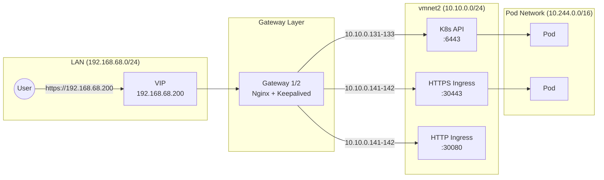

# Networking Documentation

## Overview

The cluster uses a **Dual-Homed DMZ** architecture with:
- **Cilium** for internal pod networking (CNI)
- **Nginx** for external edge routing and load balancing
- **vmnet2** for isolated cluster communication

## Network Architecture



## Traffic Flow: The Journey of a Packet

### 1. Ingress (LAN)

```
User on Home LAN requests https://myapp.local
        ↓
DNS resolves to 192.168.68.200 (VIP)
        ↓
Packet arrives at Active Gateway's Bridged Interface (ens160)
```

### 2. Load Balancing (Gateway)

```
Nginx on Gateway accepts connection on port 443
        ↓
Stream module performs TLS passthrough
        ↓
Selects backend Worker Node (e.g., k8s-worker1 at 10.10.0.141)
        ↓
Forwards packet via Internal Interface (ens192) to vmnet2
```

### 3. Cluster Entry (Worker)

```
Packet arrives at k8s-worker1 on NodePort 30443
        ↓
Cilium eBPF intercepts the packet
        ↓
Identifies traffic for Gateway API listener
```

### 4. Service Routing (Cilium)

```
Cilium Gateway terminates TLS (if configured)
        ↓
Routes based on SNI or HTTPRoute
        ↓
Forwards to target Pod IP
```

## Network Segments

### LAN Segment (Bridged - 192.168.68.0/24)

| Purpose | Description |
|---------|-------------|
| External Access | Users access cluster via VIP |
| Gateway VIP | 192.168.68.200 managed by Keepalived |
| Internet | Direct internet access for Gateways |

### Internal Segment (vmnet2 - 10.10.0.0/24)

| Purpose | Description |
|---------|-------------|
| Cluster Communication | All K8s node-to-node traffic |
| API Server | Control plane communication |
| Pod Traffic | Inter-pod communication (via Cilium) |
| Internet for Nodes | NAT through 10.10.0.2 |

### Pod Network (Cilium - 10.244.0.0/16)

| Purpose | Description |
|---------|-------------|
| Pod IPs | Dynamic IP allocation for pods |
| Service IPs | 10.96.0.0/12 for ClusterIP services |
| CNI | Cilium with eBPF dataplane |

## CNI Configuration

| Property | Value |
|----------|-------|
| **Plugin** | Cilium |
| **Mode** | Direct Routing (L2) inside vmnet2 |
| **Gateway API** | Enabled |
| **Kube-Proxy** | Replaced by Cilium eBPF |

### Cilium Features Enabled

- eBPF-based dataplane
- Gateway API support
- Hubble observability
- Network Policies
- L7 load balancing

## Port Mappings

### External (LAN - Via VIP)

| Port | Service | Backend |
|------|---------|---------|
| 6443 | K8s API | Masters (10.10.0.131-133:6443) |
| 443 | HTTPS Ingress | Workers (10.10.0.141-142:30443) |
| 80 | HTTP Ingress | Workers (10.10.0.141-142:30080) |

### Internal (vmnet2)

| Port | Service | Nodes |
|------|---------|-------|
| 6443 | K8s API Server | Masters |
| 10250 | Kubelet | All nodes |
| 2379-2380 | etcd | Masters |
| 30000-32767 | NodePort range | Workers |

## Network Segmentation Benefits

| Benefit | Description |
|---------|-------------|
| **Security** | Masters are not exposed to the LAN |
| **Stability** | Internal IP changes don't affect LAN clients |
| **Control** | All ingress funneled through managed Gateways |
| **Isolation** | Cluster traffic separated from other VMs |

## VMware Fusion vmnet2 Configuration

```
Network: 10.10.0.0/24
Type: Host-only with NAT
DHCP: Enabled (10.10.0.128-254)
NAT Gateway: 10.10.0.2
Host Interface: 10.10.0.1
```

### Why vmnet2?

1. **Dedicated Network**: Separates K8s from default vmnet8
2. **NAT Enabled**: VMs can reach internet for updates
3. **VM-to-VM**: Full L2 connectivity between all cluster VMs
4. **Host Access**: Mac can reach VMs for management

## Troubleshooting

### Check Network Connectivity

```bash
# From Gateway - check internal connectivity
ping 10.10.0.131  # Master 1

# From Master - check worker connectivity
ping 10.10.0.141  # Worker 1

# Check internet access (via NAT)
curl -I https://google.com
```

### Verify vmnet2 Configuration

```bash
# On Mac host
cat "/Library/Preferences/VMware Fusion/networking" | grep VNET_2

# Check DHCP leases
cat "/Library/Preferences/VMware Fusion/vmnet2/dhcpd.leases"
```

### Check VM Network Adapter

```bash
# In VM
ip addr show ens160
ip route

# Check DNS
cat /etc/resolv.conf
```

## Diagram: Complete Network Topology

```
┌─────────────────────────────────────────────────────────────────────┐
│                        HOME NETWORK (LAN)                            │
│                       192.168.68.0/24                                │
│                                                                      │
│    ┌──────────────┐                    ┌──────────────────────┐     │
│    │    User PC   │ ──────────────────▶│  VIP: 192.168.68.200 │     │
│    └──────────────┘                    └──────────┬───────────┘     │
│                                                   │                  │
└───────────────────────────────────────────────────┼──────────────────┘
                                                    │
                              ┌─────────────────────┴─────────────────┐
                              │         GATEWAY LAYER                  │
                              │  ┌───────────────┬───────────────┐    │
                              │  │   gateway1    │   gateway2    │    │
                              │  │ .68.56 (LAN)  │ .68.57 (LAN)  │    │
                              │  │ .0.11 (Int)   │ .0.12 (Int)   │    │
                              │  │   Nginx +     │   Nginx +     │    │
                              │  │  Keepalived   │  Keepalived   │    │
                              │  └───────┬───────┴───────┬───────┘    │
                              └──────────┼───────────────┼────────────┘
                                         │               │
┌────────────────────────────────────────┴───────────────┴────────────┐
│                    INTERNAL CLUSTER (vmnet2)                         │
│                         10.10.0.0/24                                 │
│                                                                      │
│  ┌─────────────────────────────────────────────────────────────┐    │
│  │                    CONTROL PLANE                             │    │
│  │  ┌─────────────┐ ┌─────────────┐ ┌─────────────┐            │    │
│  │  │  master1    │ │  master2    │ │  master3    │            │    │
│  │  │ 10.10.0.131 │ │ 10.10.0.132 │ │ 10.10.0.133 │            │    │
│  │  │  API+etcd   │ │  API+etcd   │ │  API+etcd   │            │    │
│  │  └─────────────┘ └─────────────┘ └─────────────┘            │    │
│  └─────────────────────────────────────────────────────────────┘    │
│                                                                      │
│  ┌─────────────────────────────────────────────────────────────┐    │
│  │                    DATA PLANE                                │    │
│  │  ┌─────────────────────────┐ ┌─────────────────────────┐    │    │
│  │  │       worker1           │ │       worker2           │    │    │
│  │  │     10.10.0.141         │ │     10.10.0.142         │    │    │
│  │  │   Cilium + Pods         │ │   Cilium + Pods         │    │    │
│  │  └─────────────────────────┘ └─────────────────────────┘    │    │
│  └─────────────────────────────────────────────────────────────┘    │
│                                                                      │
│  NAT Gateway: 10.10.0.2 → Internet                                  │
└─────────────────────────────────────────────────────────────────────┘
```
